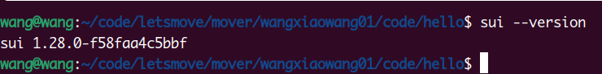
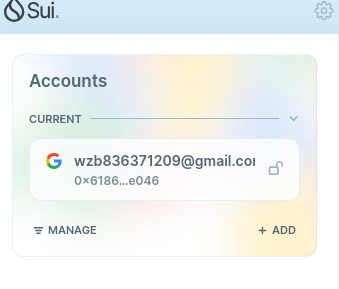
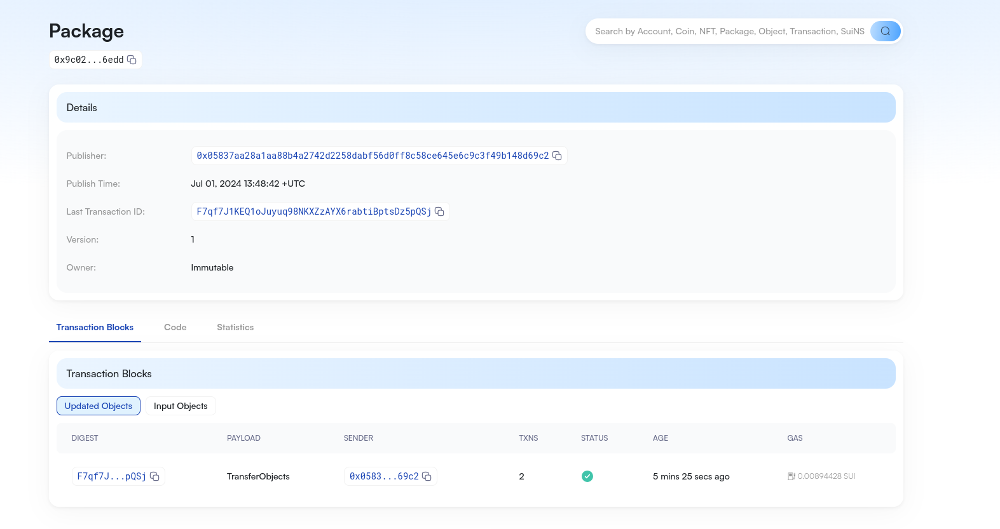

## 基本信息
- Sui钱包地址: `0xd6a00995db029a7cea10487e8a2afb7db5b2372e6a122295c3b7eeb8e71b4a43`
> 首次参与需要完成第一个任务注册好钱包地址才被合并，并且后续学习奖励会打入这个地址
- github: `wangxiaowang01`

## 个人简介
- 工作经验: 6年
- 技术栈: `Rust`  `python` `go`
> 重要提示 请认真写自己的简介
- web3行业从业者，对Move特别感兴趣，想通过Move深入了解智能合约
- 联系方式: tg: `@Williamswang` 

## 任务

##   01 hello move  
- [x] Sui cli version: `sui 1.28.0-f58faa4c5bbf` 
- [x] Sui钱包截图: 
- [x] package id: `0x9c023c114bab453220106b1a2221d9e0611b6fd75472c7996e3834dc9eaf6edd`
- [x] package id 在 scan上的查看截图:

##   02 move coin
- [] My Coin package id : 
- [] Faucet package id : 
- [] 转账 `My Coin` hash:
- [] `Faucet Coin` address1 mint hash:
- [] `Faucet Coin` address2 mint hash:

##   03 move NFT
- [] nft package id :
- [] nft object id : 
- [] 转账 nft  hash:
- [] scan上的NFT截图:

##   04 Move Game
- [] game package id :
- [] deposit Coin hash:
- [] withdraw `Coin` hash:
- [] play game hash:

##   05 Move Swap
- [] swap package id :
- [] call swap CoinA-> CoinB  hash :
- [] call swap CoinB-> CoinA  hash :

##   06 Dapp-kit SDK PTB
- [] save hash :

##   07 Move CTF Check In
- [] CLI call 截图 : 
- [] flag hash :

##   08 Move CTF Lets Move
- [] proof : 
- [] flag hash :
