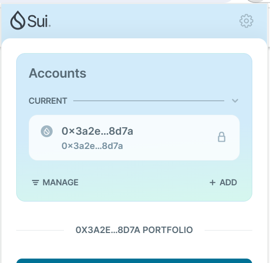
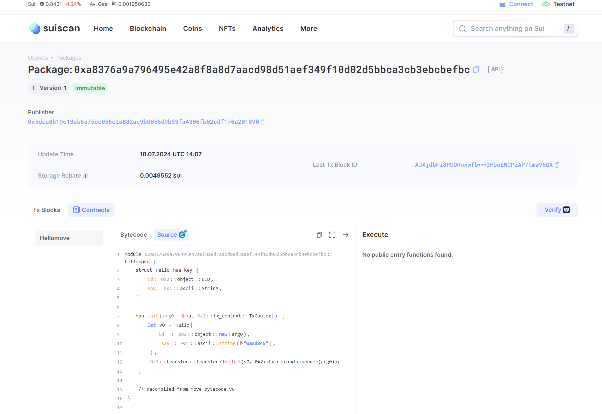
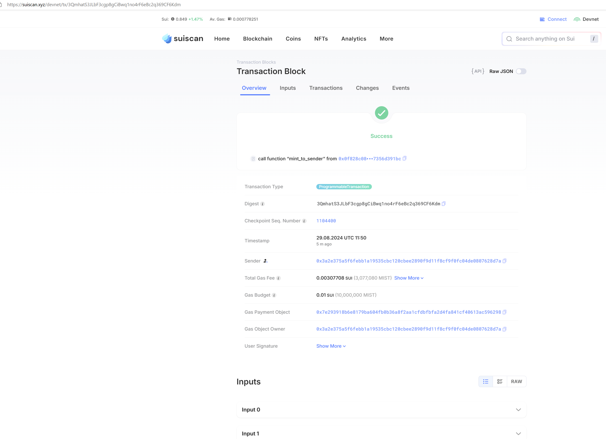
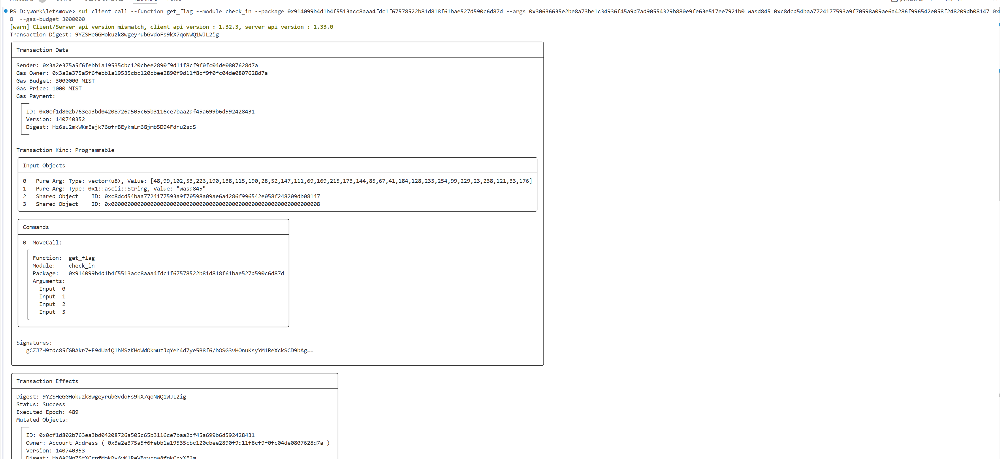

## 基本信息
- Sui钱包地址: `0x3a2e375a5f6febb1a19535cbc120cbee2890f9d11f8cf9f0fc04de0807628d7a`
> 首次参与需要完成第一个任务注册好钱包地址才被合并，并且后续学习奖励会打入这个地址
- github: `wasd845`

## 个人简介
- 工作经验: 6年
- 技术栈: `C++` `Python`
> 重要提示 请认真写自己的简介
- 多年C++开发经验，了解Solidity, 对Move感兴趣，想入门区块链和Web3开发.
- 联系方式: tg: `wegen23` 

## 任务

##   01 hello move  
- [x] Sui cli version:'sui 1.29.1-0e22aedc6f26'
- [x] Sui钱包截图: 
- [x] package id: 0xa8376a9a796495e42a8f8a8d7aacd98d51aef349f10d02d5bbca3cb3ebcbefbc
- [x] package id 在 scan上的查看截图:

##   02 move coin
- [x] My Coin package id : 0xd0388f5ee65f00e17f100d52dc3897a57a90745c7b6bdcf8761593562ae0f8ea(devnet), 0x46ce398eee459c127777253324a42f599a879178a03142b9724ec6b1789e6abe(testnet)
- [x] Faucet package id : 0xfc9584dfc35c87a09fc6ae75ed5f27c1c82da4aac2972e4906ae622fe2bc00c4(devnet), 0x8574202000858e96dca3a2b03fd4072528833eacbc1c5857a1201a9507f9f452(testnet)
- [x] 转账 `My Coin` hash: 58nSvLLjfdFqNfAQrmCpQimnKR54TY3S5Wxc5kaBevTw
- [x] `Faucet Coin` address1 mint hash: 632KiUGabmVNAED6e3hzZ6R7XDinN2tuDRsfhRisxJU3
- [x] `Faucet Coin` address2 mint hash: Ec7eT6zw9Ms7btpSzQa7S4x8Y8Kj6Lkey7xYgQKhNCZc

##   03 move NFT
- [x] nft package id : 0x0f828c084e17ae73a7132ef3eb37d2259c2a521835964375fa66317356d391bc
- [x] nft object id : 0x05c18a5edc0be6d18b2056b6d0cc9319098543d399f16581c7b1487bee4c2bf3
- [x] 转账 nft  hash: 9uFAeWqgVKFmReYgZwSkkdNfXaa2D4HqzMb79PmwauPU
- [x] scan上的NFT截图:

##   04 Move Game
- [x] game package id : 0x8d43616fb19c7b0daef72930b0f4b95a36aab07b44dc160832e6dae2ecc0ca94
- [x] deposit Coin hash: FB6ykKUXqGxYeMzutaWsZoaLyobRo5Wju3W5PakUuZWk
- [x] withdraw `Coin` hash: 8QjuAZjYWWK6o3zpCbgmgch3wTjNWL2MU8yWEygzoCYu
- [x] play game hash: B7Yw41opfMWxLiXW9GHKeQc9oQYdqVkjEHzZXENiGXr3

##   05 Move Swap
- [x] swap package id : 0x7db921414e6dd52c96023ef1500cb112e2287a52564dcc5da0a95b2306b5e0d7
- [x] call swap CoinA-> CoinB  hash : 4NXLAemEoTg5NFsWX38LnX1wWuKgyuxusw5uaTpYhtFP
- [x] call swap CoinB-> CoinA  hash : 38dBPQz6mtXMBifrQ9nKN7Zp5UVa9AmU74ivowUtrHqE

##   06 Dapp-kit SDK PTB
- [x] save hash : 2iaZi566xkrE7QqUsikGGY3XNe35RLKj5V9QViLS7JRL

##   07 Move CTF Check In
- [x] CLI call 截图 : 
- [x] flag hash : 9YZSHeGGHokuzk8wgeyrubGvdoFs9kX7qoNWQ1WJL2ig

##   08 Move CTF Lets Move
- [x] proof : 0x000000000000000000000000000000000000000000000000000000000059f79b
- [x] flag hash : 5YYX9jWdwoiXAcENhVPHPuhLu7fg2ZPkpMCstnQ1gxqS
