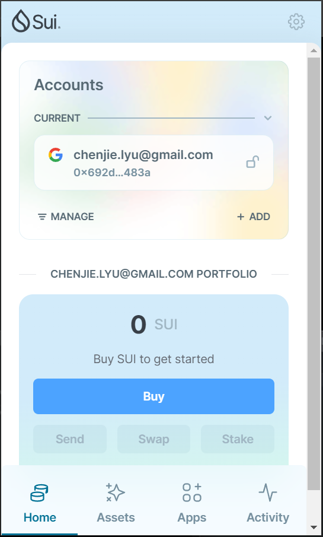
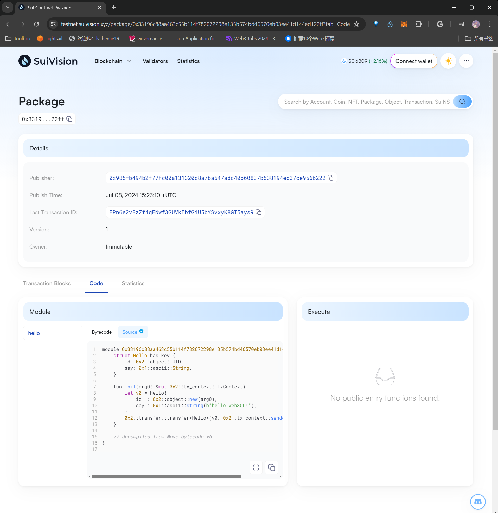
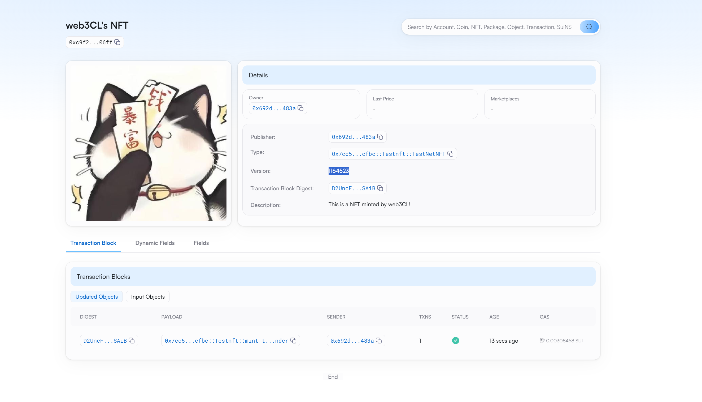

## 基本信息
- Sui钱包地址: `0x692d481fd6fdac699387b4ecbbc7c74359487ec8a81567f4f96196c2ad44483a`
> 首次参与需要完成第一个任务注册好钱包地址才被合并，并且后续学习奖励会打入这个地址
- github: `web3CL`

## 个人简介
- 工作经验: 1年
- 技术栈: `python`、`machine learning`、`solidity`
> 重要提示 请认真写自己的简介
- 可以英语为工作语言，擅长数据分析、数据可视化，有以太坊MEV bots开发经验；
- 联系方式: tg: `@chenje.lyu` 

## 任务

##   01 hello move  
- [x] Sui cli version: sui-client 1.27.2-homebrew
- [x] Sui钱包截图: 
- [x] package id: `0x33196c88aa463c55b114f782072298e135b574bd46570eb03ee41d144ed122ff`
- [x] package id 在 scan上的查看截图:

##   02 move coin
- [x] My Coin package id : `0x05b163c3a5d1fc4dbfde24163d59a1137d977fd320c964a8eacdab78e3e00f86`
- [x] Faucet package id : `0x54c1d3f374a94596cc79e8691a4354e52e5112841b49b02ced6d721c68ac9ac0`
- [x] 转账 `My Coin` hash: `8krQgZ5DDgareifn7rYXSaEvumbyFwBqdrHGVchcXGuc`
- [x] `Faucet Coin` address1 mint hash: `CPbUmpSdg1wHi3bMZA8BL8r1e9nqxTR8oYRAcKT5G98B`
- [x] `Faucet Coin` address2 mint hash: `A6Tx3PUqu4jFzZBXZ3MQB3mz2ay9MmngkS4D2jb4Zguf`

##   03 move NFT
- [x] nft package id : `0x7cc5b9f73d9aa4999556cabdcb6ffd730f2b3128d5c5753150528d6ed160cfbc`
- [x] nft object id : `0x495bc8268b2d5bce98f86a0f9a99fe5656d7b26fc5b769cd535242e8914cd0f1` 
- [x] 转账 nft hash: `B314hT7sPfxxsmzv3RdjN8hf34SC58YWSPAz5iDfaC6V`
- [x] scan上的NFT截图:

##   04 Move Game
- [x] game package id : `0x66aa36a097fff9590cf4ffbdfaf6f2f5f01dd69fa2fdba21ab9e665389035b9f`
- [x] deposit Coin hash: `DkWMkaXXWXVfM9VZTi6viL5mRzh2LChcuU3MYjku65Mo`
- [x] withdraw `Coin` hash: `0x985fb494b2f77fc00a131320c8a7ba547adc40b60837b538194ed37ce9566222`
- [x] play game hash: `8QahiRwqDf5H1c51FaA5PxmvVMWsY8tAM8GPCxr1vGcr`

##   05 Move Swap
- [x] swap package id : `0xc210bdd509d50c46e74ec3bd9577ae5dbe0d3d5091f3df7faf76b1333aca4680`
- [x] call swap CoinA-> CoinB  hash :  `2HbMxdvePfAUo9MFxXJUs5e38jYMngVmMEWQyP4nuRRS`
- [x] call swap CoinB-> CoinA  hash : `3FASWdgL3ZB1z2pnDSCWXzyGE8nVhYyyWPfsc1W5GdFD`

##   06 Dapp-kit SDK PTB
- [] save hash :

##   07 Move CTF Check In
- [] CLI call 截图 : 
- [] flag hash :

##   08 Move CTF Lets Move
- [] proof : 
- [] flag hash :
