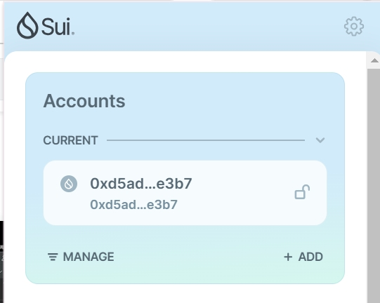
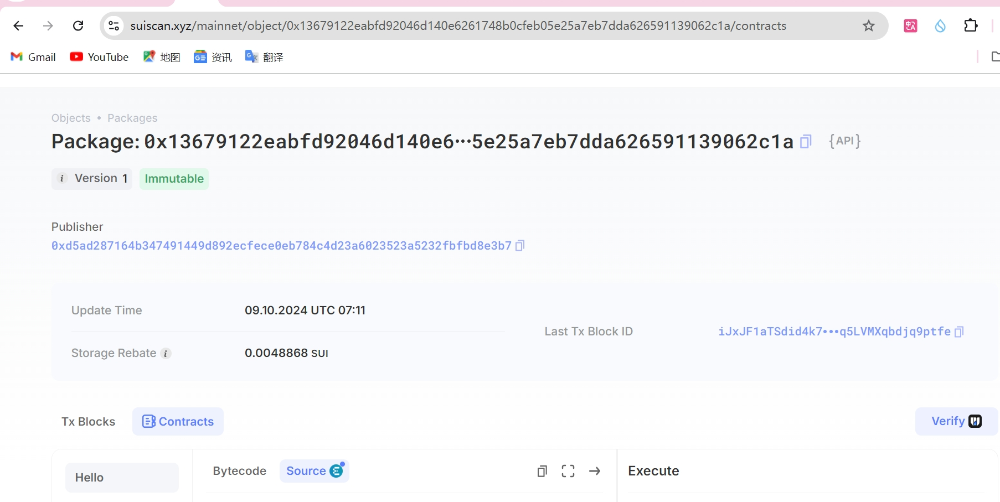

## 基本信息
- Sui钱包地址: `0xd5ad287164b347491449d892ecfece0eb784c4d23a6023523a5232fbfbd8e3b7`
> 首次参与需要完成第一个任务注册好钱包地址才被合并，并且后续学习奖励会打入这个地址
- github: `web3richer`

## 个人简介
- 工作经验: 20年
- 技术栈: `Java` `Python` `Solidity` `Rust`
> 重要提示 请认真写自己的简介
- 多年互联网从业经验，主要从事支付、电商业务系统开发；目前自学区块链相关知识，已掌握Solidity，正在学习Rust及Move
- 联系方式: tg: `@web3richer` 

## 任务

##   01 hello move  
- [x] Sui cli version: sui 1.34.2-c9ae0f9282a0
- [x] Sui钱包截图: 
  
- [x] package id:  0x13679122eabfd92046d140e6261748b0cfeb05e25a7eb7dda626591139062c1a
- [x] package id 在 scan上的查看截图:

##   02 move coin
- [] My Coin package id : 
- [] Faucet package id : 
- [] 转账 `My Coin` hash:
- [] `Faucet Coin` address1 mint hash:
- [] `Faucet Coin` address2 mint hash:

##   03 move NFT
- [] nft package id :
- [] nft object id : 
- [] 转账 nft  hash:
- [] scan上的NFT截图:

##   04 Move Game
- [] game package id :
- [] deposit Coin hash:
- [] withdraw `Coin` hash:
- [] play game hash:

##   05 Move Swap
- [] swap package id :
- [] call swap CoinA-> CoinB  hash :
- [] call swap CoinB-> CoinA  hash :

##   06 Dapp-kit SDK PTB
- [] save hash :

##   07 Move CTF Check In
- [] CLI call 截图 : 
- [] flag hash :

##   08 Move CTF Lets Move
- [] proof : 
- [] flag hash :
