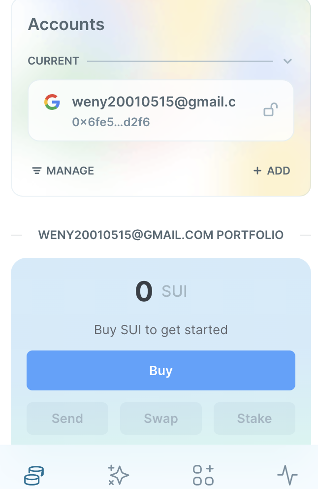
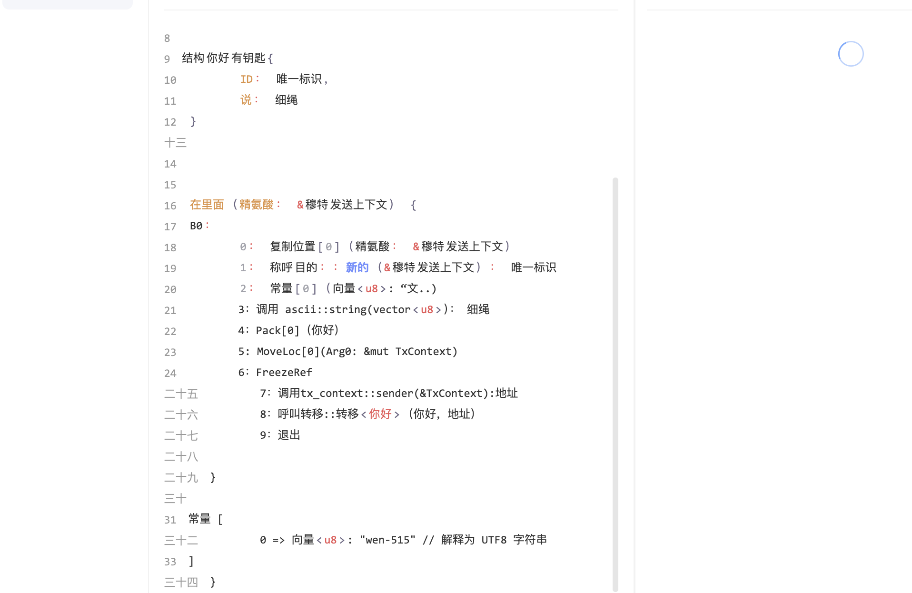

## 基本信息
- Sui钱包地址: 0x6fe5567db49bf7d67b4fe31fdef9c13e3a737cfd3abb2d7335389adc41aed2f6
> 首次参与需要完成第一个任务注册好钱包地址才被合并，并且后续学习奖励会打入这个地址
- github: wen-515

## 个人简介
- 工作经验: 0年
- 技术栈: `go` `C`
> 区块链专业大三在读，想通过学习move，清晰了解web3，为未来就业做打算
- 

## 任务

##   01 hello move  
- [] Sui cli version:sui 1.30.1-a4185da5659d
- [] Sui钱包截图: 
- [] package id: 0x169ea58eb7e81ab94e8f244e08f18cdf603c4159d34b391ec497bedfa9512cd2
- [] package id 在 scan上的查看截图:

##   02 move coin
- [] My Coin package id : 
- [] Faucet package id : 
- [] 转账 `My Coin` hash:
- [] `Faucet Coin` address1 mint hash:
- [] `Faucet Coin` address2 mint hash:

##   03 move NFT
- [] nft package id :
- [] nft object id : 
- [] 转账 nft  hash:
- [] scan上的NFT截图:

##   04 Move Game
- [] game package id :
- [] deposit Coin hash:
- [] withdraw `Coin` hash:
- [] play game hash:

##   05 Move Swap
- [] swap package id :
- [] call swap CoinA-> CoinB  hash :
- [] call swap CoinB-> CoinA  hash :

##   06 Dapp-kit SDK PTB
- [] save hash :

##   07 Move CTF Check In
- [] CLI call 截图 : 
- [] flag hash :

##   08 Move CTF Lets Move
- [] proof : 
- [] flag hash :
