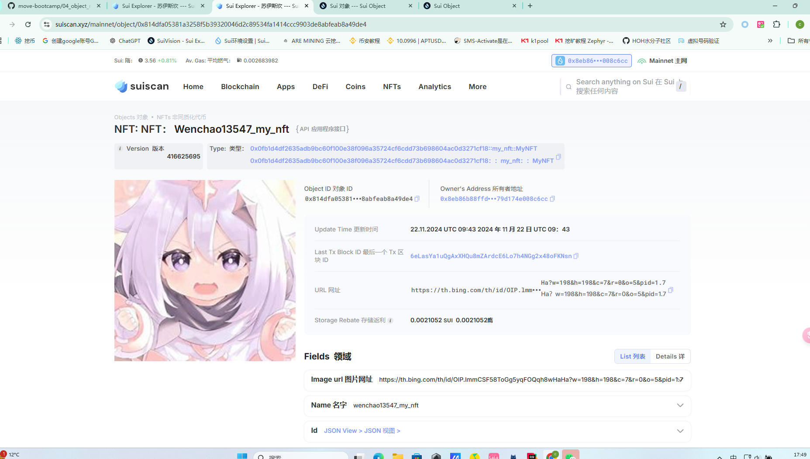

## 基本信息
- Sui钱包地址: `0x8eb86b88ffd302abe177ad781f17ea2ec1c1b51baee5a0cf5a79d174e008c6cc`
> 首次参与需要完成第一个任务注册好钱包地址才被合并，并且后续学习奖励会打入这个地址
- github: `wenchao13547`

## 个人简介
- 工作经验: 1年
- 技术栈: `Rust` `JAVA`
> 重要提示 请认真写自己的简介
- 我对Move特别感兴趣，想通过Move入门区块链,能够成为一位move的开发者，特朗普成为总统感觉web3前途一片光明，想成为web3大佬，嘿嘿
- 联系方式: tg: `wenchao13547` 

## 任务

##   01 hello move  
- [√] Sui cli version:sui 1.37.1-7839b9501066
- [√] Sui钱包截图: 
- 
- [√] package id: 0xfb527890c055ebf04c108e6923e5b43f1b3f7496402c7cc1dd29a8bdbff1e093
- [√] package id 在 scan上的查看截图:
- 

##   02 move coin
- [√] My Coin package id : 0x9f0d2d39022e2f6eeac61430464a061654250b1de62f3524103431bdda846c82
- [√] Faucet package id : 0xdcf3749d51e66858ee2443fcc0b92b33482986580aa2db686e5a0d1e5a07ffac
- [√] 转账 `My Coin` hash:5FjtnMhLq3HhyANWWD7o99EmgA2dbdewanwSs6RBayS8
- [√] `Faucet Coin` address1 mint hash:56yd4eK7o19HrDYp3FLosQAyCNs7jm8sSr79UABB71fi

- [√] `Faucet Coin` address2 mint hash:3ZJpTd1NVLKQaE67rzRHKW8pngsCUcZQfqL9GTwiASSb

##   03 move NFT
- [√] nft package id :0x0fb1d4df2635adb9bc60f100e38f096a35724cf6cdd73b698604ac0d3271cf18
- [√] nft object id : 0x814dfa05381a3258f5b39320046d2c89534fa1414ccc9903de8abfeab8a49de4
- [√] 转账 nft  hash:C7MRHLB7VCeesttTh7P8zPzktzHyhw1mLdug9BdeMLv5
- [√] scan上的NFT截图:
- 
##   04 Move Game
- [] game package id :
- [] deposit Coin hash:
- [] withdraw `Coin` hash:
- [] play game hash:

##   05 Move Swap
- [] swap package id :
- [] call swap CoinA-> CoinB  hash :
- [] call swap CoinB-> CoinA  hash :

##   06 Dapp-kit SDK PTB
- [] save hash :

##   07 Move CTF Check In
- [] CLI call 截图 : 
- [] flag hash :

##   08 Move CTF Lets Move
- [] proof : 
- [] flag hash :
