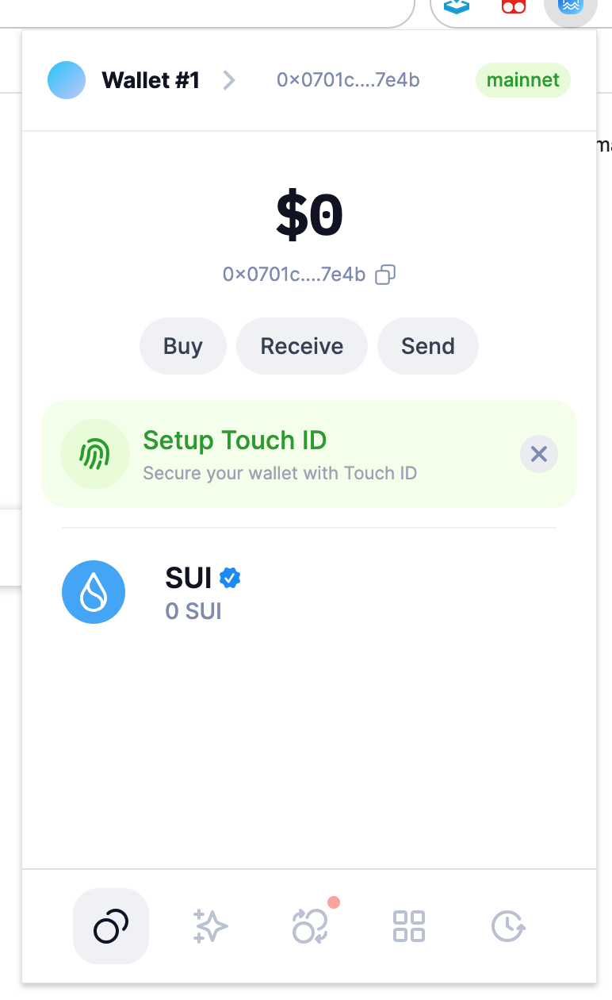
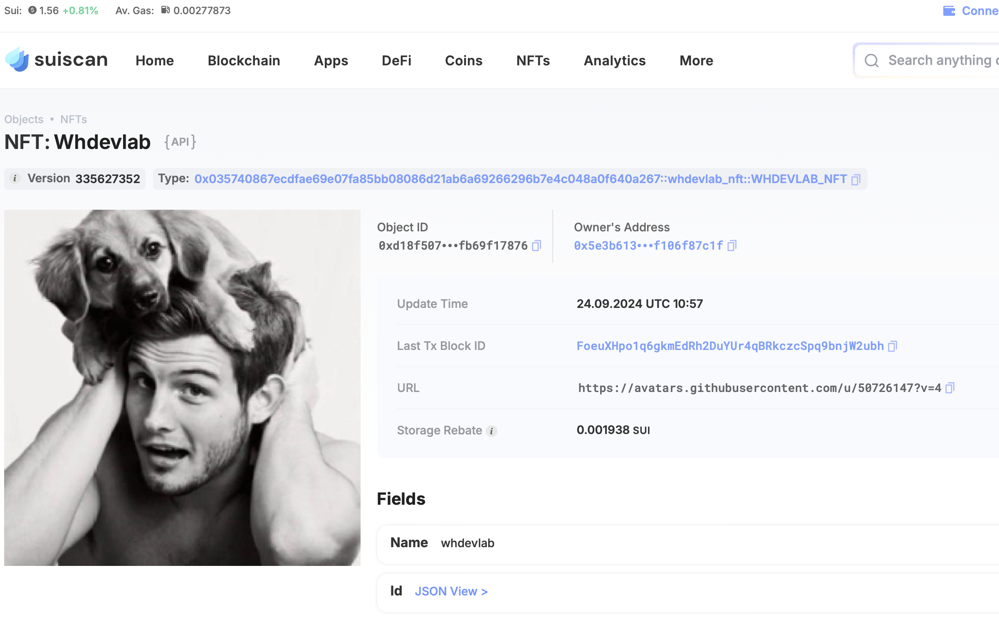

## 基本信息
- Sui钱包地址: `0x0701c4131b93e70781e7620aabd84a88105e75a11d41ed9ecfddcd6f231e7e4b`
> 首次参与需要完成第一个任务注册好钱包地址才被合并，并且后续学习奖励会打入这个地址
- github: `whdevlab`

## 个人简介
- 工作经验: 5年
- 技术栈: `Java` `Python` `Golang`
> 重要提示 请认真写自己的简介
- 多年后端开发，准备搞web3，从move入手
- 联系方式: QQ: `1002947542` 

## 任务

##   01 hello move  
- [] Sui cli version: sui 1.33.0-homebrew
- [] Sui钱包截图: 
- [] package id: 0x2e1acb1a15a89e0a32358cbe520f7f35940560e29df47d09866b6c183c865efd
- [] package id 在 scan上的查看截图:

##   02 move coin
- [] My Coin package id : 0x197759b798efa236547bd26370792d2a3f3dd0863d7303830bfa993b22a2877d
- [] Faucet package id : 0x58dcb637ae31e54b67fcea86f53a626bde4ef8e7442815f8559842fba09a45fe
- [] 转账 `My Coin` hash: BQVK3LECsUdb1g9yz6Th63gLZyiKqKf9jhQhC38RPWWJ
- [] `Faucet Coin` address1 mint hash:EiffY9GtExyN5L8jwhkrWutsCpNYtsDFEemCCY3aTyqH
- [] `Faucet Coin` address2 mint hash:HHfmAWiJm2xAQd25f7LxDv7dsGPZjvPCm2HkcRsNzyK3

##   03 move NFT
- [] nft package id :0x035740867ecdfae69e07fa85bb08086d21ab6a69266296b7e4c048a0f640a267
- [] nft object id : 0xd18f5078e702c50a5e757bd00a35d1a6d907d2a4fd411eded1389dfb69f17876
- [] 转账 nft  hash:8ZxqdsY422hRvv8K5Sp242cPE7u1vWhs584vEvKg7Nx8
- [] scan上的NFT截图:

##   04 Move Game
- [x] game package id : 0x85bbd3bd27919882a465edd4ec624f82181dfb9e717c51d98e4d2915a1b5994b
- [x] deposit Coin hash: AdGXHLxFtCQaWxtTi2Em5g9vno2xC1GgHx6JHysUxBSv
- [x] withdraw `Coin` hash: Cn9ydbuvExEkVCknsfZ8i3a3uEb8hfDuduja9MouCiEG
- [x] play game hash: FJnFyDTYkakdvG3EqrVYYo9wFnQonTdPHdWzBfqhF8oY

##   05 Move Swap
- [x] swap package id : 0x28a208bc3bc2de8c1055900b15866a3190e5ee49e90bcc7635cafb131edfdbe1
- [x] call swap CoinA-> CoinB  hash : 8XrxytzX7iY3hEJBhC4bLvRuQsR34qhBjeNmU8Ke9Ar1
- [x] call swap CoinB-> CoinA  hash : M2baC4cZNFtD1Dn83FSHGxvbLYChQ9EeKhLq26GfkjS