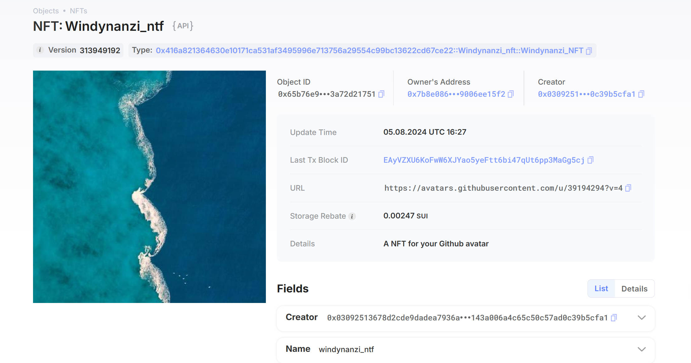

## 基本信息
- Sui钱包地址: `0xd1172b7d007f0fc94ba6473c761dbc05bfd85ce97d873295c937630b1edd6c7f`
- github: `windynanzi`

## 个人简介
- 工作经验: 3年
- 技术栈: `ES6` `Vue`
> 重要提示 请认真写自己的简介
- 3年前端经验，侧重于ES6,Vue. Nuxt,小程序,Node 也了解一二。
- 联系方式: 微信: `hq_yuzhe` 

## 任务

##   01 hello move  
- [x] Sui cli version: sui 1.29.2-homebrew
- [x] Sui钱包截图: 
- [x] package id: 0x4e2b6e6c6dfa353941d9776e4312f9ca00340e8c988afefde94c16669b94515b
- [x] package id 在 scan上的查看截图:

##   02 move coin
- [x] My Coin package id : 0x0b729163b66a6ed4ae5d7352e7bbf16573548827c22464554caf0f5a8b8c89a4
- [x] Faucet package id : 0x0b729163b66a6ed4ae5d7352e7bbf16573548827c22464554caf0f5a8b8c89a4
- [x] 转账 `My Coin` hash: DG47kddA9N26T5fwWeU3FP4nkmHZd6gQFY8oa29ux6ne
- [x] `Faucet Coin` address1 mint hash: FjQ9EkiRCbL53pm8jH4cuMhNPEy6xQW3VHPbRLtvh48Y
- [x] `Faucet Coin` address2 mint hash: C7vnFtN3RZ2qBeaMQW3xwF9yrzbyjboHCShtev1JcKrR


##   03 move NFT
- [x] nft package id : 0x416a821364630e10171ca531af3495996e713756a29554c99bc13622cd67ce22
- [x] nft object id : 0xde4e094ee30029d665fb8666aea3bb38fc9a7d2710584ce1255f530f9edf5961
- [x] 转账 nft  hash: EAyVZXU6KoFwW6XJYao5yeFtt6bi47qUt6pp3MaGg5cj
- [x] scan上的NFT截图:

##   04 Move Game
- [x] game package id : 0x3be1388d977a2eaca3f9987086048d1533953263b1bff49de6598f25b21f7b19
- [x] deposit Coin hash: 3nBEeXxeq9fM69kZ9NscbATUXU1sPUnbbCwux7kD5yPZ
- [x] withdraw `Coin` hash: Ck2EEHtiDr71USRn3kJAynF1HSwRnRxYW1zJ5N7vHNMW
- [x] play game hash: Ck2EEHtiDr71USRn3kJAynF1HSwRnRxYW1zJ5N7vHNMW
---
> 猜拳游戏, 共3次
> Ck2EEHtiDr71USRn3kJAynF1HSwRnRxYW1zJ5N7vHNMW, 4EJbqMjoqrLeCuFwJfvn9T2hLyGD3RYpjgnJWWyhrkmA, 4JywJNuNY9mZh5BYur2fnYPhfJWei15c65j3dyVf3D6c
---
- 玩家赢

- 机器赢

- 事件

- balance 变化


##   05 Move Swap
- [x] swap package id : 0xda2b6726d5ec14013e98c486976ffb64b087ad6260fb5b7c1f41df508e1dd2d0
- [x] call swap CoinA-> CoinB  hash : 4zETge4hTR1RBJ3LkVYEdQFfq8CUcxPVfx2AnK1pGmpg
- [x] call swap CoinB-> CoinA  hash : 5kPkALLCWTUS5KEFq7PUpxZdYRVubyY4jjb3ET5bHRhQ
---
> 包名是 windynanzi, 可在各个文件查看, 只是文件夹名是 hello_swap
```cmd
// publish hash 9PihP3hJP1mm8LB2YRKsZVYoQiFhrBLBYtzTJwYhyHW3
// package id 0xda2b6726d5ec14013e98c486976ffb64b087ad6260fb5b7c1f41df508e1dd2d0
// coin_a_cap 0xf301b2692d449dfa7a7e8caba279ca2d37efb8213b6d9b6fe95e3af1d639349d
// coin_b_cap 0xfd034480993e55bea9ed82a1842f0e5cb988f3054c07676bd2794143a7d54d2b
// address 0xddb33d56ab9aebc1cef10fbfb8ad6e29e2d3a2a33fc69ab658579b0699b28434


// 铸币
// sui client call --package 0xda2b6726d5ec14013e98c486976ffb64b087ad6260fb5b7c1f41df508e1dd2d0 --module coin_a --function mint --args 0xf301b2692d449dfa7a7e8caba279ca2d37efb8213b6d9b6fe95e3af1d639349d 50 0xddb33d56ab9aebc1cef10fbfb8ad6e29e2d3a2a33fc69ab658579b0699b28434
// DqYhrhB4DBTyUEcUfUUTtENjSHFUatwrcKzx9DbC3jhk a 50
// 2MyGbC78cb6V1MuUS3MZL4kNbjhG2AJ9h5QbaP7zi1dG a 50
// sui client call --package 0xda2b6726d5ec14013e98c486976ffb64b087ad6260fb5b7c1f41df508e1dd2d0 --module coin_b --function mint --args 0xfd034480993e55bea9ed82a1842f0e5cb988f3054c07676bd2794143a7d54d2b 100 0xddb33d56ab9aebc1cef10fbfb8ad6e29e2d3a2a33fc69ab658579b0699b28434
// BTN7yptt5w2GjfBnR8DAymuUXFiMYjf2LCfXs3QLBo6a b 100


// set a1_id = 0x9a99d549a97ecaec182ab5ce3f188fdcb0edaaad9bfc3841fdee178084dfa1eb
// set a2_id = 0xd925b1d9f4f32302adc687ff0ac0cc7ca402fa0a3ab1e22baa54c0a317f2409a
// set b_id = 0x186436efbfa758a0c4b0dbc74c42a4b2f84620bbd797ae08e99430bf0cf4710f

// set a_type = 0xda2b6726d5ec14013e98c486976ffb64b087ad6260fb5b7c1f41df508e1dd2d0::coin_a::COIN_A
// set b_type = 0xda2b6726d5ec14013e98c486976ffb64b087ad6260fb5b7c1f41df508e1dd2d0::coin_b::COIN_B

// 创建流动性资金池
// sui client call --package 0xda2b6726d5ec14013e98c486976ffb64b087ad6260fb5b7c1f41df508e1dd2d0 --module swap --function create_pool --type-args 0xda2b6726d5ec14013e98c486976ffb64b087ad6260fb5b7c1f41df508e1dd2d0::coin_a::COIN_A 0xda2b6726d5ec14013e98c486976ffb64b087ad6260fb5b7c1f41df508e1dd2d0::coin_b::COIN_B
// hash 2WZHK4okdaoRRGmJHGB5QwjwzDzswjoBhScyNTJ4Af6R
// pool id 0x25f08c455c9529e1d042666ad3d418d43d34324597c63575fed6f0d672e80e9a
// pocket id 0xb91b8c8339eed5ec7474c719aa9316d3e5a30fcc979ffe2ab9967458a25cfefe

// 添加流动性
// sui client call --package 0xda2b6726d5ec14013e98c486976ffb64b087ad6260fb5b7c1f41df508e1dd2d0 --module swap --function add_liquidity --args 0x25f08c455c9529e1d042666ad3d418d43d34324597c63575fed6f0d672e80e9a 0x9a99d549a97ecaec182ab5ce3f188fdcb0edaaad9bfc3841fdee178084dfa1eb 0x186436efbfa758a0c4b0dbc74c42a4b2f84620bbd797ae08e99430bf0cf4710f 0xb91b8c8339eed5ec7474c719aa9316d3e5a30fcc979ffe2ab9967458a25cfefe --type-args 0xda2b6726d5ec14013e98c486976ffb64b087ad6260fb5b7c1f41df508e1dd2d0::coin_a::COIN_A 0xda2b6726d5ec14013e98c486976ffb64b087ad6260fb5b7c1f41df508e1dd2d0::coin_b::COIN_B
// hash 5JnjdGgTTi6Q8fXUCx9quXp6yFvtt9cpRKDv3Uxgm9vF
// lp id 0x01cbd2018dff0758aee78da926b94b256ecc93b0cc116a0aa24ce878487afff1


// a 交换 b
// sui client call --package 0xda2b6726d5ec14013e98c486976ffb64b087ad6260fb5b7c1f41df508e1dd2d0 --module swap --function a_swap_b --args 0x25f08c455c9529e1d042666ad3d418d43d34324597c63575fed6f0d672e80e9a 0xd925b1d9f4f32302adc687ff0ac0cc7ca402fa0a3ab1e22baa54c0a317f2409a --type-args 0xda2b6726d5ec14013e98c486976ffb64b087ad6260fb5b7c1f41df508e1dd2d0::coin_a::COIN_A 0xda2b6726d5ec14013e98c486976ffb64b087ad6260fb5b7c1f41df508e1dd2d0::coin_b::COIN_B
// hash 4zETge4hTR1RBJ3LkVYEdQFfq8CUcxPVfx2AnK1pGmpg
// b_new_id 0xf703f0eaaad4894bd355dea55f319694b432833ecbc37d95d577a72f4784724a

// b 交换 a
// sui client call --package 0xda2b6726d5ec14013e98c486976ffb64b087ad6260fb5b7c1f41df508e1dd2d0 --module swap --function b_swap_a --args 0x25f08c455c9529e1d042666ad3d418d43d34324597c63575fed6f0d672e80e9a 0xf703f0eaaad4894bd355dea55f319694b432833ecbc37d95d577a72f4784724a --type-args 0xda2b6726d5ec14013e98c486976ffb64b087ad6260fb5b7c1f41df508e1dd2d0::coin_a::COIN_A 0xda2b6726d5ec14013e98c486976ffb64b087ad6260fb5b7c1f41df508e1dd2d0::coin_b::COIN_B
// hash 5kPkALLCWTUS5KEFq7PUpxZdYRVubyY4jjb3ET5bHRhQ

```
- a -> b


- b -> a


##   06 Dapp-kit SDK PTB
- [x] save hash : DK6KLd1jFKj9ePjU8uiztZX8rrFbq2rmgYY7173mcRuv
---
- 使用 api 创建用户后，将助记词保存下来，或者自己弄一些助记词进去生成一个 navi 相关账户
- 然后在创建client的api `NAVISDKClient`中填入助记词，此时反复刷新，账户都是不变的
- `account.depositToNavi(Sui, 1e9)` 直接就转账了

--- 


##   07 Move CTF Check In
- [x] CLI call 截图 : 
- [x] flag hash : 6jiPKATMnoD1F8TmAKz5XCc1xbnqdjvNwGxQsTNPV7sr

---
flag 参数获取hash: 4xXWQaKfCgZjro79Mh4yZdrqz4CWX5UAj91KSSK6sFvj
- [](./images/flag_str.jpg)

##   08 Move CTF Lets Move
- [x] proof : [145, 48, 12]
- [x] flag hash : CPsuTwdemrSjcM6xnSasUHWZ8BUhErJjGuXgEkuN2Ys

--- 
