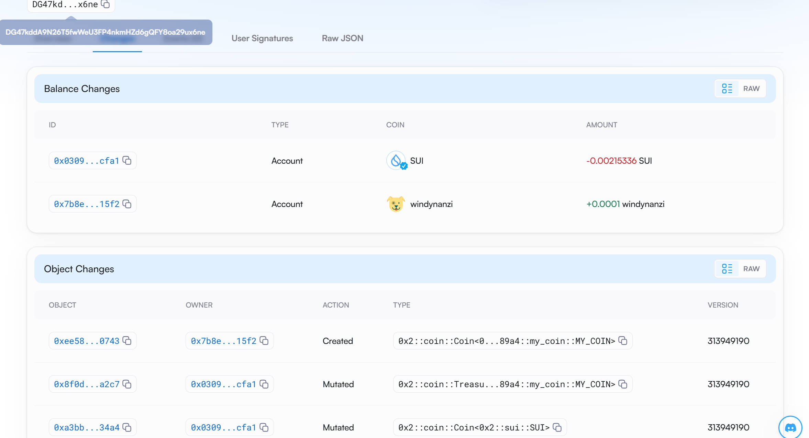
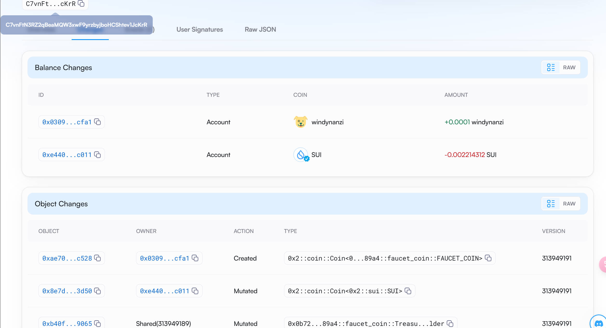

## 基本信息
- Sui钱包地址: `0xd1172b7d007f0fc94ba6473c761dbc05bfd85ce97d873295c937630b1edd6c7f`
- github: `windynanzi`

## 个人简介
- 工作经验: 3年
- 技术栈: `ES6` `Vue`
> 重要提示 请认真写自己的简介
- 3年前端经验，侧重于ES6,Vue. Nuxt,小程序,Node 也了解一二。
- 联系方式: 微信: `hq_yuzhe` 

## 任务

##   01 hello move  
- [x] Sui cli version: sui 1.29.2-homebrew
- [x] Sui钱包截图: 
- [x] package id: 0x4e2b6e6c6dfa353941d9776e4312f9ca00340e8c988afefde94c16669b94515b
- [x] package id 在 scan上的查看截图:

##   02 move coin
> 都只能在 testnet 上查询
- [x] My Coin package id : 0x7f4e44674c27f72814b38986db5f9276b8387beade723e787d93f5ccf0b27bfb
- [x] Faucet package id : 0x7f4e44674c27f72814b38986db5f9276b8387beade723e787d93f5ccf0b27bfb
- [x] 转账 `My Coin` hash: DfBa9UmJvdaWF4JzeEJL8Avv47a5Xk6sSNEs96BHofSF
- [x] `Faucet Coin` address1 mint hash: GLQLPUfgyJ9jzFEfzLWKUSADtWeEHGwEbsVF2FguD2D
- [x] `Faucet Coin` address2 mint hash: A8LVA1fE9wWeZJf9JLAhEabfcVj8dbfoxeGgvb9CUaQM
- `Faucet Coin` shared Object id: 0x2440636e94aca94715bad3c54421638eb974356497047899f50e1c191f0513cf

##   03 move NFT
> 都只能在 testnet 上查询
- [x] nft package id : 0x9d41f76683a517e518c72e28146cd00b51e6ad09788ebcde6aa524009208f317
- [x] nft object id : 0xd211072d6211e1ed78933ca8091633c7841e8c7ddf03487c636f42788f606177
- [x] 转账 nft  hash: 4aYWijwus4pu28c3nBT8wmxjY7FKJWqhaaeSMmJVD9aN
- [x] scan上的NFT截图:

##   04 Move Game
- [] game package id :
- [] deposit Coin hash:
- [] withdraw `Coin` hash:
- [] play game hash:

##   05 Move Swap
- [] swap package id :
- [] call swap CoinA-> CoinB  hash :
- [] call swap CoinB-> CoinA  hash :

##   06 Dapp-kit SDK PTB
- [] save hash :

##   07 Move CTF Check In
- [] CLI call 截图 : 
- [] flag hash :

##   08 Move CTF Lets Move
- [] proof : 
- [] flag hash :
