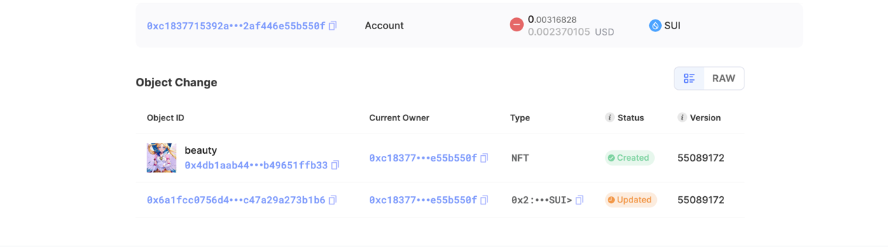

## 基本信息
- Sui钱包地址: `0x99e602ab5128b0eb740c3995e1d48220467c8011aefbbc967af4a07860fbf9b4`
- github: `wureny`

## 个人简介
- 工作经验: 在校
- 技术栈: `Rust` `Golang` `solidity`
> 重要提示 请认真写自己的简介
- 有web2后端开发和web3 AA钱包开发经验，希望能熟悉move生态
- 联系方式: tg: `lovemoonloveyou` 

## 任务

##   01 hello move  
- [] Sui cli version: sui 1.27.2-homebrew
- [] Sui钱包截图: 
- [] package id: 0x32c601e3781a3d908bfbac3a77ae3f91184e4c841ade2c2d6ad758bf50175dc6
- [] package id 在 scan上的查看截图:.png)

##   02 move coin
- [] My Coin package id : 0x98c18139f56b9fd888455a66deabd59a34e8d56e659d1205fb5dfaa6c1630ae9
- [] Faucet package id : 0x6bee188c46b96387c1143935a1b8c22c611f25b0033681f7f309d1ee15683a11
- [] 转账 `My Coin` hash: 2HtfS5o1gS3fiS3m8VWYQwMThU32wYL3ygmnUqJp4rMo
- [] `Faucet Coin` address1 mint hash: 9TEkiVHrtcSDv3PqFvJpQhfdvGFHXZTNDrCf1gKPY1b8
- [] `Faucet Coin` address2 mint hash: mYDMDcNuiqaAvS5QUWsNEJT6ts3aE3yTCpx6B6FQTJM

##   03 move NFT
- [] nft package id : 0x69823260d71ce8460012fb7904c8dc57e0eb53ce26442d54cf23de967c37edfc
- [] nft object id : 0xa4a4d0966fb027f0a640064488b0d5504425169828390589351054fec900129d
- [] 转账 nft  hash: faCm7BDLZSMumLr5zDTiu3AkDq4qyMJNYVKiVschhz1
- [] scan上的NFT截图:

##   04 Move Game
- [] game package id : 0x2680717e590792f168aa7e972010c42de90415b39150e7150b27d3beb90400fc
- [] deposit Coin hash: CEU6jD4apuiqJMkyYdBwJ7qABDLjPb6mjMfsvvbvjw7A
- [] withdraw `Coin` hash: HpM3FWXoLDA5nTdwr3RYtLXjZxkf5jJs1rVtbWxavzdT
- [] play game hash: E8gDpTQ5ySbsNcjD7rhCn3erUX8LLL3qFFWdyxUC5CxG

##   05 Move Swap
- [] swap package id :
- [] call swap CoinA-> CoinB  hash :
- [] call swap CoinB-> CoinA  hash :

##   06 Dapp-kit SDK PTB
- [] save hash :

##   07 Move CTF Check In
- [] CLI call 截图 : 
- [] flag hash :

##   08 Move CTF Lets Move
- [] proof : 
- [] flag hash :
