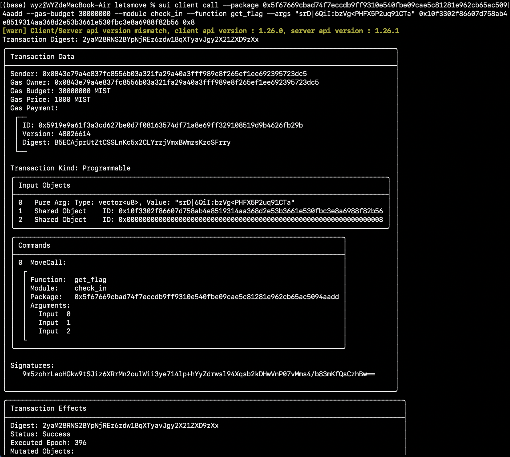

## 基本信息

- Sui 钱包地址: `0x2108b3f829cc7ab2fd740da1bd1d229938cde38b305e9cef7cf17c03808302d9`
  > 首次参与需要完成第一个任务注册好钱包地址才被合并，并且后续学习奖励会打入这个地址
- github: `wyzzhe`

## 个人简介

- 工作经验: 1 年
- 技术栈: `JS` `Python` `Linux`
- 对 Move 特别感兴趣，想通过 Move 入门区块链
- 联系方式: tg: `wyzzhe`

## 任务

## 01 hello move

- [x] package id: 0x981da1932238e54cf302b08edfa03befb931390f49e8679fae43eef42ae14436

## 02 move coin

- [x] My Coin package id : 0xae6ce4ee1a455899881bb01a2c56ef8bf4445b60c85005ca24e18c307a8b0166
- [x] Faucet package id : 0x8232d9a0ed76c80f799e550e05c7f4ab8512b712e181f257b64f20c0a2a53759
- [x] 转账 `My Coin` hash: 3Tm4b5uBDP5rRh4VHhtVxsKDQbSKLyJa52aFhSCVzj6H

## 03 move NFT

- [x] nft package id : 0x3cc7625c27e774e35d81139400340f159ebd1bf35b99c616e5d9d97b73727689
- [x] nft object id : 0x439d3fb97f964587c50bbbbf2eda171faad1ac29d990f788e9be8ba0f5958cef
- [x] 转账 nft hash: G1zMjoNEL3uTmrgvUX6PUdQbmo7EmPEh8WxftWpBYtP

## 04 Move Game

- [x] game package id : 0xd6eb8b23319439e91fd45221a8f33303db64691af4f3a97c5211ffb174d2880a
- [x] deposit Coin hash: 9XCwo1XWqcJcjXsUxnm6xuD9BVKTc1Z2FrQfA89oGupf
- [x] withdraw `Coin` hash: GVjYQtcgwhdBztP4Kp1rMzcZDt4MJPW9UiFuGkhimScg
- [x] play game hash: 4PQ9KPqDv3tdyXquxwY8zT8Hn8jn7rFrK4aKxAb2pvuy

## 05 Move Swap

- [x] swap package id : 0x2188fe7529dc9551dfad6238f00047ebf81e3566bd8ed7cd37b80a96431808aa
- [x] call swap CoinA-> CoinB hash : 9xyZMGkY1StFztxxLsDh6gyyRU4GNmhi1DsvER2aTmPa
- [x] call swap CoinB-> CoinA hash : CxN9xDe94eY3fC7prqJ8gghdC6uEt9nKWVK6GhTUMCd6

## 06 Dapp-kit SDK PTB

- [] save hash :

## 07 Move CTF Check In

- [x] CLI call 截图 : 
- [x] flag hash : 2yaM28RNS2BYpNjREz6zdw18qXTyavJgy2X21ZXD9zXx

## 08 Move CTF Lets Move

- [x] proof : 0x21a381
- [x] flag hash : 2MhfDCdkTDXQ9iLYSV1yaNkfPTizQNWr5JGtDgxmx4YM
