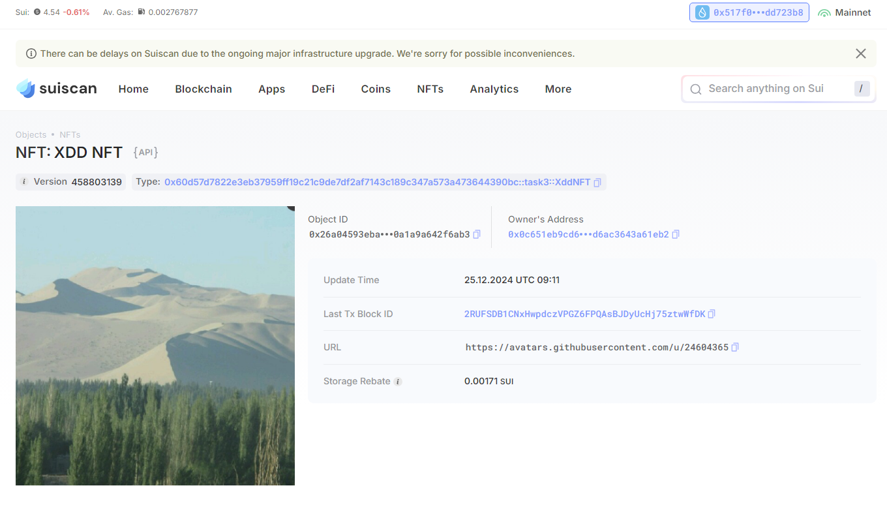
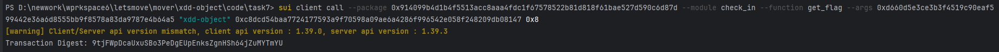

## 基本信息

- Sui钱包地址: 0x517f05f8975255e1ab82bc74419d29601ac85d761acff71f00749478edd723b8

  > 首次参与需要完成第一个任务注册好钱包地址才被合并，并且后续学习奖励会打入这个地址

- github: xdd-object

## 个人简介

- 工作经验: 0年
- 技术栈: java
- 对Move特别感兴趣，想通过Move入门区块链
- 联系方式: 767403510@qq.com

## 任务

## 01 hello move

- [x] package id: 0x98b379e2c8041537e8435a2242f6604b76592656ba53ceb07891141afc92bbf3

##   02 move coin
- [x] My Coin package id : 0x2cdd34202d285b2f4579955b57cb29cfd1c7ac9178cdc0d8424e47eb0c7a4016
- [x] Faucet package id : 0x2ba9a31fbd3e1ef640c0c52fd4f0a719ba881514133fcd5884b48b62c0eb58d2
- [x] 转账 `My Coin` hash: 4HTZGBT1Xk1aKffp5fLAiDqKnwW8W5EySbhdHLUkq4uZ
- [x] `Faucet Coin` address1 mint hash: 0x0c651eb9cd6ffa4928b5a9481f09591834a68f452cfbb8932cd6ac3643a61eb2
- [x] `Faucet Coin` address2 mint hash: 0x517f05f8975255e1ab82bc74419d29601ac85d761acff71f00749478edd723b8

##   03 move NFT
- [x] nft package id : 0x60d57d7822e3eb37959ff19c21c9de7df2af7143c189c347a573a473644390bc
- [x] nft object id : 0x1f189b1243957b0d434cd45890b66ae273dc52d9d0fe4d0bd14b5857410165dd
- [x] 转账 nft  hash: 7KwxNsp5BYYk1ceYABe9rub5HMJxXzJtfxkyxBJH5pEk
- [x] scan上的NFT截图:

##   04 Move Game
- [x] game package id : 0xa42426f6efe44d433240afab9373d311ca8aa5159a41f1fe490e8b77881c2231
- [x] deposit Coin hash: 6JptC45G1m2K7DvDT4GXdJEvURgAAsPtjex73ZoD5e3w
- [x] withdraw `Coin` hash: 48Dsd2AjJVpQBE9Utwt9EqyYMLw7HvnszscgKPwUzVPJ
- [x] play game hash: D6mrSDmLNxMiGZUdu62EVoz8oPDUcpVrVVpb89YLKc1Q

##   05 Move Swap
- [x] swap package id : 0xc3fefe6818f438ea24c5f1fc2268a52354fceabf372d5170bc9494cf96f553ca
- [x] call swap CoinA-> CoinB  hash : EVvJfKKD3gSY4AjqXNKYCMSLerHiPeYf3bT8meeW34dg
- [x] call swap CoinB-> CoinA  hash : GKpULZfR2Qvps9oqP2WehxoTepkZgG18tHSV8RnpM9Nn

##   06 Dapp-kit SDK PTB
- [] save hash :

##   07 Move CTF Check In

- [x] CLI call 截图 : 
- [x] flag hash : 9tjFWpDcaUxuSBo3PeDgEUpEnksZgnHSh64jZuMYTmYU

##   08 Move CTF Lets Move

- [x] proof :  0xcabbc40000000000
- [x] flag hash : 6caimMZNg7By49so8ZkZ7Etge37941MQEoTTpLheEWKb

