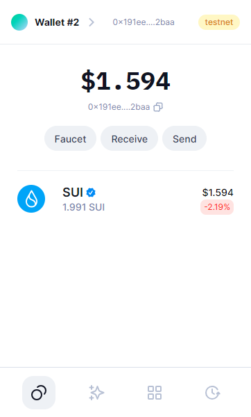
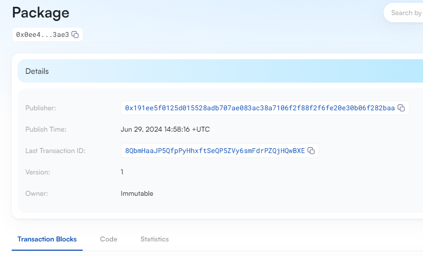
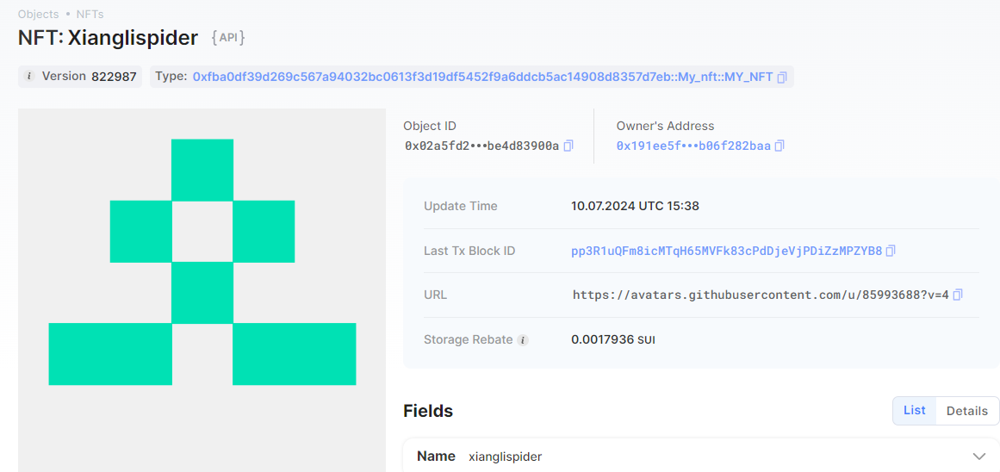

## 基本信息
- Sui钱包地址: `0x191ee5f0125d015528adb707ae083ac38a7106f2f88f2f6fe20e30b06f282baa`
> 首次参与需要完成第一个任务注册好钱包地址才被合并，并且后续学习奖励会打入这个地址
- github: `xianglispider`

## 个人简介
- 工作经验: 15年
- 技术栈: `go` `C/C++`
- 5年web3开发经验，对Move特别感兴趣
- 联系方式: tg: `https://t.me/zhangxiangli` 

## 任务

##   01 hello move  
- [x] Sui cli version:sui 1.28.0-1d48056a7519-dirty
- [x] Sui钱包截图: 
- [x] package id: 0x0ee420a503f8846f2357bb3ac5ae1fb5a79f3cbb58bf424b29fd105217d43ae3
- [x] package id 在 scan上的查看截图:

##   02 move coin
- [x] My Coin package id : 0xe99f53084f71c48281c9d673f766ac91497b5f47a11177e6c324f1f09f23073a
- [x] Faucet package id : 0x88d896dfb79e3cf42a2ff46bb78009e1772fdf917d39f8135e9e67a0151af706
- [x] 转账 `My Coin` hash: 74FB14Y7tSmkq9kRqZNxJTEzjP6Ja31G5sPxrQnPmnpt
- [x] `Faucet Coin` address1 mint hash:3ws19B35osUbjHJy7tVmr3QfkPt6Yq69HuF32vwpfBZw
- [x] `Faucet Coin` address2 mint hash:AmyQ7KToMUGD7qVN1pQskxa5y8uLc2e8WKLZUG8m5Nb

##   03 move NFT
- [x] nft package id :0xfba0df39d269c567a94032bc0613f3d19df5452f9a6ddcb5ac14908d8357d7eb
- [x] nft object id : 0x02a5fd26e3035c6515719347581ec68d142f9792f38d3a03e4eef0be4d83900a
- [x] 转账 nft  hash:9988zsQQkuE33tA3j7hVXHVHavK8b6xofafbApJ9cqJG
- [x] scan上的NFT截图:

##   04 Move Game
- [x] game package id :0xb5d183ca165aae05dde23ba6c6a6e9848f590c320ee59486fc920b43cfa38e21
- [x] deposit Coin hash:Fo6GUzKtxFhw2ycD2HisT1WfRUW122grnfj3P5gbQujg
- [x] withdraw `Coin` hash:GEZG9BishJH4QZqq4szSFGRbgVwivzSqas7jVnHhKFLF
- [x] play game hash:  ESHtNwnAqeFpg6PvZj4SduADT1QK54oLgpMTM3H4YJGq

##   05 Move Swap
- [] swap package id :
- [] call swap CoinA-> CoinB  hash :
- [] call swap CoinB-> CoinA  hash :

##   06 Dapp-kit SDK PTB
- [] save hash :

##   07 Move CTF Check In
- [] CLI call 截图 : 
- [] flag hash :

##   08 Move CTF Lets Move
- [] proof : 
- [] flag hash :
