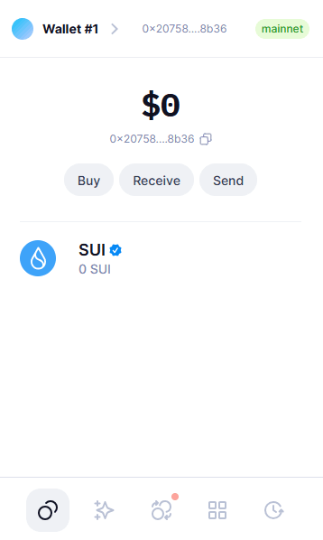
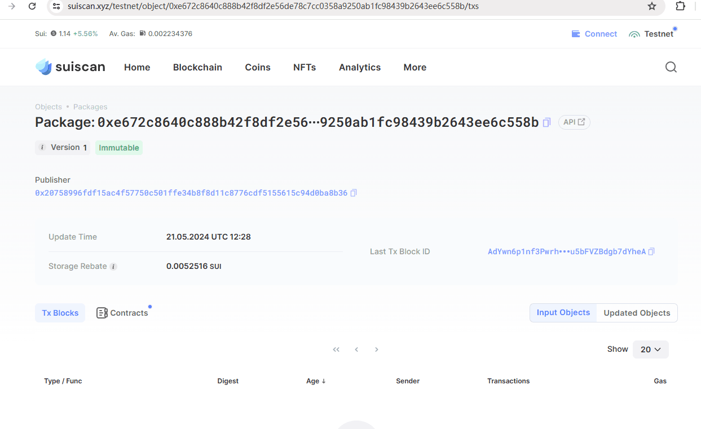
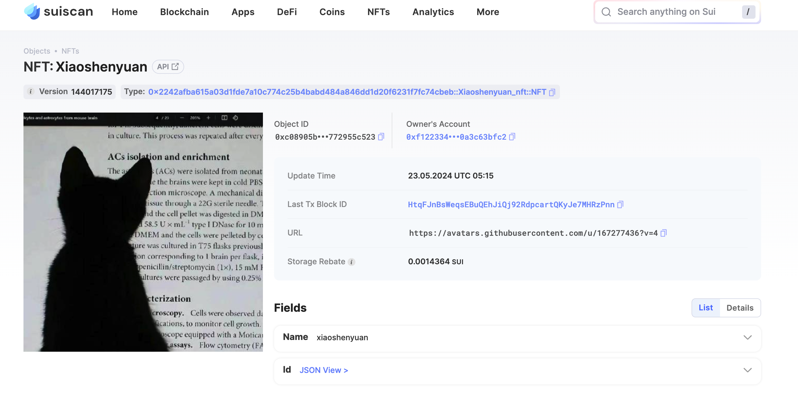

## 基本信息
- Sui钱包地址: `0x20758996fdf15ac4f57750c501ffe34b8f8d11c8776cdf5155615c94d0ba8b36`
> 首次参与需要完成第一个任务注册好钱包地址才被合并，并且后续学习奖励会打入这个地址
- github: `xiaoshenyuan`

## 个人简介
- 工作经验: 3年
- 技术栈: `Java` `Scala`
> 重要提示 请认真写自己的简介
- 多年Java开发经验，对Sui感兴趣，想通过Sui入门区块链
- 联系方式: tg: `morin_dev` 

## 任务

##   01 hello move  
- [x] Sui cli version: sui-client 1.25.0
- [x] Sui钱包截图: 
- [x] package id:  0xe672c8640c888b42f8df2e56de78c7cc0358a9250ab1fc98439b2643ee6c558b   
- [x] package id 在 scan上的查看截图:

##   02 move coin
- [x] My Coin package id :   0xff6c548c8553938d1d81e27afe8623c4b1a77692bb3729aca2ab36f274fa2500    
- [x] Faucet package id :  0x5c096f77a4dbc3be9ec01456d9c9bf5f6e2e374391b05cd26e755223a22aad29 
- [x] 转账 `My Coin` hash:  7NXdP8B6dTcenxMNVuocdRBxmr32CBU4nFu3aHCai3tD
- [x] `Faucet Coin` address1 mint hash: 4fDV3gisPzvJfkomRtyMXaedMkPURUrqVik7T1edtXJw
- [x] `Faucet Coin` address2 mint hash: 8YsBMTD4tz2gfNixYUNaH1f4VTMXR8Ep268isjbP69Vi

##   03 move NFT
- [x] nft package id : 0x2242afba615a03d1fde7a10c774c25b4babd484a846dd1d20f6231f7fc74cbeb
- [x] nft object id :  0xc08905b8bbbc9a7845a0516c1cf2531f213d405457bf8b75b68436772955c523
- [x] 转账 nft  hash:  5nQia9ef5DJSkc3H2WfYWvag8hWu5aeiy3SVM76CWVtg
- [x] scan上的NFT截图:

##   04 Move Game
- [x] game package id : 0x6dac3de3bbe52fac96b80b6335d2857996959743e015ebbf91a1dc549cac4808
- [x] deposit Coin hash: 5ndnHuk9jv8Yp5nbggT93z64sMjqqozGL8e36M6yjdXM
- [x] withdraw `Coin` hash: 6EgHgd5xPXtFs8HsRfhfqCn323iP9s4wTMBeenKGrGuw
- [x] play game hash:  BRJMSZjobDfwCutJQkPDq1xaqekhzLhGsD1NNq35AcRW

##   05 Move Swap
- [x] swap package id : 0xf35a298a979eace567237d429313602e563952bec518e5267f00c8073cd5fca4 
- [x] call swap CoinA-> CoinB  hash : FhttQ11UiJVJJyEBZDeEq5eJLcPqdSiSeN8b2mEdkJnZ
- [x] call swap CoinB-> CoinA  hash : 5KQ6FmXRnHaks9ASLTzQxZcYXxKfEvihHeKZLRcBtnwC

##   06 Dapp-kit SDK PTB
- [x] save hash : 7jVBcuDGD2Qi1AnwiKWCgyUMcSjbAZ6HipTSACHoKde3

