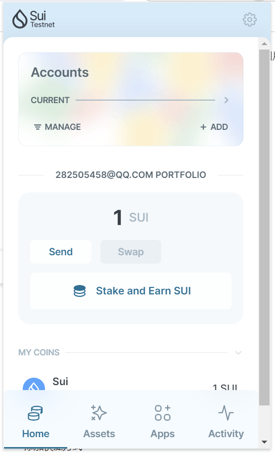
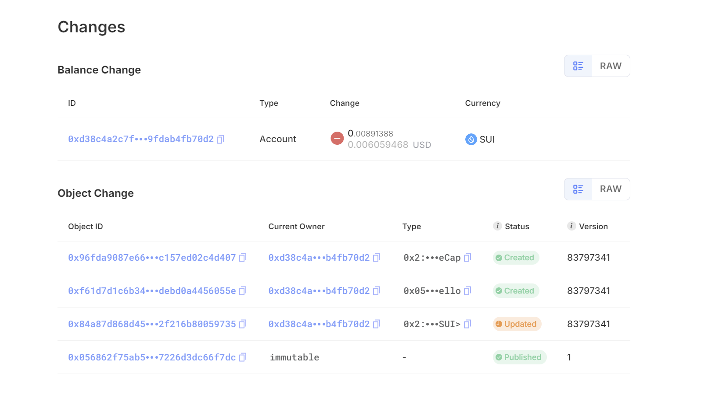

## 基本信息
- Sui钱包地址: `0x2e0495abfd6639d0a2d4931e181fd2e88380717dc52b1e3959533a67b86640d6`
> 首次参与需要完成第一个任务注册好钱包地址才被合并，并且后续学习奖励会打入这个地址
- github: `xiaoyu9022`

## 个人简介
- 工作经验: 5年
- 技术栈: `Vue` `Node`
> 重要提示 请认真写自己的简介
- 5 年 UI 设计经验，5 年前端开发经验。对 web3 很感兴趣，想通过Move入门区块链

## 任务

##   01 hello move  
- [X] Sui cli version: sui 1.30.1-a4185da5659d
- [X] Sui钱包截图: 
- [X] package id: 0x056862f75ab59d6633b38f70609c6c3ee1a6496fe47cb771937226d3dc66f7dc
- [X] package id 在 scan上的查看截图:

##   02 move coin
- [X] My Coin package id : 0xa94676950bd504a82572bebc4c4cb0758f33c85d26b0bfec55f883a3ab74ce8c
- [X] Faucet package id : 0xa94676950bd504a82572bebc4c4cb0758f33c85d26b0bfec55f883a3ab74ce8c
- [X] 转账 `My Coin` hash: 0x15eb21bc8dd18576945abbf68375621ed52db573f779f7caee2ca295dbad5749
- [X] `Faucet Coin` address1 mint hash: 0x4e1c278286e7ba8d713f6c9b193dd9bdad0752af22d4ab8cc9ea0dcece52c750
- [X] `Faucet Coin` address2 mint hash: 0xa3bcb9a72252a262f611843f58f245dd3320232e54673326a66586de4ad1fe3f

##   03 move NFT
- [] nft package id :
- [] nft object id : 
- [] 转账 nft  hash:
- [] scan上的NFT截图:

##   04 Move Game
- [] game package id :
- [] deposit Coin hash:
- [] withdraw `Coin` hash:
- [] play game hash:

##   05 Move Swap
- [] swap package id :
- [] call swap CoinA-> CoinB  hash :
- [] call swap CoinB-> CoinA  hash :

##   06 Dapp-kit SDK PTB
- [] save hash :

##   07 Move CTF Check In
- [] CLI call 截图 : 
- [] flag hash :

##   08 Move CTF Lets Move
- [] proof : 
- [] flag hash :
