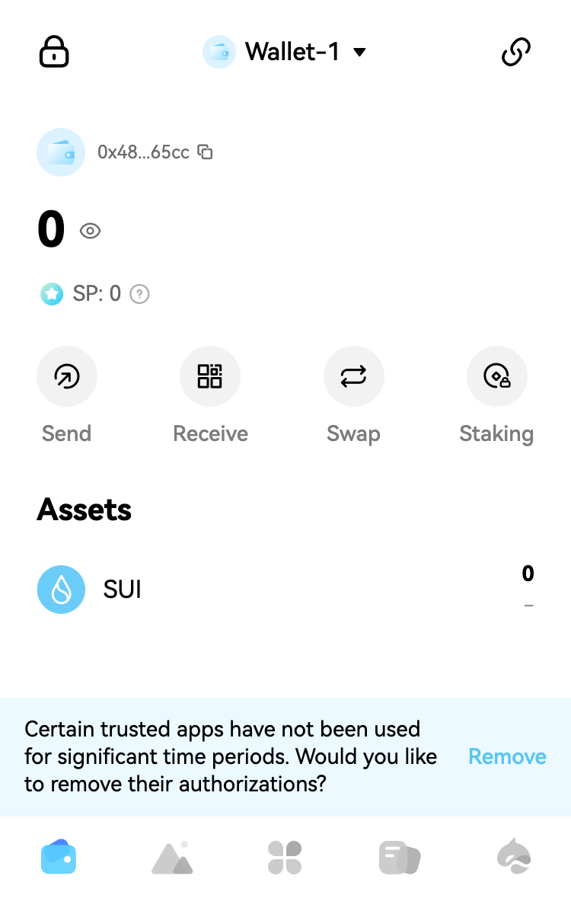
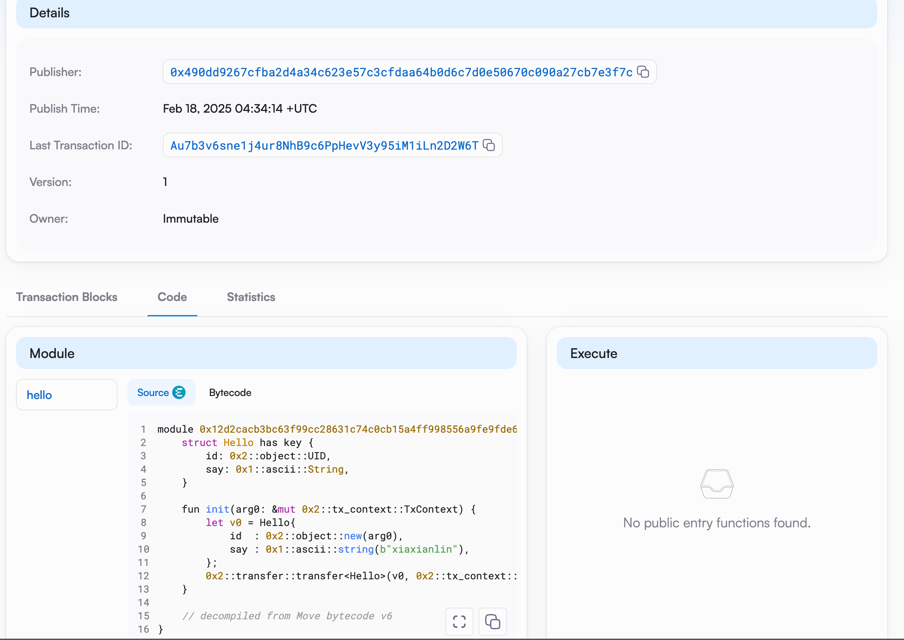
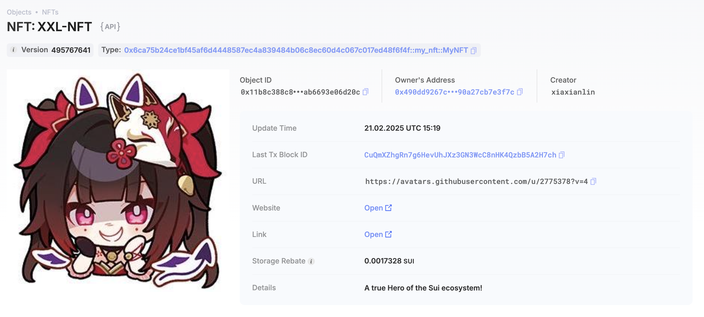

## 基本信息
- Sui钱包地址: `0x48f21c934406ce940fe743347c58b7f6392b08a03e2c22ebd3ec5d3fdfba65cc`
> 首次参与需要完成第一个任务注册好钱包地址才被合并，并且后续学习奖励会打入这个地址
- github: `xiaxianlin`

## 个人简介
- 工作经验: 13年
- 技术栈: `React` `NextJs` `Rust` `Python` `TypeScript`
> 重要提示 请认真写自己的简介
- 多年web2开发经验，对Move特别感兴趣，想通过Move入门区块链
- 联系方式: tg: `xiaxianlin` 

## 任务

##   01 hello move  
- [x] Sui cli version: `sui 1.42.2-homebrew`
- [x] Sui钱包截图: 
- [x] package id: 0x012d2cacb3bc63f99cc28631c74c0cb15a4ff998556a9fe9fde69002e78bb307
- [x] package id 在 scan上的查看截图:

##   02 move coin
- [x] My Coin package id : 0xf9896d706d2461eb997a42f53ef8ddcd1b77e622516ae95166e9cad1e102723e
- [x] Faucet package id : 0xf9896d706d2461eb997a42f53ef8ddcd1b77e622516ae95166e9cad1e102723e
- [x] 转账 `My Coin` hash: GH1DmrZdLdZLx4BMwUou1BLpYyyU1X3yGZHyja9M4dS7
- [x] `Faucet Coin` address1 mint hash: AfwzcFR9urcXU4os2PN5aGKrGHWobAHHuN9xzSssbUoC
- [x] `Faucet Coin` address2 mint hash: 4RPPV5MFEmkzzh7g2LJJdPz55AmpRn8iKxmnYmcd3N5g

##   03 move NFT
- [x] nft package id : 0x6ca75b24ce1bf45af6d4448587ec4a839484b06c8ec60d4c067c017ed48f6f4f
- [x] nft object id : 0x11b8c388c85ed229338be7587c90cb350f796ebcbf9c42bd25dab6693e06d20c
- [x] 转账 nft  hash: CuQmXZhgRn7g6HevUhJXz3GN3WcC8nHK4QzbB5A2H7ch
- [x] scan上的NFT截图:

mint 一个 nft 发送到地址: 0x7b8e0864967427679b4e129f79dc332a885c6087ec9e187b53451a9006ee15f2
transaction digest: GLnG3NrmScxNUy15FS9NUq6q2ZRDrULLvYh9mJbz69w

##   04 Move Game
- [x] game package id : 0xd1a4cf8923a99dda6ba6fffc9b3e4dc5384d8dbd0357fefc7692095ac55fee35
- [x] deposit Coin hash: 21GnyWQuPAFib3yM7pxrx9kpnfn1owVtY9QzuAzUgGfw
- [x] withdraw `Coin` hash: 2b4WAjuRdszz9PcG5ut2S1R68mkfBgWQY7iyjPkHTW2y
- [x] play game hash: 9HKAAY9c2ucQj6mAkxyrG9Jn7g9rAQshTgwGK8mYwodz

##   05 Move Swap
- [x] swap package id : 0x5241250d8a98503254c6d5faaccd787013c656728048c450828f0df0b3357d7a
- [x] call swap CoinA-> CoinB  hash : 7FHVTQF14dgpm2comUSNGe7dGKWfzSMHAGXkgfHTZxna
- [x] call swap CoinB-> CoinA  hash : aYe7UH9h5QBEqmJkaSN11dzZpFkwjPdhxDv8mZQrwAK

##   06 Dapp-kit SDK PTB
- [x] save hash : 6BhhP3ZER7bbJPW51VabXFmqHsyummXvRr2DuGHjnia4

##   07 Move CTF Check In
- [] CLI call 截图 : 
- [] flag hash :

##   08 Move CTF Lets Move
- [] proof : 
- [] flag hash :

