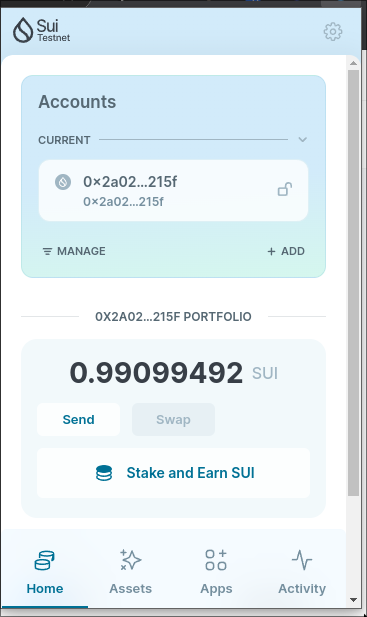
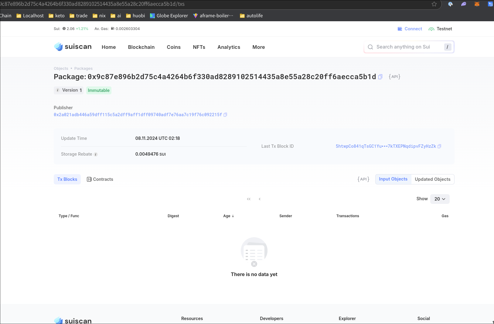
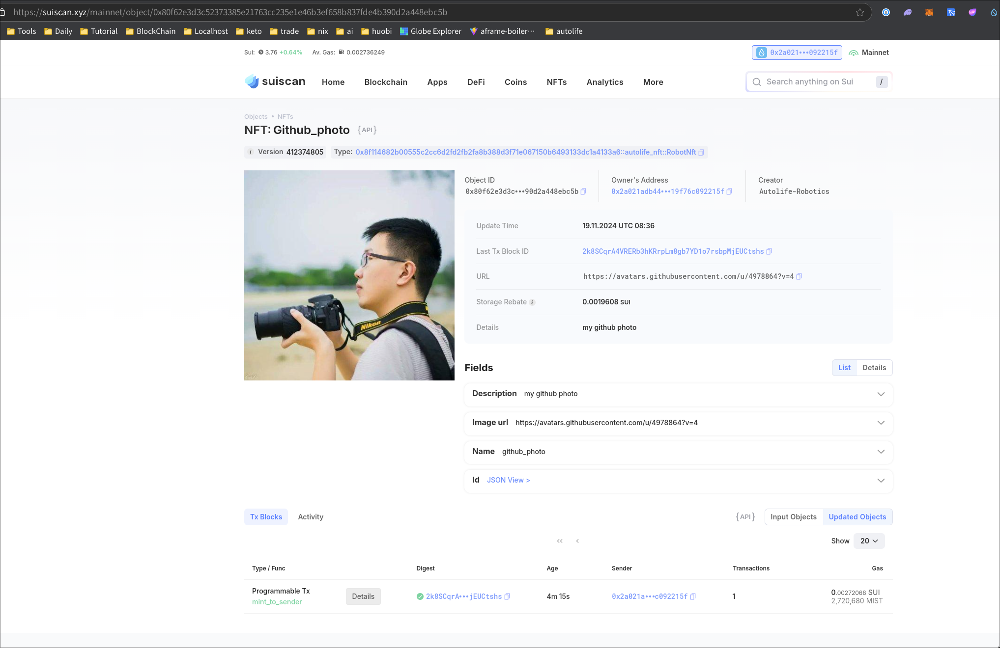
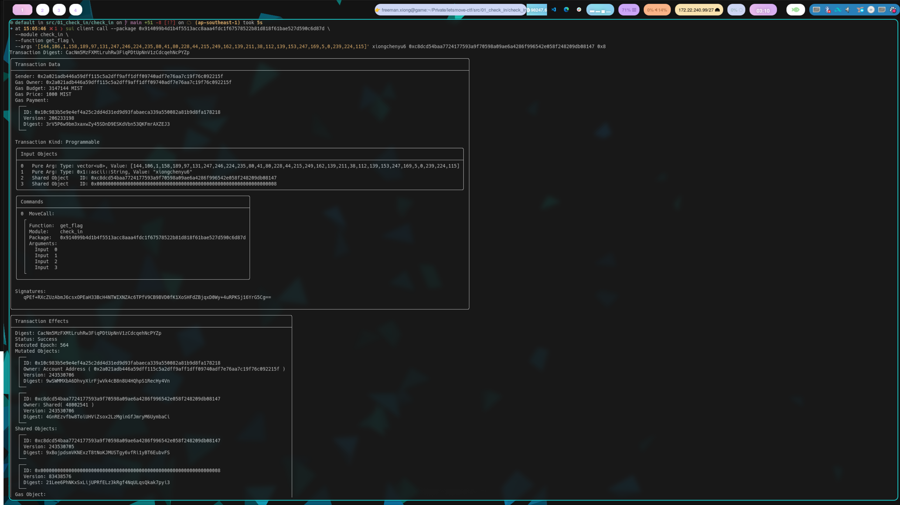
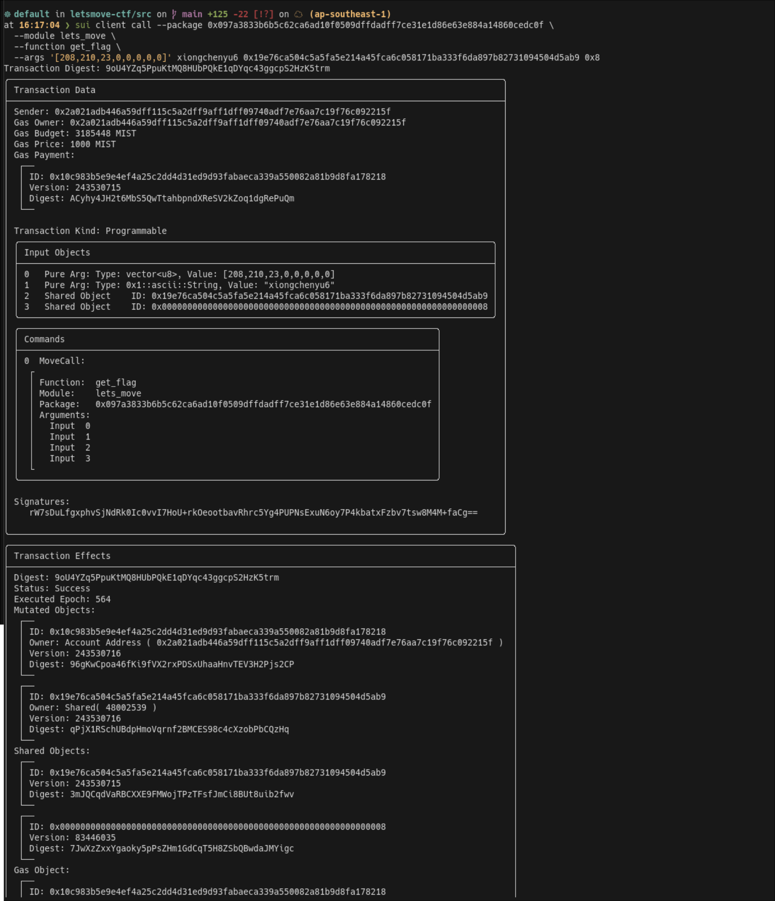

## 基本信息
- Sui钱包地址: `0x2a021adb446a59dff115c5a2dff9aff1dff09740adf7e76aa7c19f76c092215f`
> 首次参与需要完成第一个任务注册好钱包地址才被合并，并且后续学习奖励会打入这个地址
- github: `xiongchenyu6`

## 个人简介
- 工作经验: 8年
- 技术栈: `c/c++` `Java/Scala` `Haskell`
> 重要提示 请认真写自己的简介
- 多年钱包开发经验，对Sui感兴趣，想学习
- 联系方式: tg: `freemanX6` 

## 任务

## 01 hello move
- [x] Sui cli version: sui 1.37.1-7839b9501066
- [x] Sui钱包截图: 
- [x] package id:  0x9c87e896b2d75c4a4264b6f330ad8289102514435a8e55a28c20ff6aecca5b1d
- [x] package id 在 scan上的查看截图:

## 02 move coin

- [x] My Coin package id : 0x32de70fc2e92a7abddf1675afc56b37c5403a4a846d68de328c44d528450754e
- [x] Faucet package id : 0x32de70fc2e92a7abddf1675afc56b37c5403a4a846d68de328c44d528450754e
- [x] 转账 `My Coin` hash: EJBJZPbavFmXXxN8whgUMxHnWNbHKGjPFuCcbqR2kXPg
- [x] `Faucet Coin` address1 mint hash: EWKVnwGMxQxhQTGgFy7V5PP9XnAQqBm4qtNaZ3fdtzT9
- [x] `Faucet Coin` address2 mint hash: 6f5nFAjVYQUUJpW8Yvt8HM3VDWJ1XRvjPUGeoSvmC4fN

## 03 move NFT

- [x] nft package id : 0x8f114682b00555c2cc6d2fd2fb2fa8b388d3f71e067150b6493133dc1a4133a6
- [x] nft object id : 0x80f62e3d3c52373385e21763cc235e1e46b3ef658b837fde4b390d2a448ebc5b
- [x] 转账 nft hash: 7bLrDV4GVAM1niBEQ19Tz4ZB8u1XytdhzNYoUw9C2KWm
- [x] scan 上的 NFT 截图:

## 04 Move Game

- [x] game package id : 0x3fd9c2ff46850b9bdf4695b0da6e79e912095c9cb34976c16d8e8221895c439a
- [x] deposit Coin hash: 6SQrfU3LGLrhmXZNbMfb71jAfkPwksjAPGU7K9hMLUXL
- [x] withdraw `Coin` hash: DSHjboMZdQYdVbt2d6FVa4mYM7QBSERHecsB2KUJXUVH
- [x] play game hash: 8nr8rLEVPatAvYdRDsfkq1kbqdYYYES4mWJEvMX2qDnK

## 05 Move Swap

- [x] swap package id : 0x90a3c9dfde7b36a761dbf1a7630c4a3eb5c32d925a40d1363fcd776fbe044054
- [x] call swap CoinA-> CoinB hash : 3bAqJCAwx8VQtRAYucXiiiVxMRZ9DUoZWsia8RqYdRYX
- [x] call swap CoinB-> CoinA hash : J5zSow7Xz1BU1HpzGVsGLTiB8VZzNVDJE4ffvXwi3eP2

## 06 Dapp-kit SDK PTB

- [x] save hash : CEHn1tfbbxKEGcNgH74LbU1J8RBWh6osTDjM6yDBuPLt

## 07 Move CTF Check In

- [x] CLI call 截图 : 
- [x] flag hash : CacNm5MzFXMtLruhRw3FiqPDtUpNnV1zCdcqehNcPYZp

## 08 Move CTF Lets Move

- [x] CLI call 截图 : 
- [x] proof : [208,210,23,0,0,0,0,0] : vec<u8>
- [x] flag hash : 9oU4YZq5PpuKtMQ8HUbPQkE1qDYqc43ggcpS2HzK5trm
