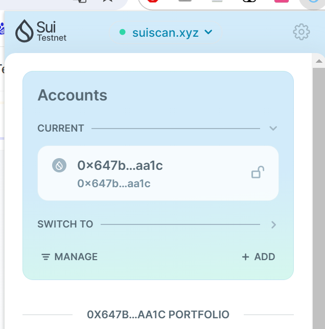

## 基本信息
- Sui钱包地址: `0x647bcc114e0e88810141e47346bdc0db47e2edba995d6a862e1f6246a4c2aa1c`
> 首次参与需要完成第一个任务注册好钱包地址才被合并，并且后续学习奖励会打入这个地址
- github: `xjh1996`

## 个人简介
- 工作经验: 6年
- 技术栈: `Golang`
> 重要提示 请认真写自己的简介
- 多年云计算开发经验，希望通过move学习sui链生态
- 联系方式: 710804429@163.com

## 任务

##   01 hello move  
- [x] Sui cli version: 1.29.0-1bc3c6996246
- [x] Sui钱包截图: 
- [x] package id: 0x6b1121f176660eda5f9882428d292ce56d963a05be9bda338923891ef2b624d7
- [x] package id 在 scan上的查看截图:

##   07 Move CTF Check In
- [] CLI call 截图 : 
- [] flag hash : 3UzmBpwFGpCQUgGgfDQ9y5MQxVjmAdirU5yJ1M3Bst3z

##   08 Move CTF Lets Move
- [x] proof : 17134936
- [x] flag hash : E8xZuxvbqLHJACgSmugpe5sz3Uwdp25mgo1dEA8VWZP6