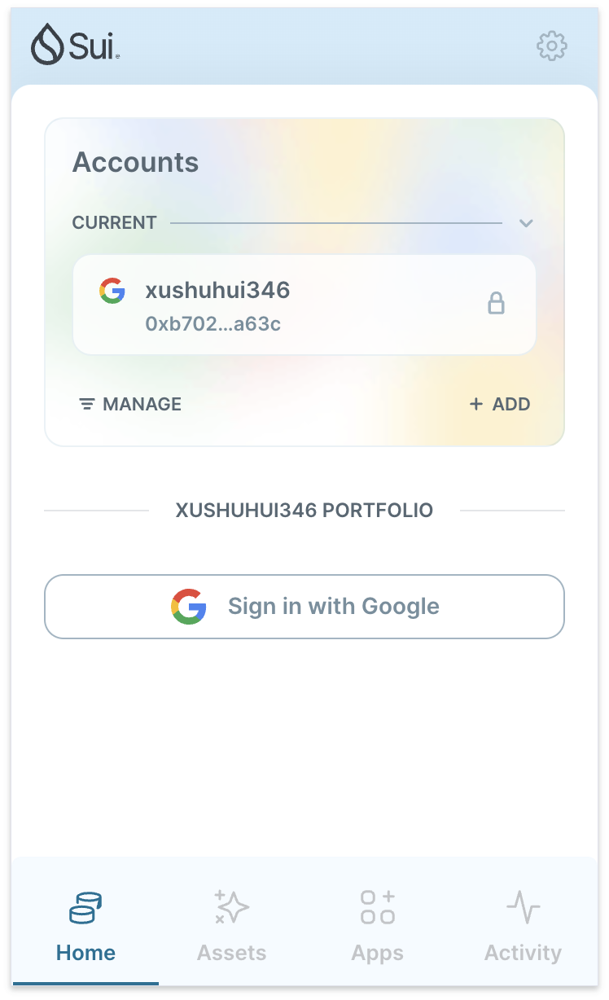
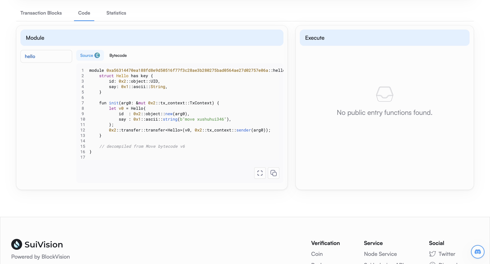
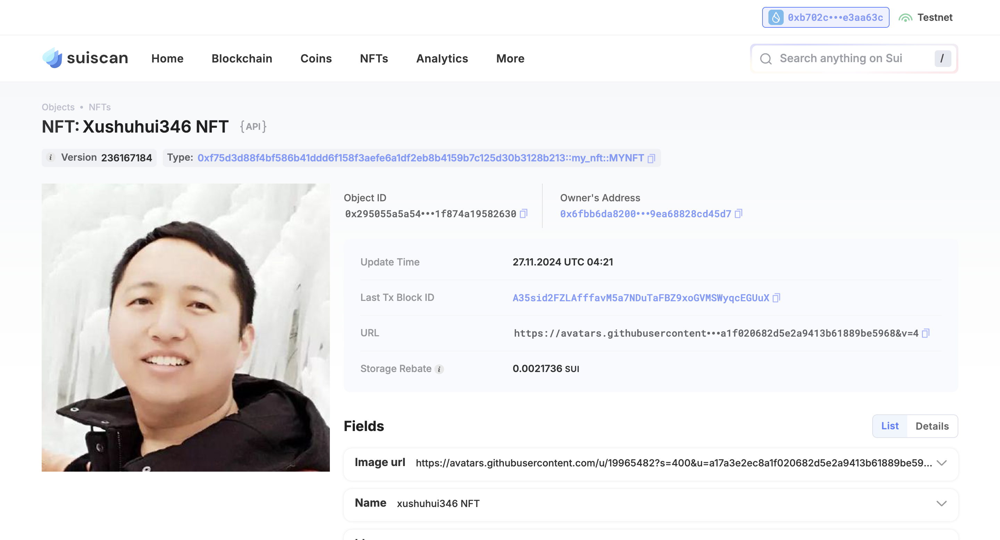

## 基本信息
- Sui钱包地址: `0xb702c5d5ec177c6fb7231d7a6bf4bba2f21459d4cf702a5c0b225fb60e3aa63c`
> 首次参与需要完成第一个任务注册好钱包地址才被合并，并且后续学习奖励会打入这个地址
- github: `xushuhui346`

## 个人简介
- 工作经验: 7年
- 技术栈: `JavaScript` `Html`
> 重要提示 请认真写自己的简介
- 多年web2开发经验，对Move特别感兴趣，想通过Move入门区块链
- 联系方式: wechat: `xushuhui346` 

## 任务

##   01 hello move  
- [x] Sui cli version: sui 1.37.3-homebrew
- [x] Sui钱包截图: 
- [x] package id: 0xa56314470ea188fd8e9d50516f77f3c28ae3b280275bad0564ae27d02757e06a
- [x] package id 在 scan上的查看截图:

##   02 move coin
- [x] My Coin package id : 0x6cacf9be08f4596ab5c3994c77b07079097f998051f870b7e363ca76fa2de1f3
- [x] Faucet package id : 0xba25083098777ce51d0038060e6e46df98253da0249dc1ff7d273bc95de83a71
- [x] 转账 `My Coin` hash: 5763XRkeGej6rMRTi5i3iDoGw5NMHNcGCR8CUsgao5ho
- [x] `Faucet Coin` address1 mint hash:9eMvFmRyymveRytRBnLPRFwCMKb4oPw7HyWviak6Dcux
- [x] `Faucet Coin` address2 mint hash:FiuERVYA5YFg8BkYQE2F7sRsyqDshFka1cbFUS3pp68o

##   03 move NFT
- [x] nft package id : 0xf75d3d88f4bf586b41ddd6f158f3aefe6a1df2eb8b4159b7c125d30b3128b213
- [x] nft object id : 0x295055a5a543dfe6ec415ef7429b0aee9dd759c60c802de0df1f874a19582630
- [x] 转账 nft  hash: 5vovzg66CYxmjmGm1PDF6WBWFWyedBVHvUKXBqFaqrxk
- [x] scan上的NFT截图:

##   04 Move Game
- [] game package id :
- [] deposit Coin hash:
- [] withdraw `Coin` hash:
- [] play game hash:

##   05 Move Swap
- [] swap package id :
- [] call swap CoinA-> CoinB  hash :
- [] call swap CoinB-> CoinA  hash :

##   06 Dapp-kit SDK PTB
- [] save hash :

##   07 Move CTF Check In
- [] CLI call 截图 : 
- [] flag hash :

##   08 Move CTF Lets Move
- [] proof : 
- [] flag hash :

