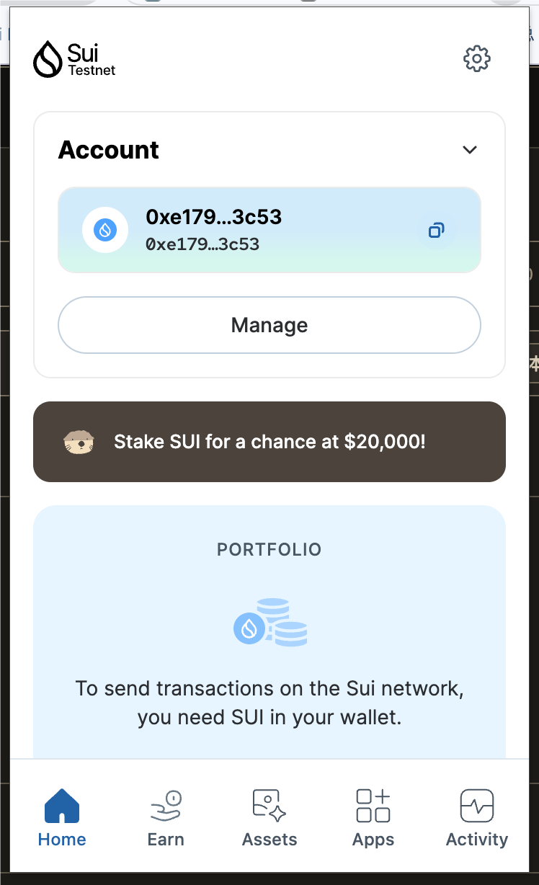
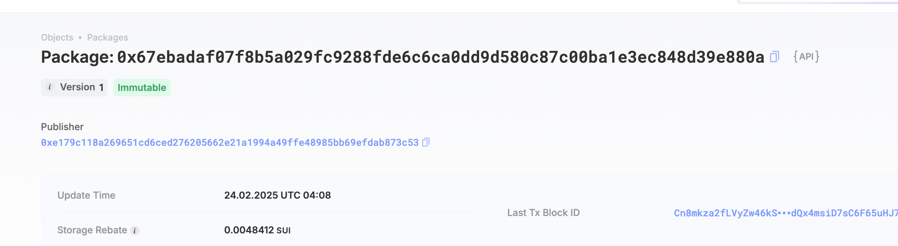

## 基本信息
- Sui钱包地址: `0xe179c118a269651cd6ced276205662e21a1994a49ffe48985bb69efdab873c53`
> 首次参与需要完成第一个任务注册好钱包地址才被合并，并且后续学习奖励会打入这个地址
- github: `xwxb`

## 个人简介
- 工作经验: 一年
- 技术栈: `Go` 
> 重要提示 请认真写自己的简介
- 介绍：将要步入工作的大学生，互联网公司一年实习经历，自学两年后端技术。毕设预期做web3相关的，所以也是想在这里学习一些相关知识。
- 联系方式: tg: `XBleach` 

## 任务

##   01 hello move  
- [] Sui cli version: sui 1.41.0-homebrew
- [] Sui钱包截图: 
- [] package id: 0x520abf364806a9724eca10b2e018fffc8dee5cbceba54f010f8d8b7a3127e5f3
- [] package id 在 scan上的查看截图:

##   02 move coin
- [] My Coin package id : 
- [] Faucet package id : 
- [] 转账 `My Coin` hash:
- [] `Faucet Coin` address1 mint hash:
- [] `Faucet Coin` address2 mint hash:

##   03 move NFT
- [] nft package id :
- [] nft object id : 
- [] 转账 nft  hash:
- [] scan上的NFT截图:

##   04 Move Game
- [] game package id :
- [] deposit Coin hash:
- [] withdraw `Coin` hash:
- [] play game hash:

##   05 Move Swap
- [] swap package id :
- [] call swap CoinA-> CoinB  hash :
- [] call swap CoinB-> CoinA  hash :

##   06 Dapp-kit SDK PTB
- [] save hash :

##   07 Move CTF Check In
- [] CLI call 截图 : 
- [] flag hash :

##   08 Move CTF Lets Move
- [] proof : 
- [] flag hash :

