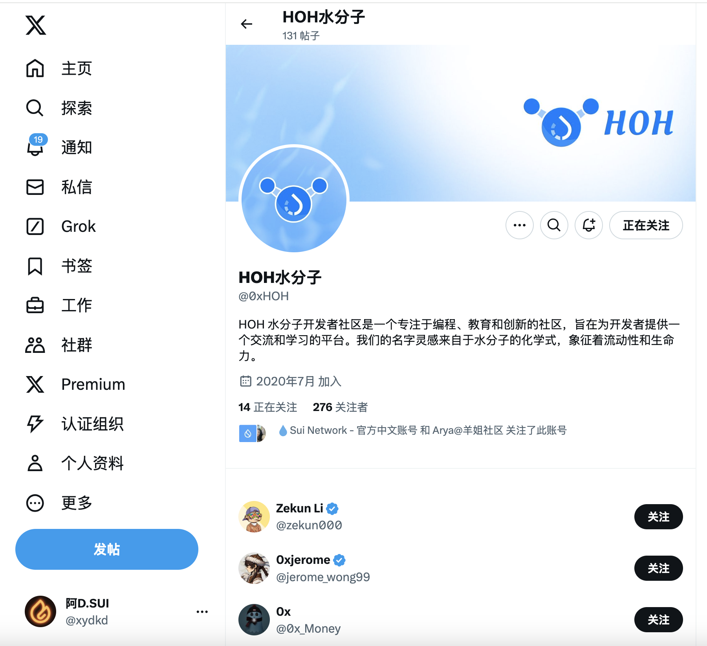
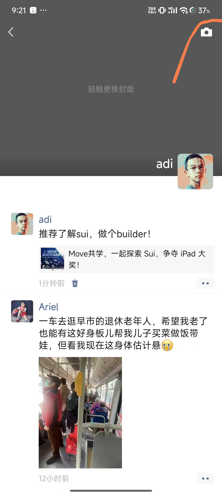

## 基本信息
- Sui钱包地址: `0x2a640aebe471137a341a904fcc9bf70b9de8475d448d44e3c522c66ffdd72651`
> 首次参与需要完成第一个任务注册好钱包地址才被合并，并且后续学习奖励会打入这个地址
- github: `xydkd`

## 个人简介
- 工作经验: 7年
- 技术栈: `python`
> 重要提示 请认真写自己的简介
- 大部分工作经历是消费信贷行业的产品经理,接触到web3后尝试通过代码了解生态,希望能够得到新的机会
- 联系方式: tg: `https://t.me/xydkd` 

## b站，推特关注

- [x] b站，推特关注截图: 

## 为共学营宣传（在朋友圈或者群聊中转发海报/文章）

- [x] 宣传截图:

## 每周课程学习

- [x] 第一周:
- [x] 第二周:
- [] 第三周:
- [] 第四周:

## 参加直播答疑

- [] 第一周:
- [x] 第二周:
- [] 第三周:
- [] 第四周:

## 群里分享学习笔记

- [] 第一篇笔记
- [] 第二篇笔记
- [] 第三篇笔记
- [] 第四篇笔记

## 对外输出学习笔记

- [] 第一篇笔记【学习笔记链接】
- [] 第二篇笔记【学习笔记链接】
- [] 第三篇笔记【学习笔记链接】
- [] 第四篇笔记【学习笔记链接】

## 在HOH社区公众号发布自己的技术文章

- [] 第一篇笔记【公众号文章链接】
- [] 第二篇笔记【公众号文章链接】
- [] 第三篇笔记【公众号文章链接】
- [] 第四篇笔记【公众号文章链接】

## 直播分享学习技巧/工具推荐

- [] 会议截图:

## 提交项目

- [x] 项目提交

## 任务

##   01 hello move  
- [x] sui 1.37.1-7839b9501066
- [x] Sui钱包截图: 
- [x] package id: 0x6bdd353ddc9ac4234f9445fa32c66dfcd5b1da5070c7a22ee7e7ca86e6bac0c4
- [x] package id 在 scan上的查看截图:

##   02 move coin
- [x] My Coin package id : 0x136f02ff814bb100b4d39d0dae658272183d1c9ca1142368a7c3ce0f0386a365
- [x] Faucet package id : 0x136f02ff814bb100b4d39d0dae658272183d1c9ca1142368a7c3ce0f0386a365
- [x] 转账 `My Coin` hash:0xd76958539ca96b5c72935ddc62d69a6c5c5417f52b8a7d50f990ca3a2af043d4
- [x] `Faucet Coin` address1 mint hash:0x116de4b85d7f47d098bf4ad26c10e1c84bc8ce2014d8983bdd2402715c5f575a
- [x] `Faucet Coin` address2 mint hash:0x32301b58242d2ca99a61dd774e27e41eebb26b52a515a3a6c119737483310dfd

##   03 move NFT
- [] nft package id :
- [] nft object id : 
- [] 转账 nft  hash:
- [] scan上的NFT截图:

##   04 Move Game
- [] game package id :
- [] deposit Coin hash:
- [] withdraw `Coin` hash:
- [] play game hash:

##   05 Move Swap
- [] swap package id :
- [] call swap CoinA-> CoinB  hash :
- [] call swap CoinB-> CoinA  hash :

##   06 Dapp-kit SDK PTB
- [] save hash :

##   07 Move CTF Check In
- [] CLI call 截图 : 
- [] flag hash :

##   08 Move CTF Lets Move
- [] proof : 
- [] flag hash :
