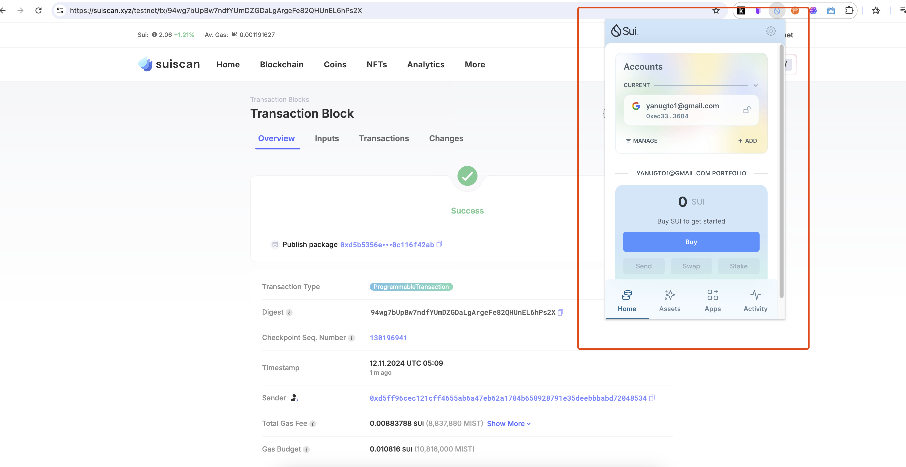
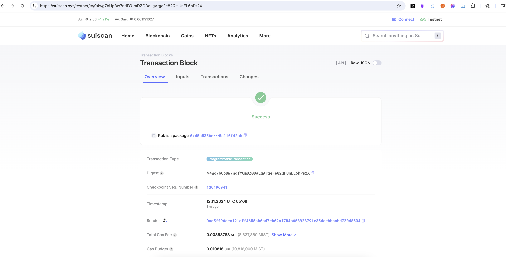
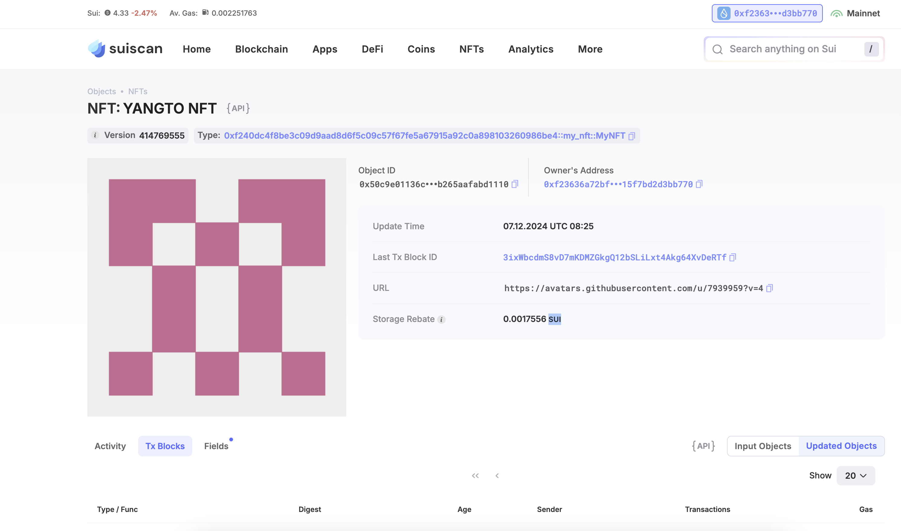

## 基本信息
- Sui钱包地址: `0xf23636a72bf155e155d27d25f1dbefbb68e441a22c480222f015f7bd2d3bb770`
> 首次参与需要完成第一个任务注册好钱包地址才被合并，并且后续学习奖励会打入这个地址
- github: `yanugto`

## 个人简介
- 工作经验: 5年
- 技术栈: `node` `java` `php`
> 重要提示 多年web2后端开发经验，对区块链感兴趣，希望可以学习到更多区块链知识
- 联系方式: tg: `无` 

## 任务

##   01 hello move  
- [x] Sui cli version: sui 1.37.2-102280ae7591
- [x] Sui钱包截图: 
- [x] package id: 94wg7bUpBw7ndfYUmDZGDaLgArgeFe82QHUnEL6hPs2X
- [x] package id 在 scan上的查看截图:

##   02 move coin
- [X] My Coin package id : 0x1f85ccfd317c2269b82562acd752f6f339d490f50e09cdc4444d7f54ff4fd875
- [X] Faucet package id : 0x1f85ccfd317c2269b82562acd752f6f339d490f50e09cdc4444d7f54ff4fd875
- [X] 转账 `My Coin` hash: H7RUb6qJxj5d6jjr5E5es1B8Jmbbnf2HRJV6xecX5LM9
- [X] `Faucet Coin` address1 mint hash: ErhbpemnyQ4KZC6gKgopu7St7yweVhiAQBsEMHnqpAeN
- [X] `Faucet Coin` address2 mint hash: 3dGG3DBhAakGF1nL3v9xLQ3GSL7pmKnHVzbH9wrNGiSq

##   03 move NFT
- [x] nft package id : 0xf240dc4f8be3c09d9aad8d6f5c09c57f67fe5a67915a92c0a898103260986be4
- [x] nft object id : 0x50c9e01136c2a0ee698190bfef61a044f7ab8f539af854679bb265aafabd1110
- [x] 转账 nft  hash: 2Sjo79qiyiVDJeFBsBpxtBQXAgaCEQayeQoVtabhLriU 
- [x] scan上的NFT截图:

##   04 Move Game
- [x] game package id : 0xbdc0241b35ec6f43475c6e56880471ded3cfbfbdc1abe6d7c3756b0d5240b839
- [x] deposit Coin hash: EA6jkLhHH5odRTqGv5sBdBDZ4RKne6CJ7mnSQUwLxTW4
- [x] withdraw `Coin` hash: FgAiL2qUJe3MoxjHndUMGAMUGqLvSs4AbZR7AVk1qT1c
- [x] play game hash: E5F63yRGgeDWiCR7Xu5eUKaezwLDgAdnvVs9jdNy1xk4

##   05 Move Swap
- [] swap package id :
- [] call swap CoinA-> CoinB  hash :
- [] call swap CoinB-> CoinA  hash :

##   06 Dapp-kit SDK PTB
- [] save hash :

##   07 Move CTF Check In
- [] CLI call 截图 : 
- [] flag hash :

##   08 Move CTF Lets Move
- [] proof : 
- [] flag hash :
