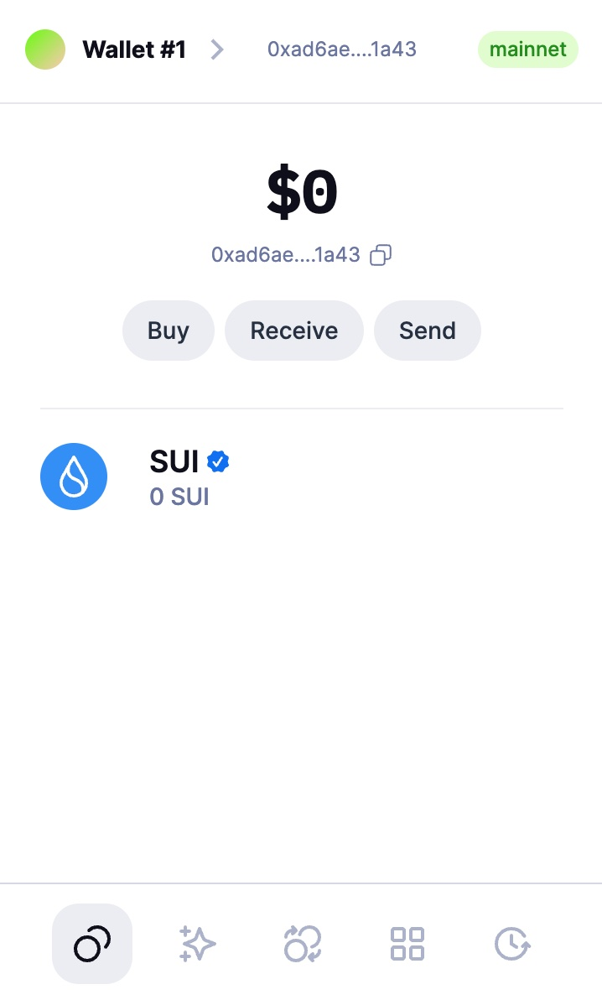
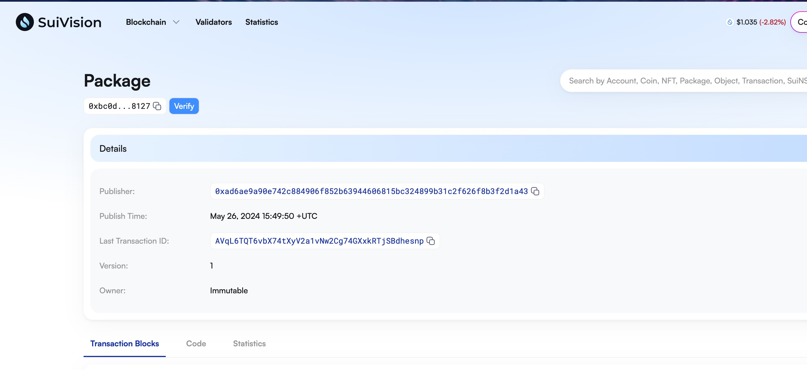
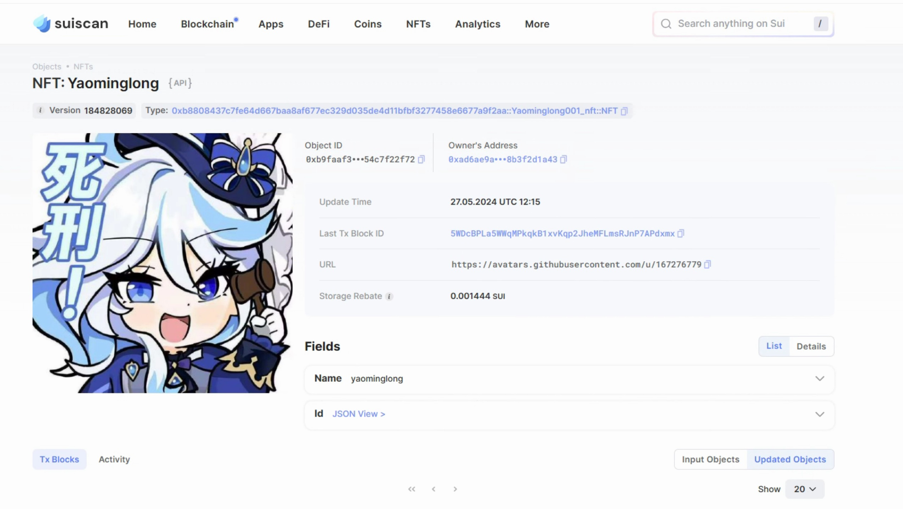

## 基本信息
- Sui钱包地址: `0xad6ae9a90e742c884906f852b63944606815bc324899b31c2f626f8b3f2d1a43`
> 首次参与需要完成第一个任务注册好钱包地址才被合并，并且后续学习奖励会打入这个地址
- github: `yaominglong001`

## 个人简介
- 工作经验: 1年
- 技术栈: `Python`
> 重要提示 请认真写自己的简介
- python & ts 用户，对Move特别感兴趣，想通过Move入门区块链
- 联系方式: tg: `none` 

## 任务

##   01 hello move  
- [x] Sui cli version: 1.25.1
- [x] Sui钱包截图: 
- [x] package id:  `0xbc0d506d085d31917b7416923eb9c19e98750098fff5113ba62911756c258127`  
- [x] package id 在 scan上的查看截图:

##   02 move coin
- [x] My Coin package id : `0x2dbd6e3eddfd792695e9da3beb1519f09cd8f3671fc2159a25eaf3210a73fe5f`
- [x] Faucet package id : `0x2dbd6e3eddfd792695e9da3beb1519f09cd8f3671fc2159a25eaf3210a73fe5f`
- [x] 转账 `My Coin` hash: `4HYiZmS6CEn7qQpyitE1GeqWva17ZgBiskNTtVCFw4Tq`
- [x] `Faucet Coin` address1 mint hash: `sHe245LZYWX8FLyZfe22jC4B2edps5Xvq9eoh5EEaU8iV`
- [x] `Faucet Coin` address2 mint hash: `EZiEdZvHWV4KJrhbHFjVBpsfUD8PBDifKfFXLjMxcSin`

##   03 move NFT
- [x] nft package id : `0xb8808437c7fe64d667baa8af677ec329d035de4d11bfbf3277458e6677a9f2aa`
- [x] nft object id :  `0xb9faaf32425cceb31c738eac6e3c3fdf0453017e50186ffca9f52c54c7f22f72`
- [x] 转账 nft  hash:   `25ossVvh9CdanZ9RRDrGSXa4pq5nCtEFBuXsRDDGG1iE`
- [x] scan上的NFT截图:

##   04 Move Game
- [x] game package id :  `0xdc26d4bb1c3e67ce33af2eee2265d5899ebdecc15c299df2a6d198559f280536`
- [x] deposit Coin hash: `C7n74CAWKotuxU3tXukBf2WBfyewbqBPt2nCtFQkU12E`
- [x] withdraw `Coin` hash: `7QECNN9oPWoVkwSXoBBx6vQqW8BnPpW374mz8J3tHGrH`
- [x] play game hash: `3fCzmzUpQnKZxUgeNLT5TQT8vVNVR7fqXJzQZtQGtdfi`

##   05 Move Swap
- [x] swap package id : `0x239138cc55902a15360ee3198f610031adb858da2d4ce458100bb9d00cc6907e`
- [x] call swap CoinA-> CoinB  hash : `Z3XQti2tfdVdM14MCwPufZyxjyPEKRdSwuiJys6RXyZ`
- [x] call swap CoinB-> CoinA  hash : `GVs5kYXJasGkpSog8B8zpb5k4twa5EaS7KMjVFLEbXFS`

##   06 Dapp-kit SDK PTB
- [x] save hash : `WMQYcGTQSZu6PAVuUCujvQYakCsRTwKU38YhbcbQtRu`