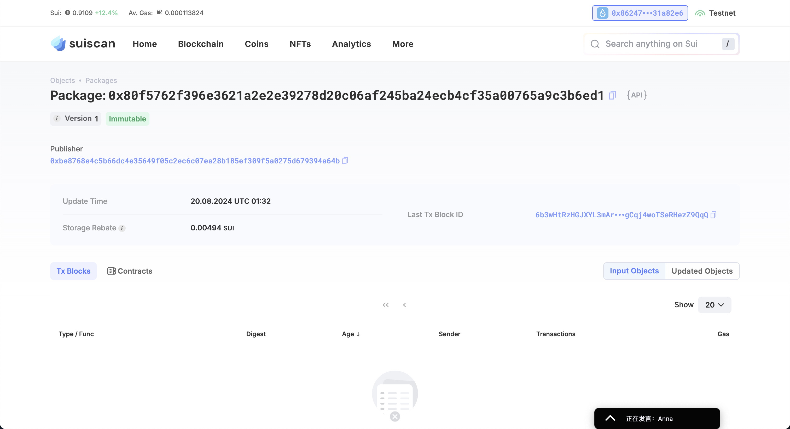
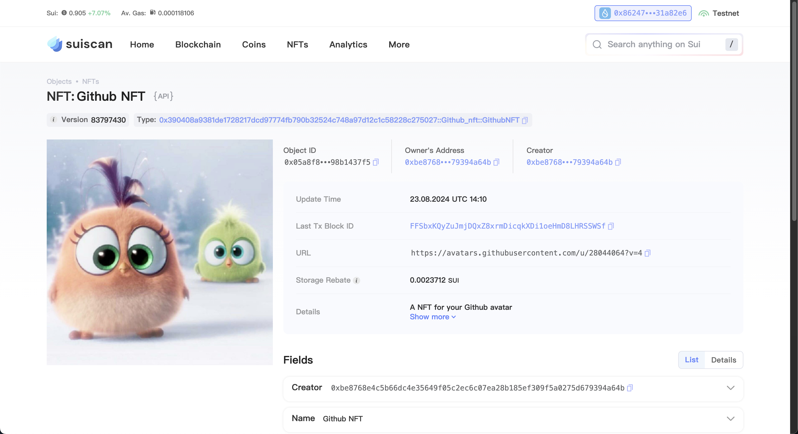

<!--
 * @Author: yaoxingpu yaoxpu@163.com
 * @Date: 2024-08-20 09:03:47
 * @LastEditors: yaoxingpu yaoxpu@163.com
 * @LastEditTime: 2024-08-23 22:26:12
 * @FilePath: /letsmove/mover/yaoxingpu/readme.md
 * @Description: 
 * 
-->
## 基本信息

- Sui钱包地址: `0x86247801438f74e556a2bf5707648a3b619735e7c9600ed5b482163f931a82e6`

> 首次参与需要完成第一个任务注册好钱包地址才被合并，并且后续学习奖励会打入这个地址

- github: `yaoxingpu`

## 个人简介

- 工作经验: 7年
- 技术栈: `vue`

> 重要提示 请认真写自己的简介

- 多年web2开发经验，对Move特别感兴趣，想通过Move入门区块链
- 联系方式: tg: `allen_8605`

## 任务

## 01 hello move  

- [x] Sui cli version: sui 1.30.3-homebrew
- [x] Sui钱包截图: 
- [x] package id: 0x80f5762f396e3621a2e2e39278d20c06af245ba24ecb4cf35a00765a9c3b6ed1
- [x] package id 在 scan上的查看截图:

## 02 move coin

- [x] My Coin package id : 0x39f9dcffd3ef96aa71be39a9a5a8b73b521bedf409ff1d50786d00a5d3f30818
- [x] Faucet package id : 0xa84acc78cc58152e1cad950eee945c0b30e8c871e31116eb60037407ba5922fc
- [x] 转账 `My Coin` hash: 75WJnqpQsUMKvarC6qzvzybyFWitmZqjpPWFCJwe2BpZ
- [x] `Faucet Coin` address1 mint hash: HMmwYCLKK7EB7b5xVtjjU4ZCf4NX8KTSdv9oo21CSDBN
- [x] `Faucet Coin` address2 mint hash: 97BE7pA7rhY3oMyatUNpWmtyQbKaES5ABt5vGzBCSzyN

## 03 move NFT

- [x] nft package id : 0x390408a9381de1728217dcd97774fb790b32524c748a97d12c1c58228c275027
- [x] nft object id : 0x9f21393ec9fb52c985039a335dd5c160fb9be37d8c90211bfea6cb89466cc8a6
- [x] 转账 nft  hash: FFSbxKQyZuJmjDQxZ8xrmDicqkXDi1oeHmD8LHRSSWSf
- [x] scan上的NFT截图:

## 04 Move Game

- [] game package id :
- [] deposit Coin hash:
- [] withdraw `Coin` hash:
- [] play game hash:

## 05 Move Swap

- [] swap package id :
- [] call swap CoinA-> CoinB  hash :
- [] call swap CoinB-> CoinA  hash :

## 06 Dapp-kit SDK PTB

- [] save hash :

## 07 Move CTF Check In

- [] CLI call 截图 : 
- [] flag hash :

## 08 Move CTF Lets Move

- [] proof :
- [] flag hash :
