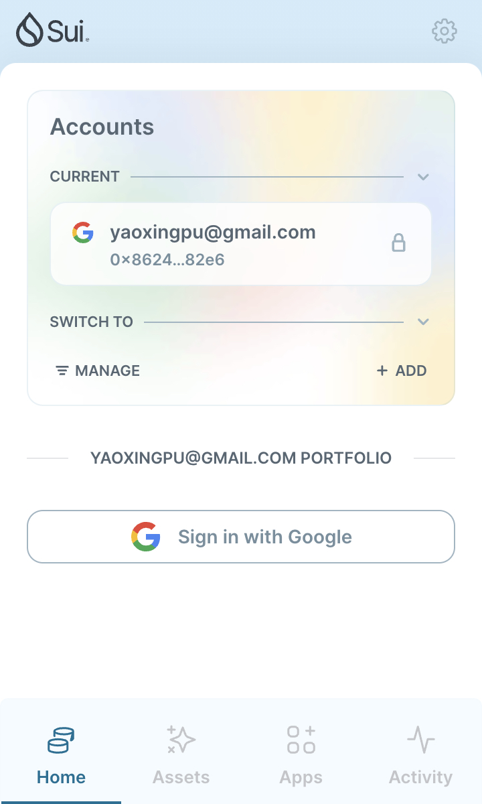

<!--
 * @Author: yaoxingpu yaoxpu@163.com
 * @Date: 2024-08-20 09:03:47
 * @LastEditors: yaoxingpu yaoxpu@163.com
 * @LastEditTime: 2024-08-20 09:35:41
 * @FilePath: /letsmove/mover/yaoxingpu/readme.md
 * @Description: 
 * 
-->
## 基本信息
- Sui钱包地址: `0x86247801438f74e556a2bf5707648a3b619735e7c9600ed5b482163f931a82e6`
> 首次参与需要完成第一个任务注册好钱包地址才被合并，并且后续学习奖励会打入这个地址
- github: `yaoxingpu`

## 个人简介
- 工作经验: 7年
- 技术栈: `vue` 
> 重要提示 请认真写自己的简介
- 多年web2开发经验，对Move特别感兴趣，想通过Move入门区块链
- 联系方式: tg: `allen_8605` 

## 任务

##   01 hello move  
- [x] Sui cli version: sui 1.30.3-homebrew
- [x] Sui钱包截图: 
- [x] package id: 0x80f5762f396e3621a2e2e39278d20c06af245ba24ecb4cf35a00765a9c3b6ed1
- [x] package id 在 scan上的查看截图:

##   02 move coin
- [] My Coin package id : 
- [] Faucet package id : 
- [] 转账 `My Coin` hash:
- [] `Faucet Coin` address1 mint hash:
- [] `Faucet Coin` address2 mint hash:

##   03 move NFT
- [] nft package id :
- [] nft object id : 
- [] 转账 nft  hash:
- [] scan上的NFT截图:

##   04 Move Game
- [] game package id :
- [] deposit Coin hash:
- [] withdraw `Coin` hash:
- [] play game hash:

##   05 Move Swap
- [] swap package id :
- [] call swap CoinA-> CoinB  hash :
- [] call swap CoinB-> CoinA  hash :

##   06 Dapp-kit SDK PTB
- [] save hash :

##   07 Move CTF Check In
- [] CLI call 截图 : 
- [] flag hash :

##   08 Move CTF Lets Move
- [] proof : 
- [] flag hash :
