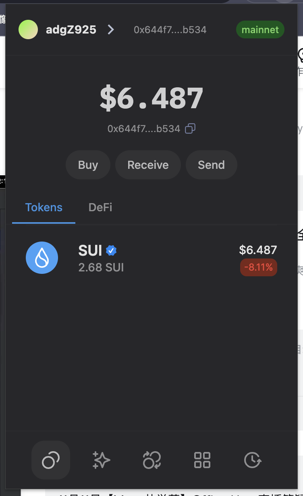
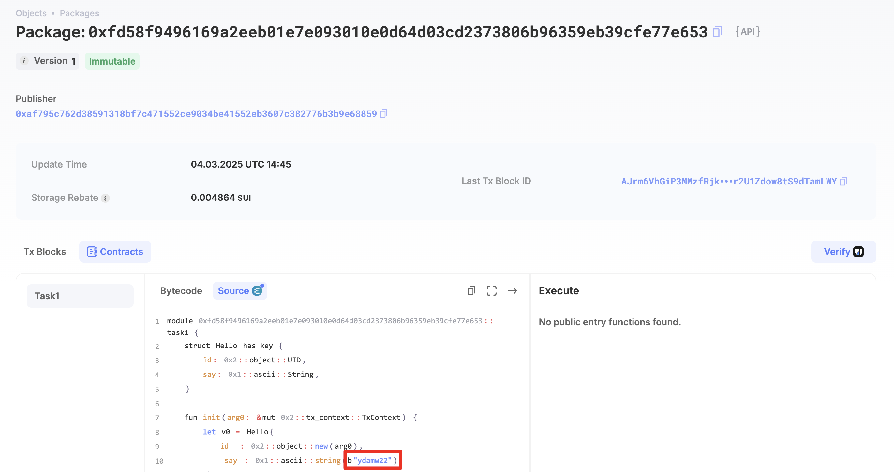
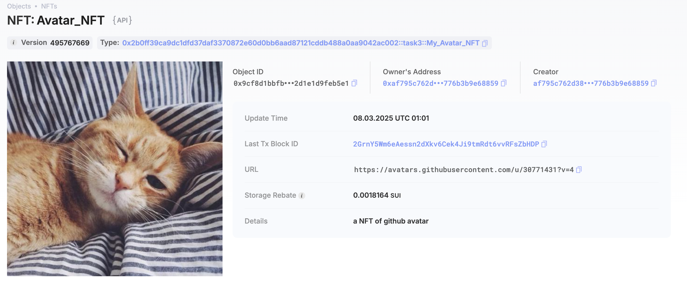

## 基本信息
- Sui钱包地址: `0x644f7071dbf69b51130ea131e43760753ec11eb92078d24d087505639e70b534`
> 首次参与需要完成第一个任务注册好钱包地址才被合并，并且后续学习奖励会打入这个地址
- github: `ydamw22`

## 个人简介
- 工作经验: 5年
- 技术栈: `javaScript`
> 重要提示 请认真写自己的简介
- 菜鸟一个，会vue+js，react会一点，在学web3
- 联系方式: tg: ``

## 任务

##   01 hello move
- [x] Sui cli version: sui 1.43.0-bd272b07244d
- [x] Sui钱包截图: 
- [x] package id:  0xfd58f9496169a2eeb01e7e093010e0d64d03cd2373806b96359eb39cfe77e653
- [x] package id 在 scan上的查看截图:

##   02 move coin
- [x] My Coin package id : 0x7bf8b3f969a6964569a3664c8d82c7495203272a81d5ec7c7ea62d2a3d001af8
- [x] Faucet package id :  0x7bf8b3f969a6964569a3664c8d82c7495203272a81d5ec7c7ea62d2a3d001af8
- [x] 转账 `My Coin` hash: E9m8u8cMiCb79N37M8ZzxoTYNvmAMUUTHXiGCSYTC9qh
- [x] `Faucet Coin` address1 mint hash:  GEzTxJXjx7pnpj4XJkdY8mWXCdS4wwoKbCvvWnDiAuMK
- [x] `Faucet Coin` address2 mint hash:  64rpQorPB9xLgheLaSt3iRKmRwPfTWuJrNFR1AKKKdK

##   03 move NFT
- [x] nft package id :  0x2b0ff39ca9dc1dfd37daf3370872e60d0bb6aad87121cddb488a0aa9042ac002
- [x] nft object id : 0x9cf8d1bbfb7ad2b55f859026035316577089eca73e2a6b3bd3e2d1e1d9feb5e1
- [x] 转账 nft  hash: EPv4v2BBZWg9cnbZzLizfPyiYVMmBEtqPwDouT6jtaU5
- [x] scan上的NFT截图:

##   04 Move Game
- [x] game package id : 0x60b2e8e63d77b8e743f6a4496cdadcc1e48a60ca1f680d459b54696703b144eb
- [x] deposit `Coin` hash:  FencnEq7rAnpGiLee4Az3BSnGATkG8JkKfQkdWVMcEEz
- [x] withdraw `Coin` hash: H7TfDuGDS2BL3UazzucFwYcihR4hqz3p1LJo3jix5jxW
- [x] play game hash: CRtYRb8gk82famB9RKg2Y6fkhJvQHTf8p6WoJvfKcJWe

##   05 Move Swap
- [] swap package id :
- [] call swap CoinA-> CoinB  hash :
- [] call swap CoinB-> CoinA  hash :

##   06 Dapp-kit SDK PTB
- [] save hash :

##   07 Move CTF Check In
- [] CLI call 截图 : 
- [] flag hash :

##   08 Move CTF Lets Move
- [] proof : 
- [] flag hash :

