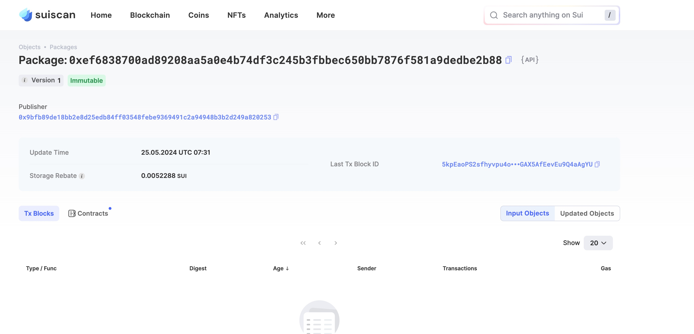
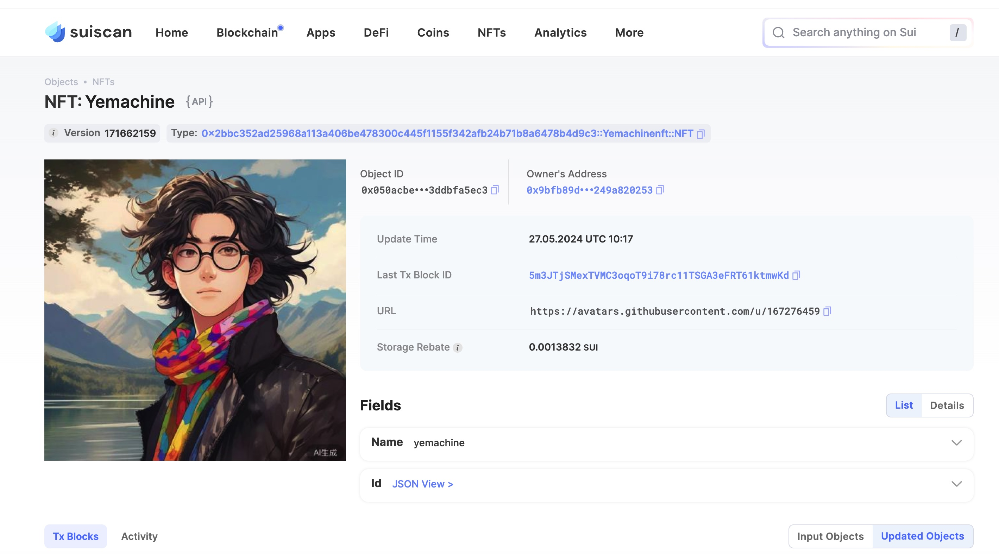

## 基本信息
- Sui钱包地址: `0x9bfb89de18bb2e8d25edb84ff03548febe9369491c2a94948b3b2d249a820253`
> 首次参与需要完成第一个任务注册好钱包地址才被合并，并且后续学习奖励会打入这个地址
- github: `yemachine`

## 个人简介
- 工作经验: 5年
- 技术栈: `C++`
> 重要提示 请认真写自己的简介
- 多年嵌入式开发经验，对Move特别感兴趣，想通过Move入门区块链
- 联系方式: tg: `yemachine` 

## 任务

##   01 hello move  
- [x] Sui cli version: sui-client 1.25.1-6579e0ed9e43
- [x] Sui钱包截图: 
- [x] package id:  0xef6838700ad89208aa5a0e4b74df3c245b3fbbec650bb7876f581a9dedbe2b88    
- [x] package id 在 scan上的查看截图:

##   02 move coin
- [x] My Coin package id :  0x5e4f05ba8ef877ab17d079939eb13ce0e21785da7379e00772fed6a6beeaeecb          
- [x] Faucet package id :  0x5e4f05ba8ef877ab17d079939eb13ce0e21785da7379e00772fed6a6beeaeecb          
- [x] 转账 `My Coin` hash: CjFf3tLbtMPg2gouEhbscBnSefEADtUy3ZG7Vos8mYKk
- [x] `Faucet Coin` address1 mint hash: Dw4kBJ3zkJT1ufTqg1ruaK3MCDNTeW3rcNBYXUy69g19
- [x] `Faucet Coin` address2 mint hash:  Hmyk97516gfDnPfFs7AfqgYSMETA8Rz83wgRyK3gnFVq

##   03 move NFT
- [x] nft package id : 0x2bbc352ad25968a113a406be478300c445f1155f342afb24b71b8a6478b4d9c3   
- [x] nft object id :  0x050acbe18360bd34a60c03f60fc48676b4d8900682d432cabd422b3ddbfa5ec3 
- [x] 转账 nft  hash: HEDPNXPDzoVc4jZBzVLw5vXSSjuURigsACHGD6YUDFBH
- [x] scan上的NFT截图:

##   04 Move Game
- [x] game package id `mainnet`: 0x317cbce842ec95f3112a0591981c85a0af8083ae49a7e371ee468dab0e7e4f6f  
- [x] deposit Coin hash `mainnet`: LpUYhJooFgRNpcML4ymJLXf5rPwj7FzUZga8Y48CCyz
- [x] withdraw `Coin` hash `mainnet`: 4TaLpU68G7UfNqmn8raV43sDxeMpH6z9Snw97KNKaF3E
- [x] play game hash `devnet`:  Dc67L6nT7kW9BQcbE5CagSHy6PyeEC3Se5Ha68krEsEg
`只有devnet的0x8才有效，所以play game的hash是在devnet上的`

##   05 Move Swap
- [x] swap package id : 0x6f91c83bca8557b322e8a228db4afb24b3172f76cd79fa7fba2d2cb45e7e7c0d 
- [x] call swap CoinA-> CoinB  hash : 25auTNc6iPqJy1ra3rwLZF9BEraUsFAESYMVvReuAJdt
- [x] call swap CoinB-> CoinA  hash : 7nSHZyXhi5fbSLSACMNQLrLCEq4vsnd4TDHnhNk1h4Hs

##   06 Dapp-kit SDK PTB
- [x] save hash : GuvhyphywAC4o2FvCFq9vT7V7Ef5sjaesX5HCuoMrGZa
