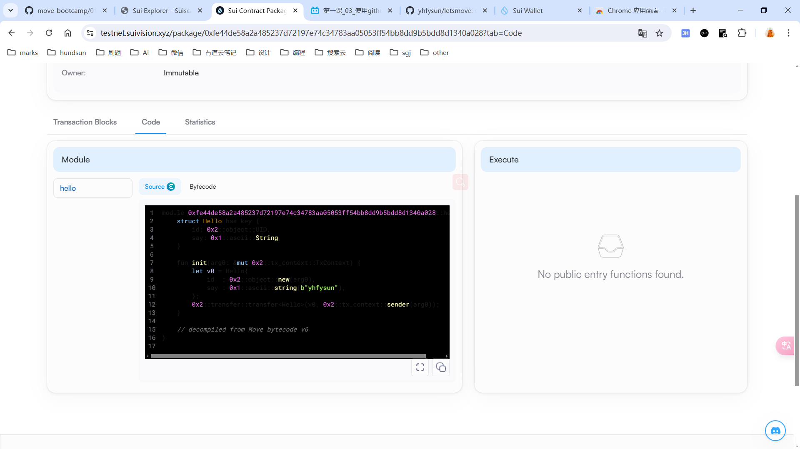

## 基本信息
- Sui钱包地址: `0x01a50ebc7aa68bb429809ac3d1cac43135c2120035732245939120f07589cfdb`
> 首次参与需要完成第一个任务注册好钱包地址才被合并，并且后续学习奖励会打入这个地址
- github: `yhfysun`

## 个人简介
- 工作经验: 5年
- 技术栈: `java` `javascript` `vue`
> 重要提示 请认真写自己的简介
- 五年java后端开发经验，对Move特别感兴趣，想通过Move入门区块链
- 联系方式: tg: `yhfysun@gmail.com` 

## 任务

##   01 hello move  
- [] Sui cli version: sui 1.37.1-7839b9501066
- [] Sui钱包截图: 
- [] package id: 0xfe44de58a2a485237d72197e74c34783aa05053ff54bb8dd9b5bdd8d1340a028
- [] package id 在 scan上的查看截图:

##   02 move coin
- [√] My Coin package id : 0xf0e5b634561fad5b4fa23550cd7ef06685271a0b457e15f30fff96b681b92807
- [√] Faucet package id : 0xff4d258471e23754770d1486edbc24376ae44bf2f4c7a773309401b50149e2e1
- [√] 转账 `My Coin` hash: 8RRJLJSFpS11eQweyyrY9TVvHoidKXBh13TvBya1X1DM
- [√] `Faucet Coin` address1 mint hash: 2rk6MADWtVPyFJr73vMR45aXrphjcL8Gekkgdh2FR3ag
- [√] `Faucet Coin` address2 mint hash: G2DaN2Z9uRQymeMCZAFwFjMAmTLbvrAGTnCq5VxUofhi

##   03 move NFT
- [√] nft package id : 0x945f3d81a741514ef778effd6ad4b27b7527a5d814c809b3036a981ca03494a9
- [√] nft object id : 0xcbcd5e636cae6126d23ec8f6b2ba6081fa0b277c1341908c53cfdcff03692efd
- [√] 转账 nft  hash: D7PmSdRuwTvb8wrULoaFSTi46THXHUNEqSUsh91iBQF5
- [√] scan上的NFT截图:

##   04 Move Game
- [] game package id :
- [] deposit Coin hash:
- [] withdraw `Coin` hash:
- [] play game hash:

##   05 Move Swap
- [] swap package id :
- [] call swap CoinA-> CoinB  hash :
- [] call swap CoinB-> CoinA  hash :

##   06 Dapp-kit SDK PTB
- [] save hash :

##   07 Move CTF Check In
- [] CLI call 截图 : 
- [] flag hash :

##   08 Move CTF Lets Move
- [] proof : 
- [] flag hash :
