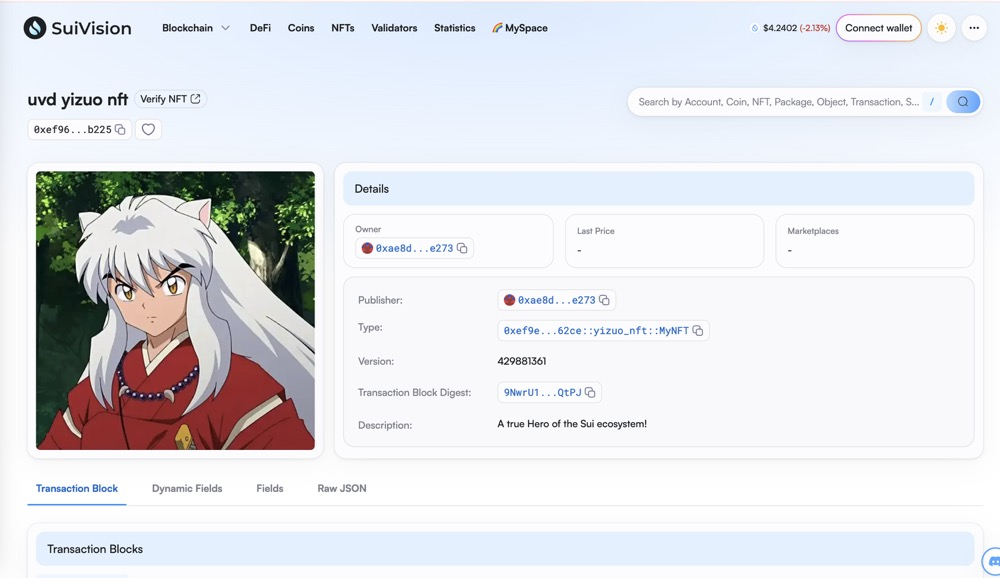

## 基本信息
- Sui钱包地址: `0x05df3dd3f3c4836af29c1df7467dff16dadf29b4843373a1726e0b1575afb8a0`
> 首次参与需要完成第一个任务注册好钱包地址才被合并，并且后续学习奖励会打入这个地址
- github: `yizuo66`

## 个人简介
- 工作经验: 9年
- 技术栈: `Go` `Python`
> 重要提示 请认真写自己的简介
- SRE，对Move特别感兴趣，想通过Move入门区块链
- 联系方式: tg: `https://t.me/Carl_xc` 

## 任务

##   01 hello move  
- [X] Sui cli version:sui 1.37.1-homebrew
- [X] Sui钱包截图: 
- [X] package id: 0x28e2c051deec7ac105b1e7fadf52817b049788ddc890c610da5b32e4072b2c6a
- [X] package id 在 scan上的查看截图:

##   02 move coin
- [X] My Coin package id : 0xa86b066a51f60c6c86b20f61d3c17b58be469ded3c8068837c4a6d7106f66761
- [X] Faucet package id : 0xa86b066a51f60c6c86b20f61d3c17b58be469ded3c8068837c4a6d7106f66761
- [X] 转账 `My Coin` hash: 4U1k1E5WoTHtsehWRtsXHMqJbmvTGfUeWczohgnMankS
- [X] `Faucet Coin` address1 mint hash: DnzjD5us383qHyoerjzBdUsW63ybCNnn6pUL6gqCRQ2Z
- [X] `Faucet Coin` address2 mint hash: 4U1k1E5WoTHtsehWRtsXHMqJbmvTGfUeWczohgnMankS

##   03 move NFT
- [X] nft package id : 0x4f46f827a7994ea523175dcb7e6ee67d817e0719daeead1734ce7998871c62ab
- [X] nft object id : 0x0233b5402c9060ee3c8fc983f7ca3c9fd2deb8eb81c4faf58fa6d58a63550b09
- [X] 转账 nft  hash: FbcDBqtxeoi1xX4Yh1WPnj6eGRYiZ1FiAtDLjzXwjyjU
- [X] scan上的NFT截图:

##   04 Move Game
- [] game package id :
- [] deposit Coin hash:
- [] withdraw `Coin` hash:
- [] play game hash:

##   05 Move Swap
- [] swap package id :
- [] call swap CoinA-> CoinB  hash :
- [] call swap CoinB-> CoinA  hash :

##   06 Dapp-kit SDK PTB
- [] save hash :

##   07 Move CTF Check In
- [] CLI call 截图 : 
- [] flag hash :

##   08 Move CTF Lets Move
- [] proof : 
- [] flag hash :
