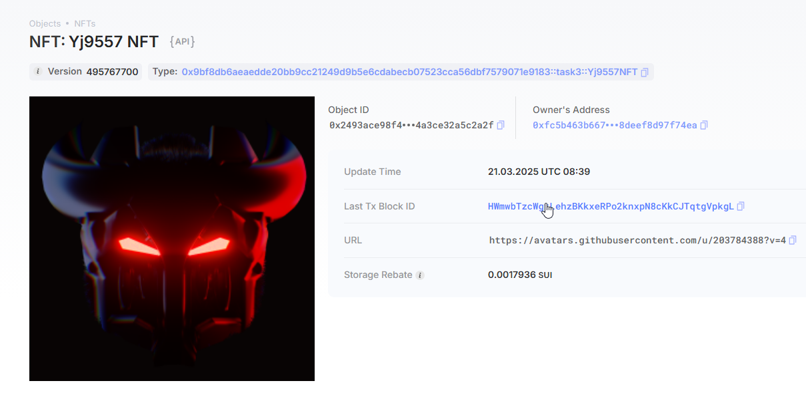

## 基本信息
- Sui钱包地址: `0xfc5b463b667aa9c30f0ae7cfe5e85e4aacaae4483df4e4ed2d8deef8d97f74ea`
> 首次参与需要完成第一个任务注册好钱包地址才被合并，并且后续学习奖励会打入这个地址
- github: `yj9557`

## 个人简介
- 工作经验: 1年
- 技术栈: `js` 
> 重要提示 请认真写自己的简介
- 多年web2开发经验，对Move特别感兴趣，想通过Move入门区块链

## 任务

##   01 hello move  
- [x] Sui cli version: sui-client 1.45.0-3ef5cc5b5c90
- [x] package id: 0x587f549af95f49e18abbf8016b9847ff551cd75ac8773dbf689a981615a98dc4
- [x] package id 在 scan上的查看截图:

##   02 move coin
- [x] My Coin package id : 0x733cbf3f83615c77b5dbd8fc94fc7fcd5b364e5efd52cbecbfa3b5d1ed4ab890
- [x] Faucet package id : 0x733cbf3f83615c77b5dbd8fc94fc7fcd5b364e5efd52cbecbfa3b5d1ed4ab890
- [x] 转账 `My Coin` hash: 7YJHjiEa4JoC7qKRMykyvhPQhKaq28QyXKe5Y6SXgK7j
- [x] `Faucet Coin` address1 mint hash: 2i8TxeBqSggsvNbvKML96CFV4e16cN3US6uniHeXyZ3v
- [x] `Faucet Coin` address2 mint hash: 976kV5KXToMq8vZyptEnyEyL4Bn8nBYqyvNEx2r1mwMy

##   03 move NFT
- [x] nft package id :0x9bf8db6aeaedde20bb9cc21249d9b5e6cdabecb07523cca56dbf7579071e9183
- [x] nft object id : 0x2493ace98f48c79bc0cc2a6d723cfa09c2da0be743f96509dd4a3ce32a5c2a2f
- [x] 转账 nft  hash:9VQVVjxovK5nh32mf5EECMvqwy4sacFTu8AR85xoMDdx
- [x] scan上的NFT截图:

##   04 Move Game
- [x] game package id :0x8521af7f80382965251b85030fdab2772fb09fbe691dc67f96b10b012ae5dfe8
- [x] deposit Coin hash:4jVEaYbodiRmLyCaabVLvTHxb2SqQjTEV3Yks5ZCTwqR
- [x] withdraw `Coin` hash:ErbTXY7WU7taeQqcPT9dHsYfjBQT4mHeHBDRGm9b9Rn7
- [x] play game hash:ADNLrPUUTTAFszcMxVDLoKNExJcUBwrqBpU75idCEnUZ

##   05 Move Swap
- [x] swap package id :0xe61c34e9e68560092b0126942e541a4b13c2428b8a776e0f391a6ff668472545
- [x] call swap CoinA-> CoinB  hash :aMLbeSGk8XK3BaFRayUU9NEStsJRNxed6zZN656t5yQ
- [x] call swap CoinB-> CoinA  hash :ETGTTTKV351WEtb6tWa8hZspXhccA8ddwA7Npz5oWm6B

##   06 Dapp-kit SDK PTB
- [] save hash :

##   07 Move CTF Check In
- [] CLI call 截图 : 
- [] flag hash :

##   08 Move CTF Lets Move
- [] proof : 
- [] flag hash :

