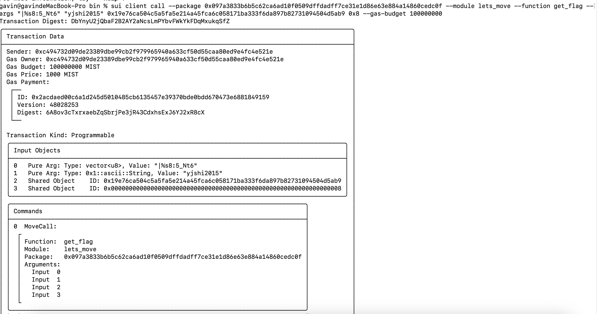

## 基本信息
- Sui钱包地址: `0xc4301a727914c051c987331f30d002ef907f6f6e4badfec8981e6275ed22486c`
> 首次参与需要完成第一个任务注册好钱包地址才被合并，并且后续学习奖励会打入这个地址
- github: `yjshi2015`

## 个人简介
- 工作经验: 10年
- 技术栈: `Rust` `Java` `Python` `Solidity` `Solana`
- 多年web2开发经验，对Move特别感兴趣，想通过Move入门区块链
- 联系方式: tg: `@Gavin2015` 

## 任务

##   01 hello move  
- [x] package id: 0x7ffa5b174381082bd3695bd0e3fa2507b6d7e8d02a99d234ed0dfeb35cbe49f1 （devnet)

##   02 move coin(部署在同一个包下)
- [x] My Coin package id : 0xf2f9f932744b1430d721d18e1b6fc5b767e67a0858a0d76340b2b55cdcdc77df
- [x] Faucet package id : 0xf2f9f932744b1430d721d18e1b6fc5b767e67a0858a0d76340b2b55cdcdc77df
- [x] 转账 `My Coin` hash: AHxmMwM7ghyp97zzgVH1n67M5BaYTkjPWfp8v7Cyk4bb

##   03 move NFT
- [x] nft package id :0x10ab2a6b138ae496bc18e1668ba030202b65ab1104e374ebcac24dcab1f2ad64
- [x] nft object id : 0xa9132656dce97535284ef01c242d5e6ab4e7dec01e82eeb05afeace75659c2b3
- [x] 转账 nft  hash: AYVLE4yBL1wpfT6BtQvXfRRXYk2Q8DNfzhiLA5rp1Dsc

##   04 Move Game
- [x] game package id :0xa901819a4cb6b5301d7028711cf62a056814a0f634325c399d1ef32bcd36c397
- [x] call game hash: GuxjPYGniNHxusPFgMFUR37qUayD4ohRZwb4c3cvVU8q

##   05 Move Swap
- [x] swap package id : 0x720963b103e2190780ecf74ce503ec2c84955d857d4da5ccb0ff60852a87025e
- [x] call swap hash: 57ekXKYx3k8j6TyKsEATL2ZCXLRTcpqWSjLd9qbxgq95

##   06 SDK PTB
- [] save hash :

##   07 Move CTF Check in
- [x] tx hash : DeBPjZovWqahNZiFS2DjNcwWmQaKgvRAahMiBXrrnzH3
```
sui client call --package 0x60695ee31f93add1f79909c884a55dff7e5f140bbd2e495819966bd2f7971d42 --module check_in --function get_flag --args "LetsMoveCTF" "yjshi2015" 0x011f9404e6f167e549b617a53eea058029167a2beac26c624cbc3550e04b5ad2 0x8 
```

Transaction Digest: DeBPjZovWqahNZiFS2DjNcwWmQaKgvRAahMiBXrrnzH3
╭─────────────────────────────────────────────────────────────────────────────────────────────────╮
│ Transaction Data                                                                                │
├─────────────────────────────────────────────────────────────────────────────────────────────────┤
│ Sender: 0xc494732d09de23389dbe99cb2f979965940a633cf50d55caa80ed9e4fc4e521e                      │
│ Gas Owner: 0xc494732d09de23389dbe99cb2f979965940a633cf50d55caa80ed9e4fc4e521e                   │
│ Gas Budget: 100000000 MIST                                                                      │
│ Gas Price: 1000 MIST                                                                            │
│ Gas Payment:                                                                                    │
│  ┌──                                                                                            │
│  │ ID: 0x27dc819e81f0adbe43014008e93d686be5909c3de127b99d2bc5a2f394233a04                       │
│  │ Version: 1174404                                                                             │
│  │ Digest: 3nyLGDgLbb4y79gShGg8dDiud1iFJ74E2Ljtv4h6X9ZP                                         │
│  └──                                                                                            │
│                                                                                                 │
│ Transaction Kind: Programmable                                                                  │
│ ╭─────────────────────────────────────────────────────────────────────────────────────────────╮ │
│ │ Input Objects                                                                               │ │
│ ├─────────────────────────────────────────────────────────────────────────────────────────────┤ │
│ │ 0   Pure Arg: Type: 0x1::ascii::String, Value: "LetsMoveCTF"                                │ │
│ │ 1   Pure Arg: Type: 0x1::ascii::String, Value: "yjshi2015"                                  │ │
│ │ 2   Shared Object    ID: 0x011f9404e6f167e549b617a53eea058029167a2beac26c624cbc3550e04b5ad2 │ │
│ │ 3   Shared Object    ID: 0x0000000000000000000000000000000000000000000000000000000000000008 │ │
│ ╰─────────────────────────────────────────────────────────────────────────────────────────────╯ │
│ ╭──────────────────────────────────────────────────────────────────────────────────╮            │
│ │ Commands                                                                         │            │
│ ├──────────────────────────────────────────────────────────────────────────────────┤            │
│ │ 0  MoveCall:                                                                     │            │
│ │  ┌                                                                               │            │
│ │  │ Function:  get_flag                                                           │            │
│ │  │ Module:    check_in                                                           │            │
│ │  │ Package:   0x60695ee31f93add1f79909c884a55dff7e5f140bbd2e495819966bd2f7971d42 │            │
│ │  │ Arguments:                                                                    │            │
│ │  │   Input  0                                                                    │            │
│ │  │   Input  1                                                                    │            │
│ │  │   Input  2                                                                    │            │
│ │  │   Input  3                                                                    │            │
│ │  └                                                                               │            │
│ ╰──────────────────────────────────────────────────────────────────────────────────╯            │
│                                                                                                 │
│ Signatures:                                                                                     │
│    IPf3W4UkhUm7PnXfe+ObK8E1Nq6nOYqbObcsI5raw32xzJg8Uo1GKyeXR9dwJHsN5vTbMYcgcJkIE8J/NI52Cg==     │
│                                                                                                 │
╰─────────────────────────────────────────────────────────────────────────────────────────────────╯
╭───────────────────────────────────────────────────────────────────────────────────────────────────╮
│ Transaction Effects                                                                               │
├───────────────────────────────────────────────────────────────────────────────────────────────────┤
│ Digest: DeBPjZovWqahNZiFS2DjNcwWmQaKgvRAahMiBXrrnzH3                                              │
│ Status: Success                                                                                   │
│ Executed Epoch: 396                                                                               │
│ Mutated Objects:                                                                                  │
│  ┌──                                                                                              │
│  │ ID: 0x011f9404e6f167e549b617a53eea058029167a2beac26c624cbc3550e04b5ad2                         │
│  │ Owner: Shared                                                                                  │
│  │ Version: 48002539                                                                              │
│  │ Digest: DbkRDVU2BnTUQBDDonYVVjugAqdsFqfQVMhfkZus4wwg                                           │
│  └──                                                                                              │
│  ┌──                                                                                              │
│  │ ID: 0x27dc819e81f0adbe43014008e93d686be5909c3de127b99d2bc5a2f394233a04                         │
│  │ Owner: Account Address ( 0xc494732d09de23389dbe99cb2f979965940a633cf50d55caa80ed9e4fc4e521e )  │
│  │ Version: 48002539                                                                              │
│  │ Digest: 487azsprjNkTnj2HmBxkH8Em1PwwrA6mDHLWnv9QR7fQ                                           │
│  └──                                                                                              │
│ Shared Objects:                                                                                   │
│  ┌──                                                                                              │
│  │ ID: 0x011f9404e6f167e549b617a53eea058029167a2beac26c624cbc3550e04b5ad2                         │
│  │ Version: 48002538                                                                              │
│  │ Digest: B1TRMirJtrTA19CgapJsY3XE5HVgvJm5TMEtfdBXkF3A                                           │
│  └──                                                                                              │
│  ┌──                                                                                              │
│  │ ID: 0x0000000000000000000000000000000000000000000000000000000000000008                         │
│  │ Version: 45480501                                                                              │
│  │ Digest: 8RPShHTK8zDLYeBvbCvDuLZ8vC9PPDZseu3GUiy5Ba2V                                           │
│  └──                                                                                              │
│ Gas Object:                                                                                       │
│  ┌──                                                                                              │
│  │ ID: 0x27dc819e81f0adbe43014008e93d686be5909c3de127b99d2bc5a2f394233a04                         │
│  │ Owner: Account Address ( 0xc494732d09de23389dbe99cb2f979965940a633cf50d55caa80ed9e4fc4e521e )  │
│  │ Version: 48002539                                                                              │
│  │ Digest: 487azsprjNkTnj2HmBxkH8Em1PwwrA6mDHLWnv9QR7fQ                                           │
│  └──                                                                                              │
│ Gas Cost Summary:                                                                                 │
│    Storage Cost: 2424400 MIST                                                                     │
│    Computation Cost: 1000000 MIST                                                                 │
│    Storage Rebate: 2445300 MIST                                                                   │
│    Non-refundable Storage Fee: 24700 MIST                                                         │
│                                                                                                   │
│ Transaction Dependencies:                                                                         │
│    5a5CFvFUKb58WyrzYngXTehjhkPXowaoZTcyRxWi2xZQ                                                   │
│    AW7vbqtpJWnFbjRWuL4SsaAyDfwSdKmZqkx6222dJNNx                                                   │
│    Ga2sY6MCrxn4uWPC2otrXQ4Xurtu57sKkgArewCwNLQa                                                   │
╰───────────────────────────────────────────────────────────────────────────────────────────────────╯
╭──────────────────────────────────────────────────────────────────────────────────────────────────╮
│ Transaction Block Events                                                                         │
├──────────────────────────────────────────────────────────────────────────────────────────────────┤
│  ┌──                                                                                             │
│  │ EventID: DeBPjZovWqahNZiFS2DjNcwWmQaKgvRAahMiBXrrnzH3:0                                       │
│  │ PackageID: 0x60695ee31f93add1f79909c884a55dff7e5f140bbd2e495819966bd2f7971d42                 │
│  │ Transaction Module: check_in                                                                  │
│  │ Sender: 0xc494732d09de23389dbe99cb2f979965940a633cf50d55caa80ed9e4fc4e521e                    │
│  │ EventType: 0x60695ee31f93add1f79909c884a55dff7e5f140bbd2e495819966bd2f7971d42::check_in::Flag │
│  │ ParsedJSON:                                                                                   │
│  │   ┌───────────┬────────────────────────────────────────────────────────────────────┐          │
│  │   │ flag      │ true                                                               │          │
│  │   ├───────────┼────────────────────────────────────────────────────────────────────┤          │
│  │   │ github_id │ yjshi2015                                                          │          │
│  │   ├───────────┼────────────────────────────────────────────────────────────────────┤          │
│  │   │ sender    │ 0xc494732d09de23389dbe99cb2f979965940a633cf50d55caa80ed9e4fc4e521e │          │
│  │   ├───────────┼────────────────────────────────────────────────────────────────────┤          │
│  │   │ ture_num  │ 1                                                                  │          │
│  │   └───────────┴────────────────────────────────────────────────────────────────────┘          │
│  └──                                                                                             │
╰──────────────────────────────────────────────────────────────────────────────────────────────────╯
╭──────────────────────────────────────────────────────────────────────────────────────────────────────────╮
│ Object Changes                                                                                           │
├──────────────────────────────────────────────────────────────────────────────────────────────────────────┤
│ Mutated Objects:                                                                                         │
│  ┌──                                                                                                     │
│  │ ObjectID: 0x011f9404e6f167e549b617a53eea058029167a2beac26c624cbc3550e04b5ad2                          │
│  │ Sender: 0xc494732d09de23389dbe99cb2f979965940a633cf50d55caa80ed9e4fc4e521e                            │
│  │ Owner: Shared                                                                                         │
│  │ ObjectType: 0x60695ee31f93add1f79909c884a55dff7e5f140bbd2e495819966bd2f7971d42::check_in::FlagString  │
│  │ Version: 48002539                                                                                     │
│  │ Digest: DbkRDVU2BnTUQBDDonYVVjugAqdsFqfQVMhfkZus4wwg                                                  │
│  └──                                                                                                     │
│  ┌──                                                                                                     │
│  │ ObjectID: 0x27dc819e81f0adbe43014008e93d686be5909c3de127b99d2bc5a2f394233a04                          │
│  │ Sender: 0xc494732d09de23389dbe99cb2f979965940a633cf50d55caa80ed9e4fc4e521e                            │
│  │ Owner: Account Address ( 0xc494732d09de23389dbe99cb2f979965940a633cf50d55caa80ed9e4fc4e521e )         │
│  │ ObjectType: 0x2::coin::Coin<0x2::sui::SUI>                                                            │
│  │ Version: 48002539                                                                                     │
│  │ Digest: 487azsprjNkTnj2HmBxkH8Em1PwwrA6mDHLWnv9QR7fQ                                                  │
│  └──                                                                                                     │
╰──────────────────────────────────────────────────────────────────────────────────────────────────────────╯
╭───────────────────────────────────────────────────────────────────────────────────────────────────╮
│ Balance Changes                                                                                   │
├───────────────────────────────────────────────────────────────────────────────────────────────────┤
│  ┌──                                                                                              │
│  │ Owner: Account Address ( 0xc494732d09de23389dbe99cb2f979965940a633cf50d55caa80ed9e4fc4e521e )  │
│  │ CoinType: 0x2::sui::SUI                                                                        │
│  │ Amount: -979100                                                                                │
│  └──                                                                                              │
╰───────────────────────────────────────────────────────────────────────────────────────────────────╯

##   08 Move CTF get_flag
- [x] tx hash : DbYnyU2jQbaF2B2AY2aNcsLmPYbvFWkYkFDqMxukqSfZ
```
sui client call --package 0x097a3833b6b5c62ca6ad10f0509dffdadff7ce31e1d86e63e884a14860cedc0f --module lets_move --function get_flag --args "|%s8:5_Nt6" "yjshi2015" 0x19e76ca504c5a5fa5e214a45fca6c058171ba333f6da897b82731094504d5ab9 0x8 
```


## 09 translate move-book
- [x] pr : https://github.com/move-cn/move-book/pull/1
      pr : https://github.com/move-cn/move-book/pull/2
my sui address: 0xc4301a727914c051c987331f30d002ef907f6f6e4badfec8981e6275ed22486c 

## 10 translate reference
- [x] pr : https://github.com/move-cn/move-book/pull/5
