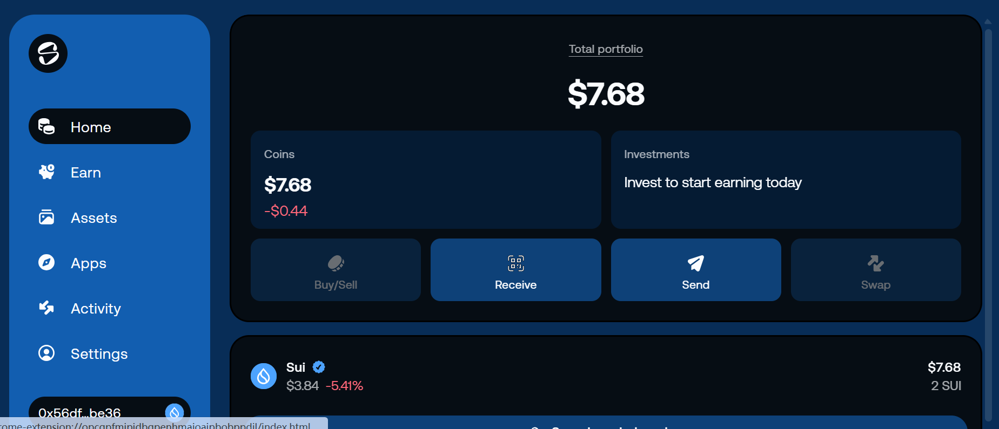
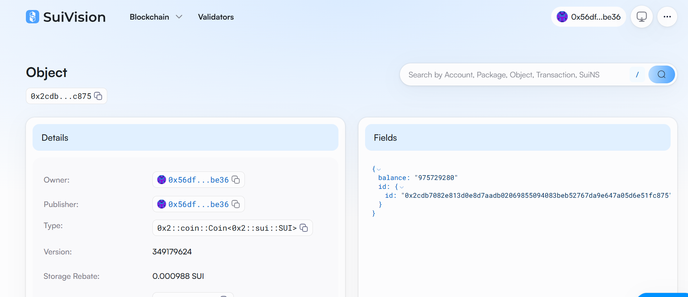

## 基本信息
- Sui钱包地址: `0x56dfa07d4ea782e8fa67f25adfc94a2cf639166d0f6fcd008ef71a0b7f53be36`
- github: `ynjzw`

## 个人简介
- 工作经验: 7年
- 技术栈: `python` `hadoop` `clickhouse`
- 熟悉python django框架，vue编程，3年企业内大数据开发经验，想通过Move入门区块链

## 任务

##   01 hello move  
- [] Sui cli version:sui-client 1.49.1-3b1d6b3bd63f
- [] Sui钱包截图: 
- [] package id: `0x62a85cdb2ae1216c59e1fad612949011ca2a8c16eb4140cc90eb6d39a4f41484`
- [] package id 在 scan上的查看截图:
