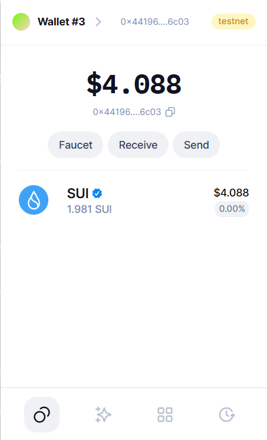
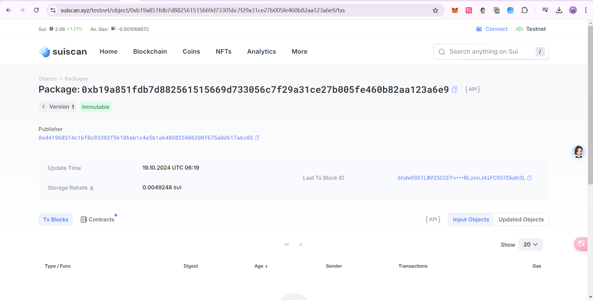
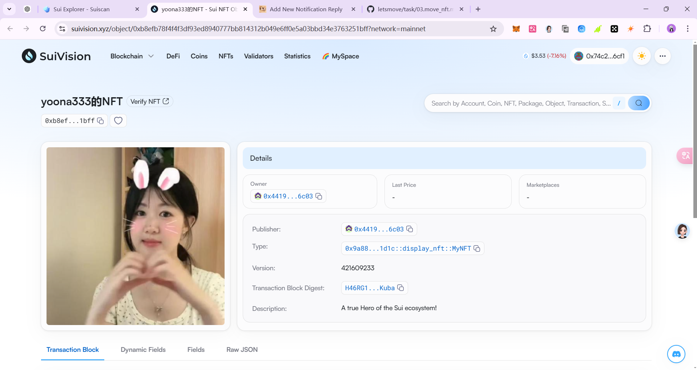

## 基本信息
- Sui钱包地址: `0x441968514c1bf0c93392f56186eb1c4e5b1a6485825406208f675a0d617a6c03`
> 首次参与需要完成第一个任务注册好钱包地址才被合并，并且后续学习奖励会打入这个地址
- github: `yoona333`

## 个人简介
- 工作经验: 1年
- 技术栈: `Rust` `python`
> 重要提示 请认真写自己的简介
- 多年web3开发经验，对Move特别感兴趣，想通过Move入门区块链
- 联系方式: tg: `xxx` 

## 任务

##   01 hello move  s
- [x] Sui cli version:sui 1.35.2-4e46da89efd5
- [x] Sui钱包截图: 
- [x] package id: 0xb19a851fdb7d882561515669d733056c7f29a31ce27b005fe460b82aa123a6e9
- [x] package id 在 scan上的查看截图:

##   02 move coin
- [x] My Coin package id : `0x42d09c92dc048f5753f6c7960c8dbb92934dc7e69b4b59bbf89f4e2e0ad4525d`
- [x] Faucet package id : `0x42d09c92dc048f5753f6c7960c8dbb92934dc7e69b4b59bbf89f4e2e0ad4525d`
- [x] 转账 `My Coin` hash: `4g7MaYruPQxsGvMTfVx36nxeNPJJwxHR2jXNkJDXVJjw`
- [x] `Faucet Coin` address1 mint hash:`CoTU33nN3XGjDyVn3KeCtdcE6xYu9JCrkkSpJtpHvTJZ`
- [x] `Faucet Coin` address2 mint hash:`734tBAzvZANFsJrhFv5aUgE57YaM6ZhAhwBwy4Tou19m`

##   03 move NFT
- [x] nft package id :`0x9a88207e421473b8a6c0dc2b83a71a8dac8c8cb4783621d454bf3c67737b1d1c`
- [x] nft object id : `0xb8efb78f4f4f3df93ed8940777bb814312b049e6ff0e5a03bbd34e3763251bff`
- [x] 转账 nft  hash: `CT4wfdfoNTHmwtKy5yXZRLzzkmtrU512GbHP2JJ4Stma`
- [x] scan上的NFT截图:

##   04 Move Game
- [] game package id :
- [] deposit Coin hash:
- [] withdraw `Coin` hash:
- [] play game hash:

##   05 Move Swap
- [] swap package id :
- [] call swap CoinA-> CoinB  hash :
- [] call swap CoinB-> CoinA  hash :

##   06 Dapp-kit SDK PTB
- [] save hash :

##   07 Move CTF Check In
- [] CLI call 截图 : 
- [] flag hash :

##   08 Move CTF Lets Move
- [] proof : 
- [] flag hash :
