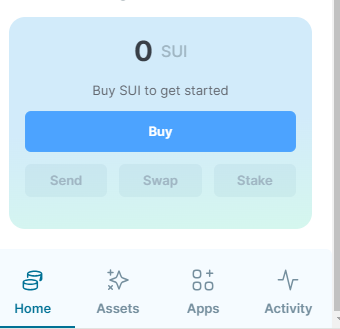
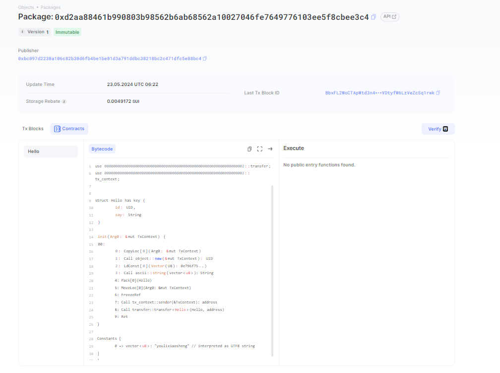
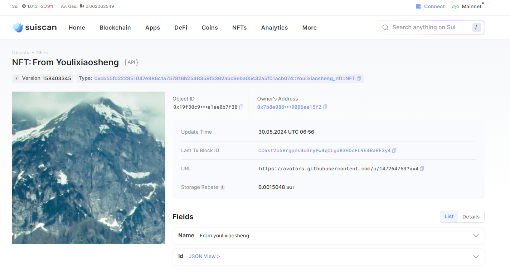

## 基本信息

- Sui钱包地址: 0xce33274e4cb49ac902a87c46d93a3705dae6236f506423c11cb756c8332e502e
  
  > 首次参与需要完成第一个任务注册好钱包地址才被合并，并且后续学习奖励会打入这个地址

- github: youlixiaosheng

## 个人简介

- 工作经验: 3年
- 技术栈: python
- 联系方式: fanwu259@qq.com

## 任务

## 01 hello move

- [x] Sui cli version: 1.24.1-d63ccc6-dirty
- [x] package id: 0xd2aa88461b990803b98562b6ab68562a10027046fe7649776103ee5f8cbee3c4
- [x] Sui钱包截图: 
- [x] package id 在 scan上的查看截图:

##   02 move coin
- [x] My Coin package id : 0x3ca45f029d57df2f18e9a1a922c76732bb8219320020f6c32fa3005648cecba1
- [x] Faucet package id : 0x4e8512cb40dcf967f19010d2f9bfa2c3051468a0ab64edf0447c88e7af1cb83f
- [x] 转账 `My Coin` hash: FE3J9ZZEsxpVmekwYNrDAdEkj3rMWG2eGZR6rAP3vyZH
- [x] `Faucet Coin` address1 mint hash: F7S15b517rmiSPe9F3YgH2VU6RvBFYNp9Qmb8KQ3dvos
- [x] `Faucet Coin` address2 mint hash: Cu4oPSxLH5u332q4KZWzkLytfxYXkQ2YradXR8baRCAN

##   03 move NFT
- [x] nft package id :  0xcb55fd222851047e986c1a757816b2548358f3362abc9eba05c32a5f01acb074
- [x] nft object id : 0x19f30c95b3572796b8203185681cde50519c23d9de8438ce6da534e1ee0b7f30
- [x] 转账 nft  hash: CC6st2o5Vrgpns4o3ryPw4qCLga83HDcFL9E4RaRE3y4
- [x] scan上的NFT截图:
