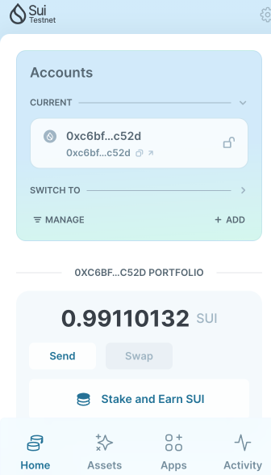
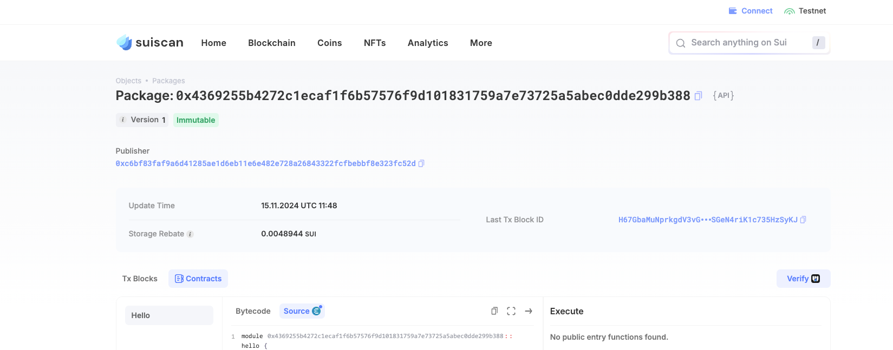

## 基本信息
- Sui钱包地址: `0xc6bf83faf9a6d41285ae1d6eb11e6e482e728a26843322fcfbebbf8e323fc52d`
> 首次参与需要完成第一个任务注册好钱包地址才被合并，并且后续学习奖励会打入这个地址
- github id: `ytbiu`

## 个人简介
- 工作经验: 10年
- 技术栈: `rust` `solidity` `golang`
> 重要提示 请认真写自己的简介
- 有多年web后端开发经验，熟悉常见后端开发语言以及相关领域的技术栈.目前从事web3方向开发工作，
- 主要负责solidity只能合约开发，substrate runtime开发. 希望学习move on sui链上开发.
- 联系方式: tg: `@robin1351`

## 任务

##   01 hello move
- [] Sui cli version: sui 1.37.3-homebrew
- [] Sui钱包截图: 
- [] package id: 0x4369255b4272c1ecaf1f6b57576f9d101831759a7e73725a5abec0dde299b388
- [] package id 在 scan上的查看截图:

##   02 move coin
- [] My Coin package id :
- [] Faucet package id :
- [] 转账 `My Coin` hash:
- [] `Faucet Coin` address1 mint hash:
- [] `Faucet Coin` address2 mint hash:

##   03 move NFT
- [] nft package id :
- [] nft object id :
- [] 转账 nft  hash:
- [] scan上的NFT截图:

##   04 Move Game
- [] game package id :
- [] deposit Coin hash:
- [] withdraw `Coin` hash:
- [] play game hash:

##   05 Move Swap
- [] swap package id :
- [] call swap CoinA-> CoinB  hash :
- [] call swap CoinB-> CoinA  hash :

##   06 Dapp-kit SDK PTB
- [] save hash :
