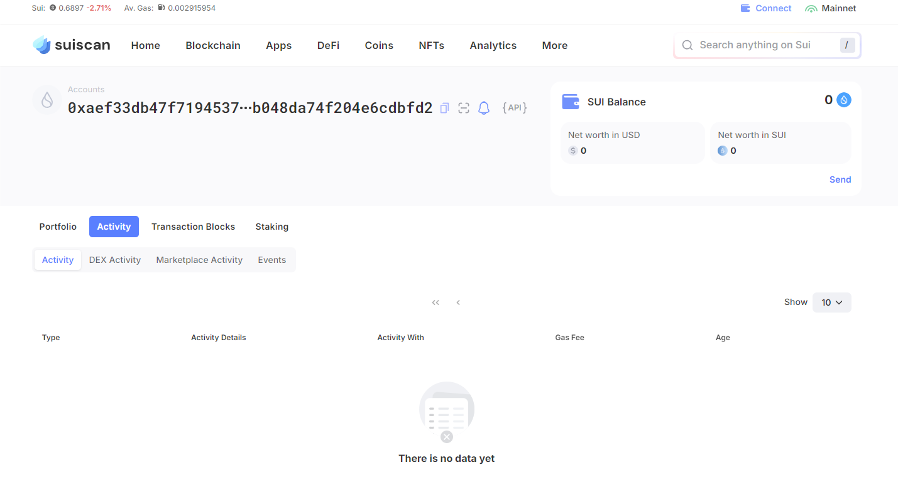
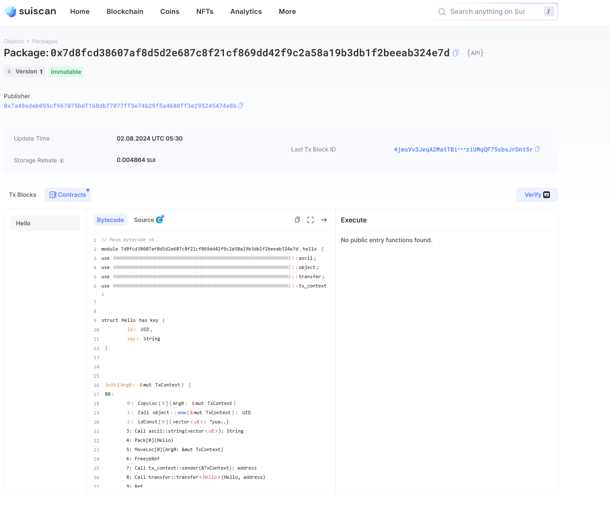

## 基本信息
- Sui钱包地址: `0xaef33db47f719453704741de83c13300d692ce1bece4b048da74f204e6cdbfd2`
- github: `yuanbug`

## 个人简介
- 工作经验: 4年
- 技术栈: `Java`、`Typescript`
- Web2 工程师，愿天下人都能享受信息技术带来的便利。
- 联系方式: [yuanbug@qq.com](mailto:yuanbug@qq.com)

## 任务

##   01 hello move  
- [x] Sui cli version: `1.30.1-a4185da5659d`
- [x] Sui钱包截图: 
- [x] package id: `0x7d8fcd38607af8d5d2e687c8f21cf869dd42f9c2a58a19b3db1f2beeab324e7d`
- [x] package id 在 scan上的查看截图:

##   02 move coin
- [] My Coin package id : 
- [] Faucet package id : 
- [] 转账 `My Coin` hash:
- [] `Faucet Coin` address1 mint hash:
- [] `Faucet Coin` address2 mint hash:

##   03 move NFT
- [] nft package id :
- [] nft object id : 
- [] 转账 nft  hash:
- [] scan上的NFT截图:

##   04 Move Game
- [] game package id :
- [] deposit Coin hash:
- [] withdraw `Coin` hash:
- [] play game hash:

##   05 Move Swap
- [] swap package id :
- [] call swap CoinA-> CoinB  hash :
- [] call swap CoinB-> CoinA  hash :

##   06 Dapp-kit SDK PTB
- [] save hash :

##   07 Move CTF Check In
- [] CLI call 截图 : 
- [] flag hash :

##   08 Move CTF Lets Move
- [] proof : 
- [] flag hash :
