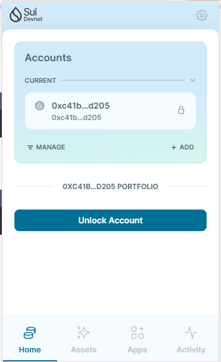

## 基本信息
- Sui钱包地址: `0xc41b971b91a974e84cdb5a460533425129306404904207744484e4e8fe13d205`
- github: `yuanchengjiayu`

## 个人简介
- 工作经验: 1年
- 技术栈: `solidity` `js`
- 对Move特别感兴趣
- 联系方式: qq: `2449462436` 

## 任务

##   01 hello move  
- [x] Sui cli version: 1.36.2
- [x] Sui钱包截图: 
- [x] package id: 0x1edc1dcacd2e1403d9ee7d7f9992e9b255e19698ecc2e1a8c5aac35594383cb8
- [x] package id 在 scan上的查看截图:

##   02 move coin
- [x] My Coin package id : 0x839c8bd56fdb7ea8668884079cb7c0bd9ae2fe62a9a016bed3e5c8d60f1b2e2b
- [x] Faucet package id : 0x00620ccf7fdfcff7b8cbc136097552bd76aa12d09d1d2d4dd98d3633af990dc3
- [x] 转账 `My Coin` hash: J79We9AkMHbMY8aVm6L27A7WioikHMSqk8T7jpddu89V
- [x] `Faucet Coin` address1 mint hash: DY4Piz9tqaEa67kTqEssGRqaKnNQobEivt7SZq1cn9P9 
- [x] `Faucet Coin` address2 mint hash: 9Lf8hvK3xFJpAEqNyBmt5FpJDEizoR7YFNsNtJFEVqYa

##   03 move NFT
- [] nft package id :
- [] nft object id : 
- [] 转账 nft  hash:
- [] scan上的NFT截图:

##   04 Move Game
- [] game package id :
- [] deposit Coin hash:
- [] withdraw `Coin` hash:
- [] play game hash:

##   05 Move Swap
- [] swap package id :
- [] call swap CoinA-> CoinB  hash :
- [] call swap CoinB-> CoinA  hash :

##   06 Dapp-kit SDK PTB
- [] save hash :

##   07 Move CTF Check In
- [] CLI call 截图 : 
- [] flag hash :

##   08 Move CTF Lets Move
- [] proof : 
- [] flag hash :
