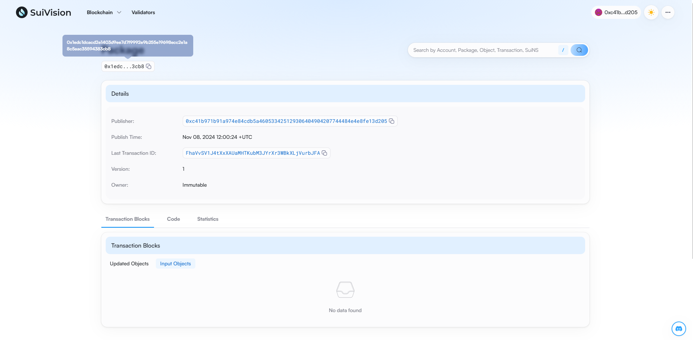
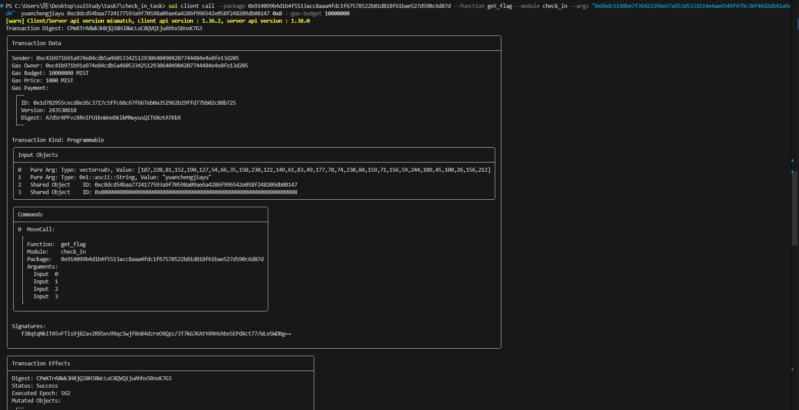

## 基本信息
- Sui钱包地址: `0xc41b971b91a974e84cdb5a460533425129306404904207744484e4e8fe13d205`
- github: `yuanchengjiayu`

## 个人简介
- 工作经验: 1年
- 技术栈: `solidity` `js`
- 对Move特别感兴趣
- 联系方式: qq: `2449462436` 

## 任务

##   01 hello move  
- [x] Sui cli version: 1.36.2
- [x] Sui钱包截图: 
- [x] package id: 0x1edc1dcacd2e1403d9ee7d7f9992e9b255e19698ecc2e1a8c5aac35594383cb8
- [x] package id 在 scan上的查看截图:

##   02 move coin
- [x] My Coin package id : 0x839c8bd56fdb7ea8668884079cb7c0bd9ae2fe62a9a016bed3e5c8d60f1b2e2b
- [x] Faucet package id : 0x00620ccf7fdfcff7b8cbc136097552bd76aa12d09d1d2d4dd98d3633af990dc3
- [x] 转账 `My Coin` hash: J79We9AkMHbMY8aVm6L27A7WioikHMSqk8T7jpddu89V
- [x] `Faucet Coin` address1 mint hash: DY4Piz9tqaEa67kTqEssGRqaKnNQobEivt7SZq1cn9P9 
- [x] `Faucet Coin` address2 mint hash: 9Lf8hvK3xFJpAEqNyBmt5FpJDEizoR7YFNsNtJFEVqYa

##   03 move NFT
- [x] nft package id : 0xc681449c387eea67a13aa169981cae0a15a106f58bf28b214f0cc6167a249375
- [x] nft object id : 0xb414e51b616d8babd0df13afc5a55c38e05abbc8c1d3fdd9948d222c8376fddd
- [x] 转账 nft  hash: FnMcCE4GVLVMk7SPPUSbCcxMFdmC2CC38HfNjfhAJ7eH
- [x] scan上的NFT截图:

##   04 Move Game
- [x] game package id : 0xa521ddd7e07eeae313ff50f3f9963c29f1972163f23da80df8f2bdf36ab3af2d
- [x] deposit Coin hash: 2VTydXGr7e7LD6vcU6fLAdnSTCdT9CdLeapYbbBX5GHL
- [x] withdraw `Coin` hash: 2tWyXHQ9mnqVFkrDm5RzdZwpWnhfWnLiSMwKAUgZeC4y
- [x] play game hash: DUxCLkRBk1D1BtXP9vYd4PM3PFffVZT9uREJ8waQgSJt

##   05 Move Swap
- [x] swap package id : 0x923395a4a920290c69f4802b9ecc60f2ab8fc58cd94727fe2d85ef22140533f5
- [x] call swap CoinA-> CoinB  hash : 6sy61XHY4bqaj9RY5ohL5E6StqSLi7gDoZGpReCsvyVk
- [x] call swap CoinB-> CoinA  hash : 8Sz5ZmnAUxVZVEduy1dzXwoBmoP2q47JkGKCnFUb8Soo

##   06 Dapp-kit SDK PTB
- [x] save hash :3ZxKWcNqq48stYusqcq4zTYxLHxFDswzE5eVEwWqjFJj

##   07 Move CTF Check In
- [x] CLI call 截图 : 
- [x] flag hash : CPmXTrA8Wk3H8jQ38HJ8WcLoC8QVQ1juAhhxSBnxK7G3

##   08 Move CTF Lets Move
- [x] proof : [115,180,2,0,0,0,0,0]
- [x] flag hash : 66yHxkMna3MJV7L6YYUfXJAAjNte2DSit8g8sD2zbsBD
