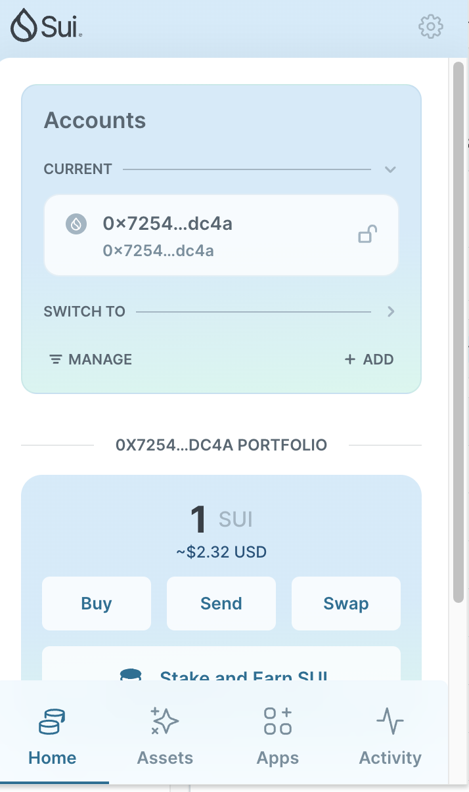
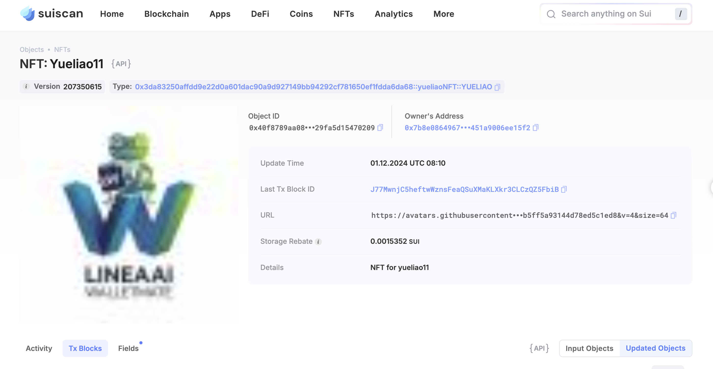

## 基本信息
- Sui钱包地址: `0x725436096e31e9a5ba0a73e47baf5387e0c5ba7a2c2150659efaa2b9caf5dc4a`
> 首次参与需要完成第一个任务注册好钱包地址才被合并，并且后续学习奖励会打入这个地址
- github: `yueliao11`

## 个人简介
- 工作经验: 10年
- 技术栈: `python/Nodejs`
> 重要提示 请认真写自己的简介
- 多年大数据+web开发经验，对 SUI 感兴趣
- 联系方式: x: moon2me 

## 任务

##   01 hello move  
- [√] Sui cli version: sui 1.37.1-homebrew
- [√] Sui钱包截图: 
- [√] package id: 0x5710ea3038ee649d2d1836c8ed4ed0143f90ac855d43a534f1f1360dd1c1e99c
- [√] package id 在 scan上的查看截图:

##   02 move coin
[x] My Coin package id : 0xc542cb63bd5b818c97a381cc9a9e412f39fc8931ea3b649d56a8ee160feb8809
[x] Faucet package id : 0x4e4ca0ff3a45ec5a9f81abe87a2c87ca13c95b73a2007eeab1f1d92a5b704e5f
[x] 转账 My Coin hash: 0x459d25ef46777b3b86e99ecfd67cae0cb78c470ff378f3e0ab91bd01bf165cc7
[x] Faucet Coin address1 mint hash: 0x2120d4a20b68d08df7e8bb219ebf0487964c1273777e2f0218d1c1947ebd52e9
[x] Faucet Coin address2 mint hash: 0x2a956c6bad2bad738b21f1176912633801d144d0b831e4262e4b91bc6ef760b2

##   03 move NFT
- [x] nft package id : 0x3da83250affdd9e22d0a601dac90a9d927149bb94292cf781650ef1fdda6da68
- [x] nft object id : 0x40f8789aa08594412c6002e03f5cf7d5b7f777ef715a8031e129fa5d15470209
-[x] 转账 nft hash: J77MwnjC5heftwWznsFeaQSuXMaKLXkr3CLCzQZ5FbiB
-[x] scan上的NFT截图:

##   04 Move Game
[x] game package id: 0x981f325093d40c850ea38d53274edae71fa965e00cc6cdf079945b0f85d50c5f
[x] deposit Coin hash: 58uFSq6zsLJ1ToYQz51iTJUUzCEP5pkyB9sy1Buqgz3D
[x] withdraw Coin hash: HjQZkpKUm9WmsMTBakUQNsS9LjMZEf4J9ciCPEG1zx5D
[x] play game hash: 3yxA5gVCmawJw3iD9GFtnAZ1CNPquuz9Xr2Ew3d6ffUm

##   05 Move Swap
[x] swap package id : 0xfef81d348e8902d99597ed2601e187ebc6588c811b4d7da2a45d100ec94552f8
[x] call swap CoinA-> CoinB hash : Dt7bzgA9t8SqEBtV1iqFUgASXB9Uk5tXHZciPjtdcUjL
- [] call swap CoinB-> CoinA  hash :sG5iT3Be5zVEVV7u6p12yy7EnZuEKMozV8JaRrhhSbB

##   06 Dapp-kit SDK PTB
- [] save hash : 3p7UBS5hiwd76uWyYU9Ytuuce2vKbLWrevA8XdDCtT7o

##   07 Move CTF Check In
- [] CLI call 截图 : 
- [] flag hash :

##   08 Move CTF Lets Move
- [] proof : 
- [] flag hash :
