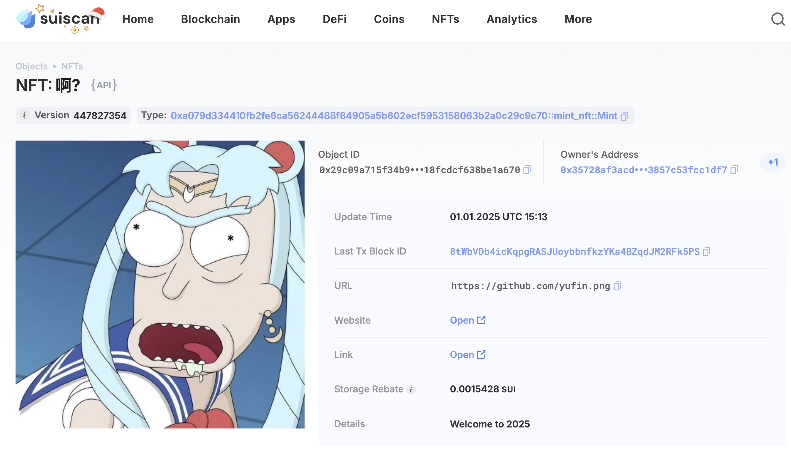

## 基本信息
- Sui钱包地址: `0xd894dbe7954249bc2c89a7857ac34937c438370d877d21fd66bdb120605ee56f`
> 首次参与需要完成第一个任务注册好钱包地址才被合并，并且后续学习奖励会打入这个地址
- github: `yufin`

## 个人简介
- 工作经验: 5年
- 技术栈: `Golang` `Python` `Java`
> 重要提示 请认真写自己的简介
- 多年web2开发经验，1年web3 infra开发经验，学习move中
- 联系方式: tg: `yfinity` 

## 任务

##   01 hello move  
- [] Sui cli version: sui 1.39.3-homebrew
- [] Sui钱包截图: 
- [] package id: 0x59b3ca18a2bdbe015b943b283ddeeed2c8c5693d340864ef7de2b689335f2555
- [] package id 在 scan上的查看截图:

##   02 move coin
- [] My Coin package id : 0xe31a18ace543a8d317824b15718a54cf0477e5c93bcedb2f4c5d877dedc16a18::mycoin::MYCOIN
- [] Faucet package id : 0xe31a18ace543a8d317824b15718a54cf0477e5c93bcedb2f4c5d877dedc16a18::faucet::FAUCET
- [] 转账 `My Coin` hash: 9V51hiPNoN2aA9hWLtcBvEudeNtCiDyTJNpoVPUAciR
- [] `Faucet Coin` address1 mint hash: CbDSqqANWULSK3BcnQrv47iu9qKsX3UXPZcwp6TWybTx
- [] `Faucet Coin` address2 mint hash: HY47d61EJYGM6TnLGDnfBTpLxyfX9LjTexyhsEbozh3x

##   03 move NFT
- [] nft package id : 0xa079d334410fb2fe6ca56244488f84905a5b602ecf5953158063b2a0c29c9c70
- [] nft object id : 0x29c09a715f34b93ef8ee4a8cb8ac3bb2647dd555eac0a3118fcdcf638be1a670
- [] 转账 nft  hash: DcEcyxXZaWoXpM4a3T9LuUf48ynGNG3YGzCLDVeUrvQ 
- [] scan上的NFT截图:

##   04 Move Game
- [] game package id : 0x6c38fa662e97fc659e1e9181b074342fe398f5dca6b64e428e927df0bf2883a4
- [] deposit Coin hash: Ga9KvaR3fcqSeRVjBtzzYk4Zc83vmRBeHS1ZJMsV5VHc
- [] withdraw `Coin` hash: Aa6QFbRbtRUaoMjDYSPLptjBJ4wut5mr8QKpNbAHnMc5
- [] play game hash: Byg6qCLoRW7yraE5v65MqcUH3hW4wFUr4mTTaahukYmw

##   05 Move Swap
- [] swap package id : 0xfbbe7bf2da2589103369910b042479da6d2afcdf9091819d1780afefe37b2da6
- [] call swap CoinA-> CoinB  hash : 3zzMfBJn6mynFHmgmHQGKBLe5vXFa7eZB3DeurRwDTvD
- [] call swap CoinB-> CoinA  hash : Eh5RrSTKofav18B6aQAPRGpUVUmvm5dY8VEE9DRNiGQj

##   06 Dapp-kit SDK PTB
- [] save hash :

##   07 Move CTF Check In
- [] CLI call 截图 : 
- [] flag hash :

##   08 Move CTF Lets Move
- [] proof : 
- [] flag hash :

