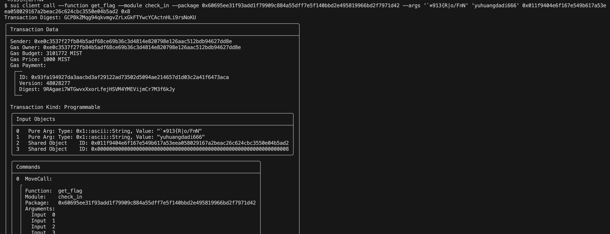

## 基本信息
- Sui钱包地址: `0xe0c3537f27fb84b5adf68ce69b36c3d4814e820798e126aac512bdb94627dd8e`
> 首次参与需要完成第一个任务注册好钱包地址才被合并，并且后续学习奖励会打入这个地址
- github: `yuhuangdadi666`

## 个人简介
- 工作经验: 3年Java 失业在家
- 技术栈: `Java`
- 熟悉 web2 的 tomcat、jsp 等技术，准备转行学习 web3
- 联系方式: qq 2543175043

## 任务

##   01 hello move  
- [x] package id: 0x7cccb53d1cf8302dba2c99704aaad0fd4d714fc805d427a68cc4de17ebae353a

##   02 move coin
- [x] My Coin package id : 0xe1e643943a5a76715fbb11fad80c10244462dea0143151fcf9377586e7e53dbf
- [x] Faucet package id : 0xe1e643943a5a76715fbb11fad80c10244462dea0143151fcf9377586e7e53dbf
- [x] 转账 `My Coin` hash: F6bdFAdxta84EVheNQz2swTLX82ZKiqTCLSab11JzApv

##   03 move NFT
- [x] nft package id : 0x4ebff147600fa7625fd1266bf32b56ddf0835ccd6ba3117db77bae2a682868e9
- [x] nft object id : 0x5536c370a47f7d8ec774a12f60fdcdd1686fdae39a8d2adc28b0ca8637d270f7
- [x] 转账 nft  hash: CnNFvPacAFMLZ7nmgNoKe2VMJVcRVorMkYsSJj9Qe5xw

##   04 Move Game
- [x] game package id : 0xe18b5761ac1d4e55802125ba42320cda857c6e25a23b568c6b60389c7f4c0bd4
- [x] call game hash: U2C7KPkphgaD5qqG1CY4TQuXbYxR8k64nbXEUJ8BeYM

##   05 Move Swap
- [ ] swap package id :
- [ ] call swap hash:

##   06 SDK PTB
- [ ] save hash :

##   07 Move CTF Check In
- [x] CLI call 截图: 
- [x] flag hash: GCPBkZMqg94qkvmgvZrLxGkFTYwcYCActnHLi9rsNoKU

##   08 Move CTF Lets Move
- [x] proof: `mmIjhC`
- [x] Transaction block: 7GSntmwd89jnesiiosEzBGg4jyRF19FBiNdyRzbkCKhB