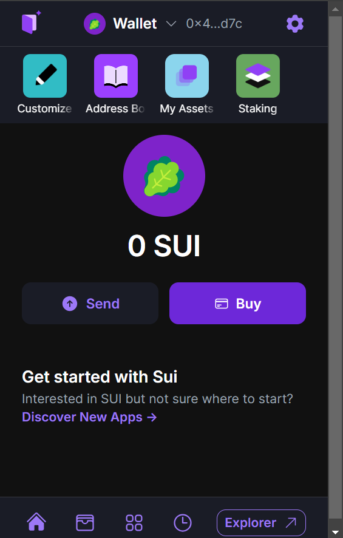
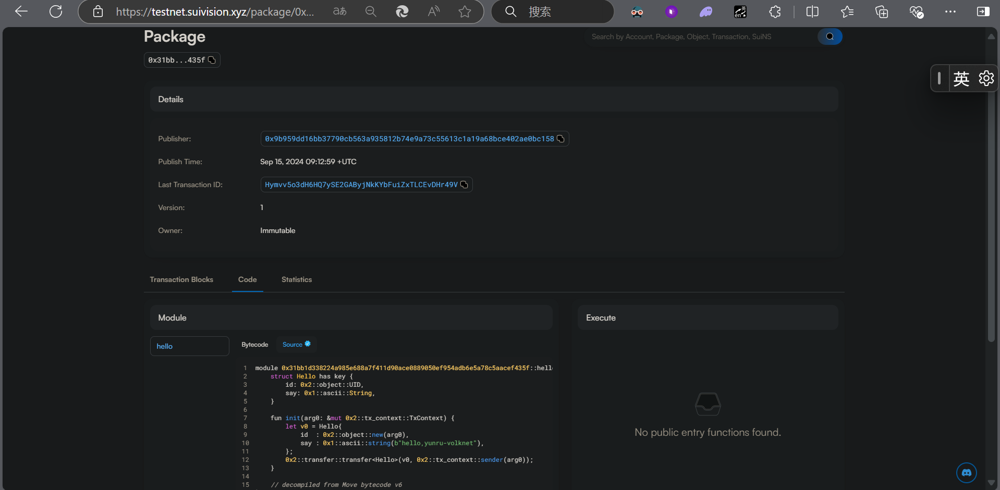

## 基本信息
- Sui钱包地址: `0x4bfe4b568b1519082b5b2861a573e1522a30be16e394782250b07f9b76c1ad7c`
> 首次参与需要完成第一个任务注册好钱包地址才被合并，并且后续学习奖励会打入这个地址
- github: `yunru-volknet`

## 个人简介
- 工作经验: 0年
- 技术栈: `PHP` `react` `python ` 
> 重要提示 请认真写自己的简介
- 本科在读学生，有web2的项目经验，尝试入门web3
- 联系方式: tg: `xxx` 

## 任务

##   01 hello move  
- [+] Sui cli version:sui 1.33.0-77b18b45c195
- [+] Sui钱包截图: 
- [+] package id: 0x31bb1d338224a985e688a7f411d90ace0889050ef954adb6e5a78c5aacef435f
- [+] package id 在 scan上的查看截图:

##   02 move coin
- [] My Coin package id : 
- [] Faucet package id : 
- [] 转账 `My Coin` hash:
- [] `Faucet Coin` address1 mint hash:
- [] `Faucet Coin` address2 mint hash:

##   03 move NFT
- [] nft package id :
- [] nft object id : 
- [] 转账 nft  hash:
- [] scan上的NFT截图:

##   04 Move Game
- [] game package id :
- [] deposit Coin hash:
- [] withdraw `Coin` hash:
- [] play game hash:

##   05 Move Swap
- [] swap package id :
- [] call swap CoinA-> CoinB  hash :
- [] call swap CoinB-> CoinA  hash :

##   06 Dapp-kit SDK PTB
- [] save hash :

##   07 Move CTF Check In
- [] CLI call 截图 : 
- [] flag hash :

##   08 Move CTF Lets Move
- [] proof : 
- [] flag hash :
