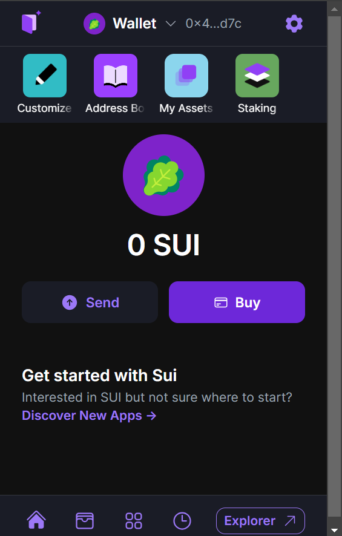
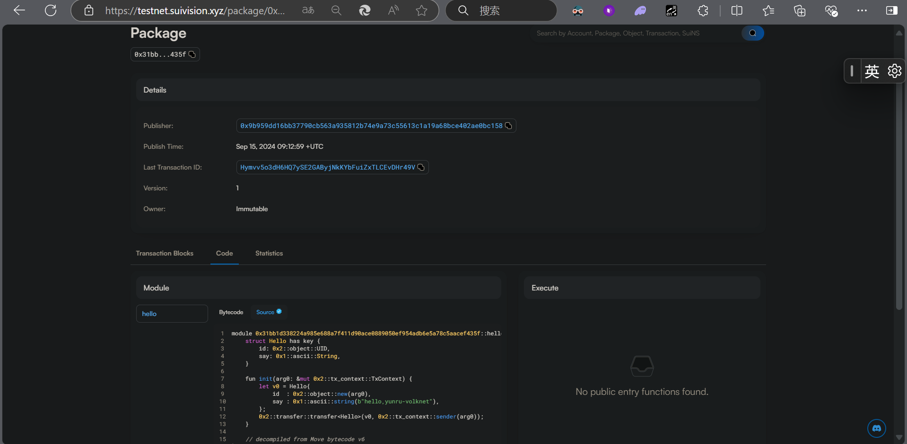
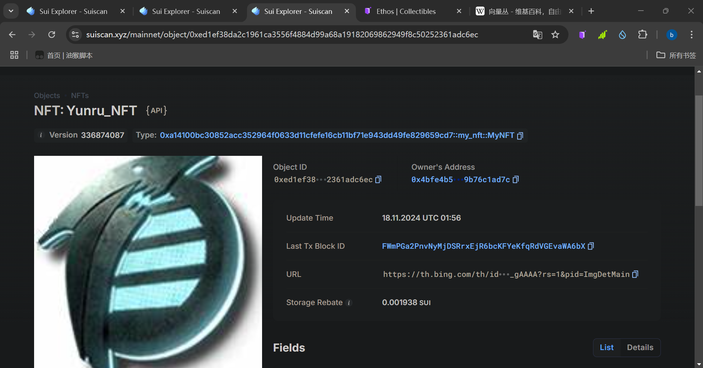

## 基本信息
- Sui钱包地址: `0x4bfe4b568b1519082b5b2861a573e1522a30be16e394782250b07f9b76c1ad7c`
> 首次参与需要完成第一个任务注册好钱包地址才被合并，并且后续学习奖励会打入这个地址
- github: `yunru-volknet`

## 个人简介
- 工作经验: 0年
- 技术栈: `PHP` `react` `python ` 
> 重要提示 请认真写自己的简介
- 本科在读学生，有web2的项目经验，尝试入门web3
- 联系方式: tg: `xxx` 

## 任务

##   01 hello move  
- [v] Sui cli version:sui 1.33.0-77b18b45c195
- [v] Sui钱包截图: 
- [v] package id: 0x31bb1d338224a985e688a7f411d90ace0889050ef954adb6e5a78c5aacef435f
- [v] package id 在 scan上的查看截图:

##   02 move coin
- [v] My Coin package id : 0x51b2d5f14320716b52dbce753a3d6ec0a1dcc6a53f11529351b73ce2afaf159d
- [v] Faucet package id : 0x6c4332ec49ac2262615fa10432a598a5aea2bf0bc35679bdafbe2720c49921d6
- [v] 转账 `My Coin` hash: 3pusLpdKKFZ8rpUJAQAX5VaUZVGQwsngfMAZciSx6Vhb
- [v] `Faucet Coin` address1 mint hash:HooXTwheoAebAFVQWKm7FBaB7CeQfk1vUtcABCwBh7kh
- [v] `Faucet Coin` address2 mint hash:FtZ7QuEj6pCp8cca3DzfJh92RcNxPBGiHT9KXcuwWmPJ

##   03 move NFT
- [v] nft package id :  0xa14100bc30852acc352964f0633d11cfefe16cb11bf71e943dd49fe829659cd7
- [v] nft object id : 0xed1ef38da2c1961ca3556f4884d99a68a19182069862949f8c50252361adc6ec
- [v] 转账 nft  hash: FWmPGa2PnvNyMjDSRrxEjR6bcKFYeKfqRdVGEvaWA6bX
- [v] scan上的NFT截图:

##   04 Move Game
- [v] game package id :0xab22f4f8d2d80d83d33cd7dd3980c25fee6e99ad2a90459851af66961f189b22
- [v] deposit Coin hash:HNhWUTd4YhEN8MdhfA9ZbAxUpNQCRqAFXw9q5UPRQMpT
- [v] withdraw `Coin` hash:21hXviYNxkCzrhnmNRU7FW183t917sEknnJ9vKokyJJE
- [v] play game hash:4npgTfetMDJaheXMYuisrCz8VbUVcmruCKgYGYzCp8ap

##   05 Move Swap
- [v] swap package id :0x0c1ce2d18ba07a161672ca0f614c5bd035ea4eae8666edc1dc50b3fdbf7fe459
- [v] call swap CoinA-> CoinB  hash :2txAW2JViCiZNDUqawY5ffT3q1sqdSKx4FrpTmheCqPa
- [v] call swap CoinB-> CoinA  hash :E5P2FNVFCjPvLgC9xZ97cp6fiqSw6KRuhN4Nv4oRo1Gy

##   06 Dapp-kit SDK PTB
- [v] save hash :G3jcgbs31pzuQ4sYv6vR3ihjzLs7uemNUnvHoprbkARo

##   07 Move CTF Check In
- [] CLI call 截图 : 
- [] flag hash :

##   08 Move CTF Lets Move
- [] proof : 
- [] flag hash :
