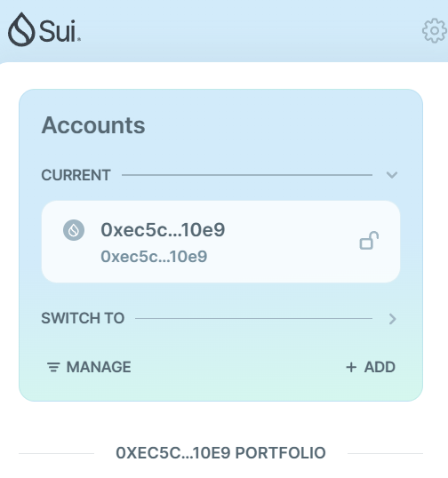
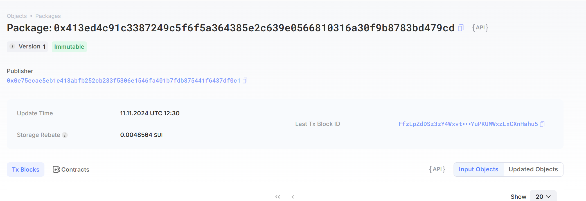
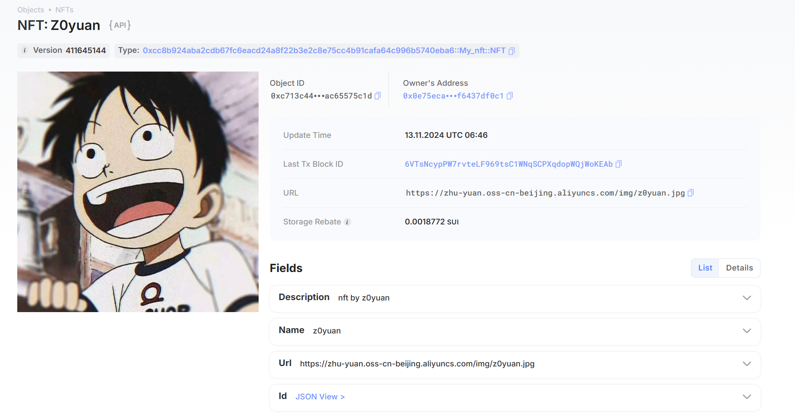

## 基本信息
- Sui钱包地址: `0xec5cbd4310aef155e2bf3a58b5f584c381821870c9ddaf45eb205f52a16710e9`
> 首次参与需要完成第一个任务注册好钱包地址才被合并，并且后续学习奖励会打入这个地址
- github: `z0yuan`

## 个人简介
- 工作经验: 0年
- 技术栈: `C` `C++` `python`
> 重要提示 请认真写自己的简介
- 本科在读，擅长网络安全中的二进制方向，想学习区块链技术，从move入门。
- 联系方式: tg: `@z0yuan` 

## 任务

##   01 hello move  
- `Sui cli version:sui 1.37.1-7839b9501066`
- Sui钱包截图: 
- package id: `0x413ed4c91c3387249c5f6f5a364385e2c639e0566810316a30f9b8783bd479cd`
- package id 在 scan上的查看截图:

##   02 move coin
- [x] My Coin package id : 0x5e4d65fdd9f8db59ebcff3b99769896e9ac3f76c247370ed8897bcdfa7e20609
- [x] Faucet package id : 0x5711dc07a73d745ab646c4c2b2961bb5342454d49681a30a7092ed66f065f081
- [x] 转账 `My Coin` hash: 42jBJ8NbQCYZLd4X3ZsydfMpoupz2iq4uvHPbE3L3YTV
- [x] `Faucet Coin` address1 mint hash: AVgiuexQDv4niVTC9kBvaF7S775pJNguWN3jwwQjv38u
- [x] `Faucet Coin` address2 mint hash: DfDgDuAU3BjMRNpALs6ukhoYsEnTArbeafTpk1EZ4pPu

##   03 move NFT
- [x] nft package id :0xcc8b924aba2cdb67fc6eacd24a8f22b3e2c8e75cc4b91cafa64c996b5740eba6
- [x] nft object id : 0xc713c44bfffabb90c17a3b1d324b6df744ab8347710a6abe2e479fac65575c1d
- [x] 转账 nft  hash: F9MWicSjVk2aSxP6E6fmzjG8RCwRCfjCntmLi52HkCGG
- [x] scan上的NFT截图:

##   04 Move Game
- [x] game package id :0xbce4d4ae01a013e40000a2e82fd158529e16c88f52416b0f8b0d2fb3cedba22e
- [x] deposit Coin hash:GWL6dmLEFhgAgHjmjPF8vQnW62qJXUnnRrCmBuyB522Y
- [x] withdraw `Coin` hash:GtKW22GhaheeArUcYEY7bQVBYrSJRqb7LWUmqTFq1qPB
- [x] play game hash:GtKW22GhaheeArUcYEY7bQVBYrSJRqb7LWUmqTFq1qPB

##   05 Move Swap
- [x] swap package id :0x876bde98af774c6e5df5a0e0f484b8a2c9e3abadf596581ebce0fc62eeda2e85
- [x] call swap CoinA-> CoinB  hash :BmcdN6yKbgUYLiJQEg2sXKv4CYxMoccfFRbtwFGkZCpw
- [x] call swap CoinB-> CoinA  hash :DsDNLY7q1q8GnPpWVDaCVGyQH7WCGzxE3M3RLnZs7ApX

##   06 Dapp-kit SDK PTB
- [] save hash :

## 07 Move CTF Check In

- [] CLI call 截图 : 
- [] flag hash : 
