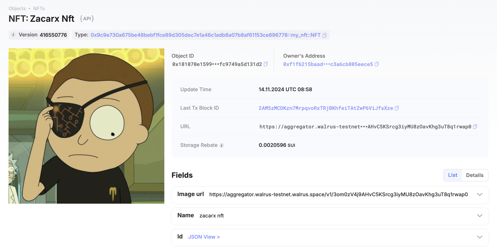

## 基本信息
- Sui钱包地址: `0xdd3ef4a5f244874b6649519092e92482c262e7abcd6e1d84f435004ced85022d`
> 首次参与需要完成第一个任务注册好钱包地址才被合并，并且后续学习奖励会打入这个地址
- github: `Zacarx`

## 个人简介
- 工作经验: 1年
- 技术栈: `golang` `Python`
> 重要提示 请认真写自己的简介
- CTFer,web手，对Move特别感兴趣，想通过Move入门区块链学习提升自己，开阔眼界
- 联系方式: tg: `zjoplo` 

## 任务

##   01 hello move  

- [x] Sui cli version:sui 1.24.1

- [x] package id: 0x56d5be8a02cda3d771df9b01da7420eb751ecc66b711631230dfc376cedafcf5

- [x]  Sui钱包截图: 

  

- [x] [] package id 在 scan上的查看截图:

  

##   02 move coin
- [x] My Coin package id : 0xfb935e0ef8cb76d207ad2cdfe15bca9130e90d783f5d5dd51a865551655c48ba
- [x] Faucet package id : 0xed033d020f7796449b1c845cdde8bca79e2d0a77329f03d014b2daa7896709ae
- [x] 转账 `My Coin` hash:  9bSsBeyv1gfm3BMULPjDKy6dFkALaWKwis6MmEVoqocT
- [x] `Faucet Coin` address1 mint hash: 9vWSqxLEW8mRriqVcY1F6FUX2KperUjputgx3MLuXW7b
- [x] `Faucet Coin` address2 mint hash:8JyJBcnimsZBFJpnYFFiV6gfvnrqLBQH7AbAeMWnSJNy

##   03 move NFT
- [x] nft package id :0x9c9e730a675be48bebf1fce89d305dec7e1a46c1adb8a07b8af61153ce696778

- [x] nft object id : 0x9c9e730a675be48bebf1fce89d305dec7e1a46c1adb8a07b8af61153ce696778

- [x] 转账 nft  hash:CknAVhVVDDDPVKoz8Va5haxqv4PmVpL7pkLVLLccfmTN

- [x] scan上的NFT截图:

  

##   04 Move Game
- [] game package id :
- [] deposit Coin hash:
- [] withdraw `Coin` hash:
- [] play game hash:

##   05 Move Swap
- [] swap package id :
- [] call swap CoinA-> CoinB  hash :
- [] call swap CoinB-> CoinA  hash :

##   06 SDK PTB
- [] save hash :
