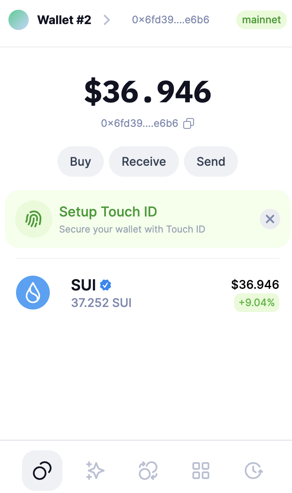
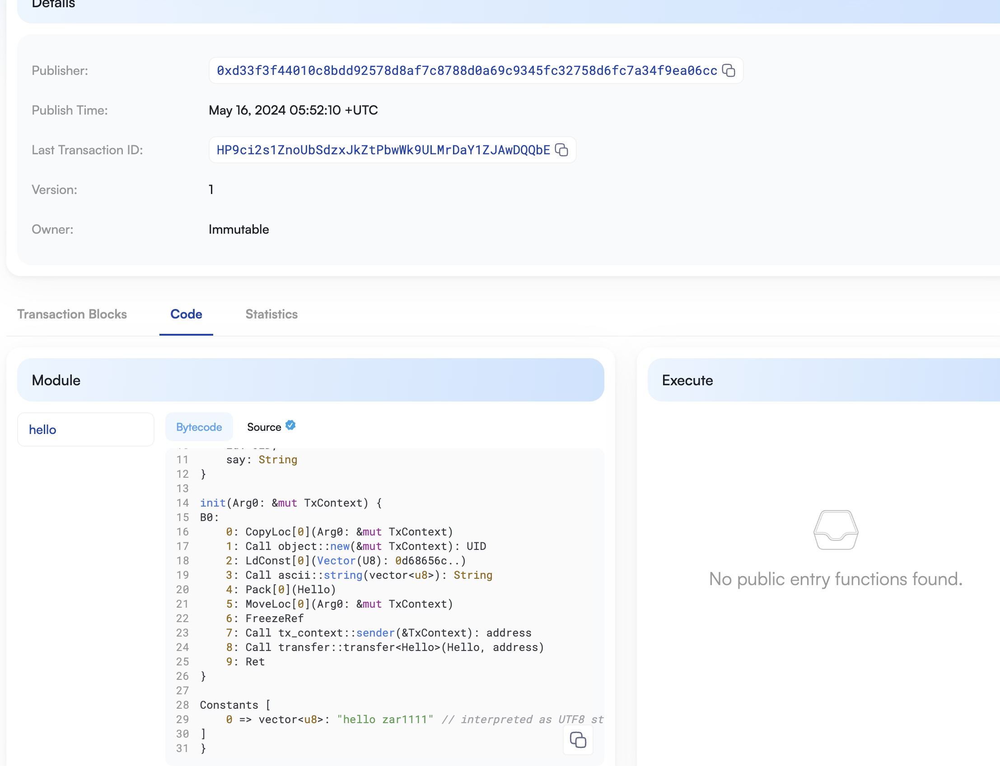

## 基本信息
- Sui钱包地址: `0x6fd3941213c3061728f702df266b6dde3b1021788455e5de146b6055d6b2e6b6`
> 首次参与需要完成第一个任务注册好钱包地址才被合并，并且后续学习奖励会打入这个地址
- github: `zar1111`

## 个人简介
- 工作经验: 2年
- 技术栈: `Python` `JavaScript` `TypeScript`
> 重要提示 请认真写自己的简介
- 两年web2开发经验，曾做过EVM的NFT交易市场，对Move特别感兴趣，想通过Move入门区块链
- 联系方式: wechat: `Little_Zar`

## 任务

##   01 hello move  
- [] Sui cli version: 1.5.0
- [] Sui钱包截图: 
- [] package id: 0x01405970ed4f10ea351dae0a40880fafb8f84ef9e894563757150fe8875a108c
- [] package id 在 scan上的查看截图:

##   02 move coin
- [] My Coin package id : 
- [] Faucet package id : 
- [] 转账 `My Coin` hash:
- [] `Faucet Coin` address1 mint hash:
- [] `Faucet Coin` address2 mint hash:

##   03 move NFT
- [] nft package id :
- [] nft object id : 
- [] 转账 nft  hash:
- [] scan上的NFT截图:

##   04 Move Game
- [] game package id :
- [] deposit Coin hash:
- [] withdraw `Coin` hash:
- [] play game hash:

##   05 Move Swap
- [] swap package id :
- [] call swap CoinA-> CoinB  hash :
- [] call swap CoinB-> CoinA  hash :

##   06 SDK PTB
- [] save hash :
