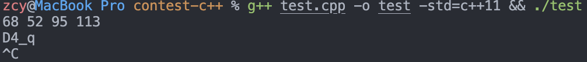
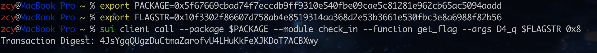

1. 查询当前str

[点击](https://testnet.suivision.xyz/object/0x10f3302f86607d758ab4e8519314aa368d2e53b3661e530fbc3e8a6988f82b56)查询，这里能直接复制成如下格式：`[68,52,95,113]`
当然，也可以通过`sui client object <ObjectID>`等方式查看

2. ascii -> char

有很多种方式，这里写了一个简单的c++

```c++
#include<iostream>

using namespace std;

int main()
{
    int code;
    while (cin >> code) {
        cout << char(code);
    }
    return 0;
}
// 太久没写c++了，能用就行~~
```

运行后输入上一步得到的ascii码，去掉中括号和逗号，用空格隔开


3. 链上调用



**重要输出**

```bash
╭──────────────────────────────────────────────────────────────────────────────────────────────────╮
│ Transaction Block Events                                                                         │
├──────────────────────────────────────────────────────────────────────────────────────────────────┤
│  ┌──                                                                                             │
│  │ EventID: 4JsYgqQUgzDuCtmaZarofvU4LHuKkFeXJKDoT7ACBXwy:0                                       │
│  │ PackageID: 0x5f67669cbad74f7eccdb9ff9310e540fbe09cae5c81281e962cb65ac5094aadd                 │
│  │ Transaction Module: check_in                                                                  │
│  │ Sender: 0x9e4092b6a894e6b168aa1c6c009f5c1c1fcb83fb95e5aa39144e1d2be4ee0d67                    │
│  │ EventType: 0x5f67669cbad74f7eccdb9ff9310e540fbe09cae5c81281e962cb65ac5094aadd::check_in::Flag │
│  │ ParsedJSON:                                                                                   │
│  │   ┌────────┬────────────────────────────────────────────────────────────────────┐             │
│  │   │ flag   │ true                                                               │             │
│  │   ├────────┼────────────────────────────────────────────────────────────────────┤             │
│  │   │ sender │ 0x9e4092b6a894e6b168aa1c6c009f5c1c1fcb83fb95e5aa39144e1d2be4ee0d67 │             │
│  │   └────────┴────────────────────────────────────────────────────────────────────┘             │
│  └──                                                                                             │
╰──────────────────────────────────────────────────────────────────────────────────────────────────╯
```