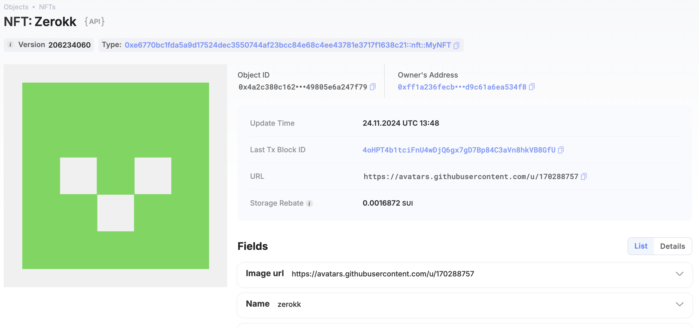

## 基本信息
- Sui钱包地址: `0x615841a9c9928e5060408dd499a8d7fa4b201bfe715fc2f9257dc74a60dd2ee9`
> 首次参与需要完成第一个任务注册好钱包地址才被合并，并且后续学习奖励会打入这个地址
- github: `zerokk246`

## 个人简介
- 工作经验: 5年
- 技术栈: `Go` `C++`
> 重要提示 请认真写自己的简介
- 5年web2后端开发经验，对web3,sui,Move特别感兴趣，想通过Move入门区块链
- 联系方式: tg: `@allenxuxu` 

## 任务

##   01 hello move  
- [ x ] Sui cli version: sui 1.36.2
- [ x ] Sui钱包截图: 
- [ x ] package id: 0x5145beee322323760429ae683cf09e168da6e4a1129dcba10cf8e13ab8f488a8
- [ x ] package id 在 scan上的查看截图:

##   02 move coin
- [ x ] My Coin package id : 0x11ee890df33c22a0ac689959b818e4669d835b68ea947e05e5a45e6915bbc75d
- [ x ] Faucet package id : 0x5d0648b63188eec5a74c027f5bd781dce8a7653bdf64f086efb8af3213c7b214
- [ x ] 转账 `My Coin` hash: BEEe4wjeTFA7cnas6ByUSwJpUxEvD6aYdmcHF6MrPLry
- [ x ] `Faucet Coin` address1 mint hash: E41aizriUyQ9qjiRteHgq7V2fgnpR3yRqheRdknJJYKY
- [ x ] `Faucet Coin` address2 mint hash: Cc9nbqeQ76cK9E8hkkuXaeAEt3tjY43oGMf2EsA8f3Pk

##   03 move NFT
- [ x ] nft package id : 0xe6770bc1fda5a9d17524dec3550744af23bcc84e68c4ee43781e3717f1638c21
- [ x ] nft object id : 0x4a2c380c16236750a126b70546616e6e4e4ecfe6a9b596040b49805e6a247f79
- [ x ] 转账 nft  hash: 7wNeifxCCm9VLcSxUHwFtE9edT3RG9mWACEYHf8fL2kS
- [ x ] scan上的NFT截图:

##   04 Move Game
- [] game package id :
- [] deposit Coin hash:
- [] withdraw `Coin` hash:
- [] play game hash:

##   05 Move Swap
- [] swap package id :
- [] call swap CoinA-> CoinB  hash :
- [] call swap CoinB-> CoinA  hash :

##   06 Dapp-kit SDK PTB
- [] save hash :

##   07 Move CTF Check In
- [] CLI call 截图 : 
- [] flag hash :

##   08 Move CTF Lets Move
- [] proof : 
- [] flag hash :
