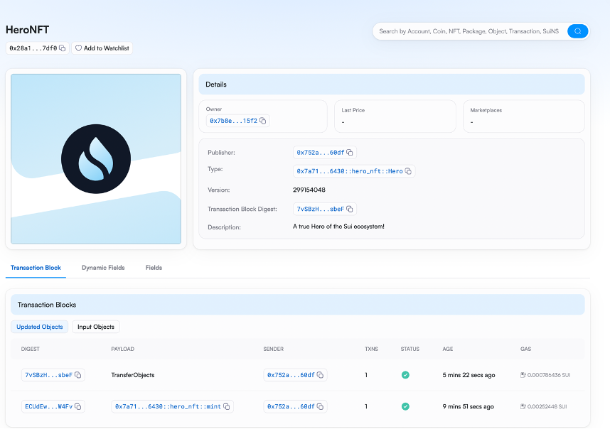

## 基本信息
- Sui钱包地址: `0x752a51cb73279848ab3ee9802899ccd99fb293a6ad3d654825f14fc6300060df`
> 首次参与需要完成第一个任务注册好钱包地址才被合并，并且后续学习奖励会打入这个地址
- github: `zhanglehui0612`

## 个人简介
- 工作经验: 12年
- 技术栈: `Java` `Go` `Solidity`
- 多年Web2开发和架构经验，熟悉以太坊技术栈， 对Move,Sui特别感兴趣
- 联系方式: tg: [@nickyzhang0612](https://t.me/nickyzhang0612)

## 任务

##   01 hello move  
- [] Sui cli version: sui 1.23.0
- [] Sui钱包截图: 
- [] package id: 0xa2d380fae66b53b69f192b8583c0fbf1afe82acc0e6a0b1dff7dd064df6968a1
- [] package id 在 scan上的查看截图:

##   02 move coin
- [] My Coin package id : 0x8ee56689c2e689b501efdcfd74a0a1db4e87aa9a50eba47057cc1322a16d8d0e
- [] Faucet package id : 0x8ee56689c2e689b501efdcfd74a0a1db4e87aa9a50eba47057cc1322a16d8d0e
- [] 转账 `My Coin` hash: 4tnCTqVmafSDxzWUk8SyF7d6W3VFZNyxYtpyRY211Ms2
- [] `Faucet Coin` address1 mint hash: 33xUHTuF22wHCf7r9ukMkXEDRTNpZDnSvLy9pUGdxXPh
- [] `Faucet Coin` address2 mint hash: EZ3S5aBRwiJpg6KG8FN3gMAXFdUEVezpQd26jPc9prT5

##   03 move NFT
- [] nft package id : 0x7a718faaf0c4899eaec698c9038ff79eb9403ef254e4dacc620831f0d8576430
- [] nft object id : 0x28a11f86df88b3b7d3c5f5d55f74b8be32e84c053cec46ce7c498f8e2df57df0
- [] 转账 nft  hash: 7vSBzHFscvejPciJcoDLnWnCz53ucyURpBr7JBVXsbeF
- [] scan上的NFT截图:  

##   04 Move Game
- [] game package id : 0xd047c569341da17a09510a4f06229b6e1f05dab1e219377bdad93c887b2dcee4 (mainnet)
- [] deposit Coin hash: 891Lann5bipevvwQLBVhFLuNMKNk5k8U6VdBzR4SbFSo (mainnet)
- [] withdraw `Coin` hash: EgPrqJDZA5wX4Rq9YUNa4psudYzpHDagb4qHKrWbGtUr (mainnet)
- [] play game hash: FTapaYNddSDDZYYBk4xSyNscpfCYx6pbmKvZWT42Vzw3     (devnet)

##   05 Move Swap
- [] swap package id :
- [] call swap CoinA-> CoinB  hash :
- [] call swap CoinB-> CoinA  hash :

##   06 Dapp-kit SDK PTB
- [] save hash :

##   07 Move CTF Check In
- [] CLI call 截图 : 
- [] flag hash :

##   08 Move CTF Lets Move
- [] proof : 
- [] flag hash :