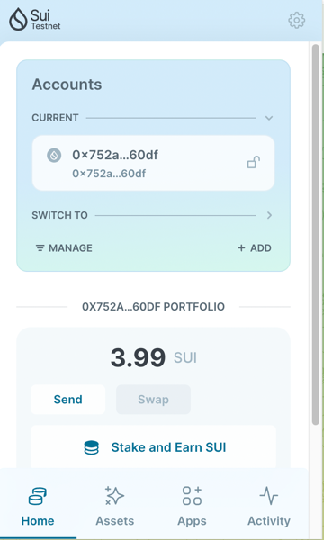
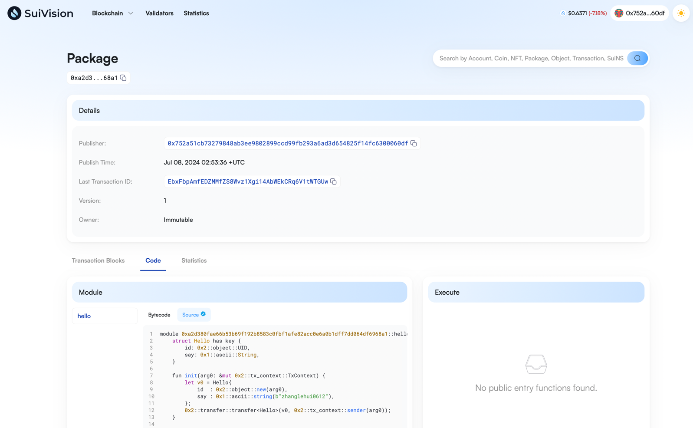

## 基本信息
- Sui钱包地址: `0x752a51cb73279848ab3ee9802899ccd99fb293a6ad3d654825f14fc6300060df`
> 首次参与需要完成第一个任务注册好钱包地址才被合并，并且后续学习奖励会打入这个地址
- github: `zhanglehui0612`

## 个人简介
- 工作经验: 12年
- 技术栈: `Java` `Go` `Solidity`
- 多年Web2开发和架构经验，熟悉以太坊技术栈， 对Move,Sui特别感兴趣
- 联系方式: tg: [@nickyzhang0612](https://t.me/nickyzhang0612)

## 任务

##   01 hello move  
- [] Sui cli version: sui 1.23.0
- [] Sui钱包截图: 
- [] package id: 0xa2d380fae66b53b69f192b8583c0fbf1afe82acc0e6a0b1dff7dd064df6968a1
- [] package id 在 scan上的查看截图:

